# Lab3 - **Fundamental Manifest Section - Terraform Block**

## **Section-01: Lab Overview**

-   Within the next several labs we will deeply explore the primary code blocks within Terraform files/manifest including individual explorations of the Terraform, Provider, and Resources blocks
-   Within this lab we will thoroughly explore the Terraform Block of our HashiCorp Configuration Language (HCL) based manifests
-   Note - throughout the rest of this lab guide the terms HashiCorp Configuration Language (HCL) files and Terraform Manifests are used interchangeably

*GitHub Directory Code Location and Guidance*

-   The Github root directory for this lab and corresponding sub-directories are depicted below.
-   Use your own local copy of the repository for code execution and any code edits necessary.

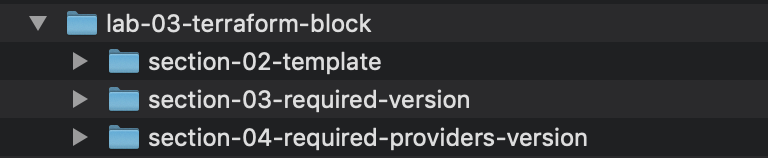

## **Section-02: Terraform Block Template**

| *Section Overview*  The Terraform block of our manifest files contain the following elements: Required Terraform Version - while it is not required - it is recommended to include Terraform versions supported by the manifest. This ensures that the manifest is only executed utilizing Terraform versions it was authored/tested against. Required Providers and Required Provider Versions - our example provider is AWS and we may additionally stipulate the required/supported version of the Terraform AWS provider The objective of this section is to introduce a simplistic Terraform block template There will be no execution of the code within this section as we review the template from a high level but will execute manifest with only a Terraform block isolated in the other sections of this lab |
|--------------------------------------------------------------------------------------------------------------------------------------------------------------------------------------------------------------------------------------------------------------------------------------------------------------------------------------------------------------------------------------------------------------------------------------------------------------------------------------------------------------------------------------------------------------------------------------------------------------------------------------------------------------------------------------------------------------------------------------------------------------------------------------------------------------------------|

*Subdirectory for Lab Section*

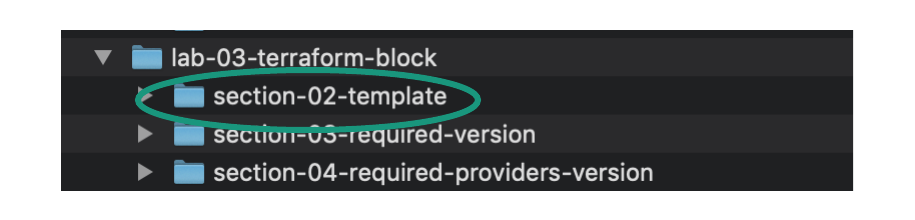

*Open the Current Manifest and Explore Contents*

| Open the following file in your local code editor for this section:  terraform-block-template.tf |
|--------------------------------------------------------------------------------------------------|

-   In this Terraform block template \> the AWS provider that will be used in all subsequent labs is included along with a “random” provider
-   The primary objective in inclusion of the “random” provider is simply to demonstrate the formatting when multiple required providers exist
-   The inclusion of version requirements for both Terraform and the required providers are included and the operators utilized (I.e. “\~\>” and “=”) are detailed in the next section

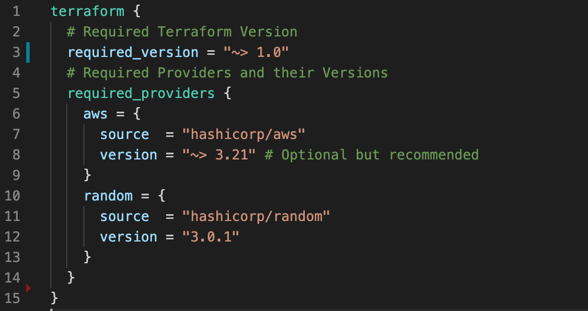

## **Section-03: Terraform Block - Require Terraform Version**

| *Section Overview*  The required_version statement of the Terraform fundamental block focuses on the underlying Terraform CLI installed on PC/Server platform executing the manifest If the running version of Terraform on the platform doesn't match the constraints specified in your terraform block - Terraform will produce an error and exit without taking any further action This is a mechanism to ensure that there are not compatibility issues with the Terraform version developed under and the Terraform version we are attempting to invoke the manifest with In this lab we will experiment with changing the versions specified in the Terraform block and issuing “terraform init” and observe results Utilize the following Terraform document for a through discussion on operator types available (=, !=, \<, \>, etc): <https://www.terraform.io/docs/language/expressions/version-constraints.html> |
|------------------------------------------------------------------------------------------------------------------------------------------------------------------------------------------------------------------------------------------------------------------------------------------------------------------------------------------------------------------------------------------------------------------------------------------------------------------------------------------------------------------------------------------------------------------------------------------------------------------------------------------------------------------------------------------------------------------------------------------------------------------------------------------------------------------------------------------------------------------------------------------------------------------------------|

*Subdirectory for Lab Section*

*Open the Current Manifest and Explore Contents*

| Open the following file in your local code editor for this section:  terraform-block.tf |
|-----------------------------------------------------------------------------------------|

*Terraform Manifest With Specific Terraform CLI Version Explained:*

-   The current Terraform manifest utilizes “required_version” with the equality (“=”) operator
-   The “required_version” specification pertains to the Terraform CLI version and with the equality operator states \> the Terraform CLI version on the platform invoking the manifest must be EXACTLY “1.0.0”
-   Note if this lab is being run in the future post new release/installation of the Terraform CLI \> the “required_version” statement must be updated to that current release to allow execution

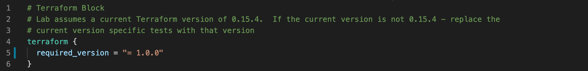

*Change Directory into Section Sub-Directory Containing Terraform Manifest Location*

| cd lab-03-terraform-block/section-03-required-version/ |
|--------------------------------------------------------|

-   Execute the “terraform init” command
-   The init command should succeed based on the exact match of the running version and the equal to version specified in the manifest as depicted below

| terraform init |
|----------------|

*Update the Terraform Manifest With a Lesser Version Than Current - Provoking Failure*

-   Update the Terraform manifest to require a version exactly of 0.15.1 as depicted below

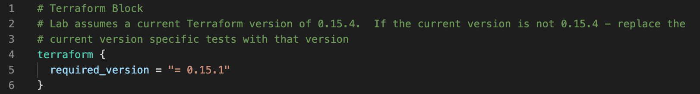

-   Execute the “terraform init” command anew
-   We should observe a failure to initialize the manifest as the equal operator is utilized to force an exact Terraform version and our current Terraform CLI version does not meet this mandate

| terraform init |
|----------------|

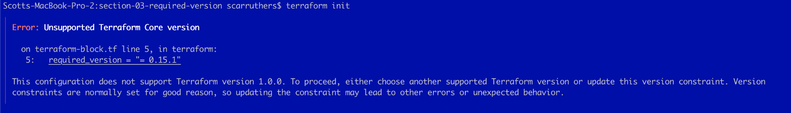

*Additional Operator Experimentation*

-   Within the Terraform manifest for this section exists a commented block specifying other operator test cases as depicted below
-   Update the manifest file’s “required_version” statement as detailed in this comment block to test additional operators
-   Following each statement update - re-issue the “terraform init” command and observe results

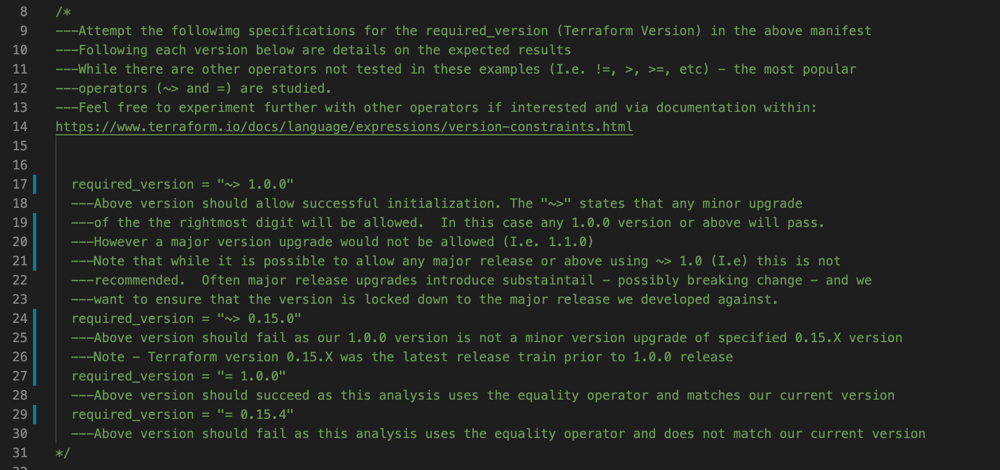

## **Section-04: Terraform Block - Require Provider Version**

| *Section Overview*  The requied_providers specifies the external providers (example = AWS) required by the Terraform manifest. The statements map each provider name to a source address and a version constraint. As will be demonstrated in the labs that follow - when a provider is updated/changed - we must execute the “terraform init -upgrade” command which provokes a download of the specified provider file into the .terraform directory While the flag is -upgrade - this option is necessary whether the change to the provider is an upgrade or a downgrade Documentation location for the hashicorp/aws provider that is the subject of this lab guide: <https://registry.terraform.io/providers/hashicorp/aws/latest/docs> |
|-----------------------------------------------------------------------------------------------------------------------------------------------------------------------------------------------------------------------------------------------------------------------------------------------------------------------------------------------------------------------------------------------------------------------------------------------------------------------------------------------------------------------------------------------------------------------------------------------------------------------------------------------------------------------------------------------------------------------------------------------|

*Subdirectory for Lab Section*

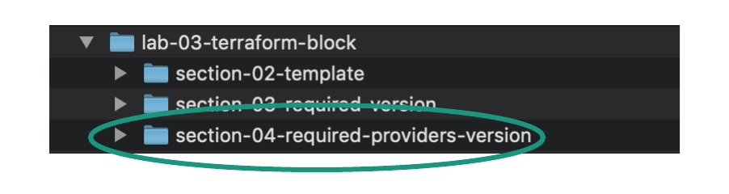

*Change Directory into Section Sub-Directory Containing Terraform Manifest Location*

| cd lab-03-terraform-block/section-04-required-providers-version/ |
|------------------------------------------------------------------|

*Open the Current Manifest and Explore Contents*

| Open the following file in your local code editor for this section:  terraform-block.tf |
|-----------------------------------------------------------------------------------------|

| *Notes Regarding Current Manifest required_providers aws Section*  Source Specification The manifest source is specified as “hashicorp/aws''. When the source is hashicorp this shorthand notation may be used. The short hand source specification states that the Hashicorp registry should be used to download the AWS provider. The Hashicorp registry long form location for the AWS provider is as follows: <https://registry.terraform.io/providers/hashicorp/aws/latest> If a non-Hashicorp registry were used the long form specification would be necessary.  Version Specification The manifest has an AWS version specified as “\~\> 3.0” When the manifest is initialized Terraform will search the registry for the latest version available in the 3.X train and install that latest revision |
|--------------------------------------------------------------------------------------------------------------------------------------------------------------------------------------------------------------------------------------------------------------------------------------------------------------------------------------------------------------------------------------------------------------------------------------------------------------------------------------------------------------------------------------------------------------------------------------------------------------------------------------------------------------------------------------------------------------------------------------------------------------------------------------------------------------|

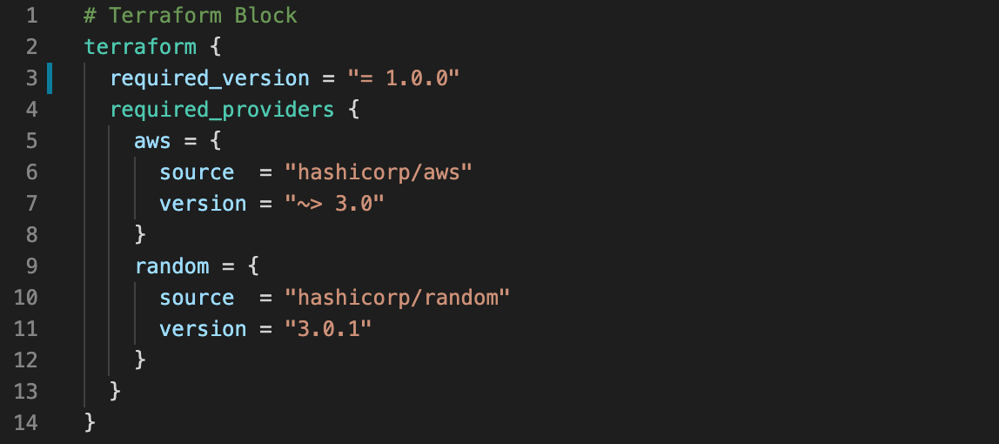

*Terraform Manifest Initialization with Provider Version “\~\>” Operator*

-   Execute the “terraform init” command and observe the results with the manifest specifying an AWS provider version of “\~\>3.0”
-   Note - detailing of the “random” provider will occur later within this section but we will observe that provider plug in install at this juncture as well

| terraform init |
|----------------|

*Observed Results*

-   Note that the AWS provider version 3.45.0 was downloaded and installed which at the time of this writing is the latest version of the 3.X train
-   The latest version could be validated by visiting the Terraform registry’s documentation page for this provider and which was shared previously in this section

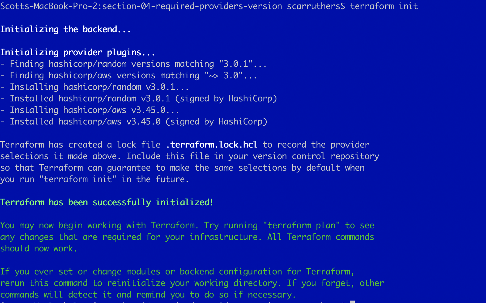

*Explore the Working Directory to Validate AWS Provider Version*

-   Following a Terraform initialization we may confirm a provider version by navigating the working directory such as:
-   Execute a “ls -al” command (“ls” within Windows PowerShell) to list the contents of the working directory and note the .terraform directory that has now been created

| ls -al |
|--------|

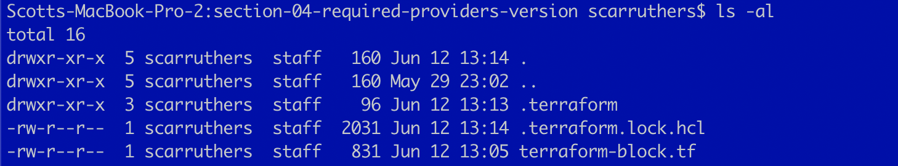

-   Navigate into the .terraform directory and then into the providers directory

| cd .terraform cd providers |
|----------------------------|

-   Execute a “ls” command to list the contents of the working directory and note the appearance of “registry.terraform.io” which is a sub-directory containing any provider integrations originating from the Terraform primary registry

| ls |
|----|

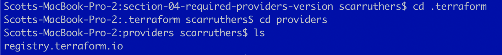

-   Change directory into registry.terraform.io

| cd registry.terraform.io |
|--------------------------|

-   Execute a “ls” command to list the contents of the working directory and note the appearance of “hashicorp”
-   Contents within this directory are provider files made available by Hashicorp

| ls |
|----|

-   Change directory into hashicorp

| cd hashicorp |
|--------------|

-   Execute a “ls” command to list the contents of the working directory and note the appearance of “aws”.
-   The random provider will be explored subsequently but for now we are interested in the AWS provider.

| ls |
|----|

-   Change directory into aws

| cd aws |
|--------|

-   Execute a “ls” command to list the contents of the working directory and note a directory with the name of the AWS version downloaded and implemented
-   This concludes our validation of the currently implemented version
-   Knowledge of the provider directory structure and as explores provides a mechanism of validating the currently installed provider integrations and the software version of those integrations

| ls |
|----|

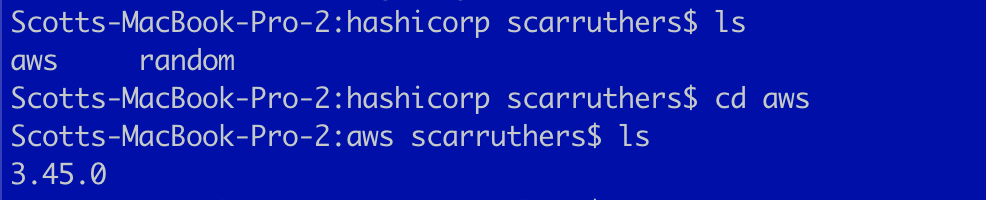

*.terraform.lock.hcl File*

-   In addition to the provider validation performed in the prior step - the .terraform.lock.hcl file provides a validation of the installed provider version
-   Open the file highlighted below within your code editor

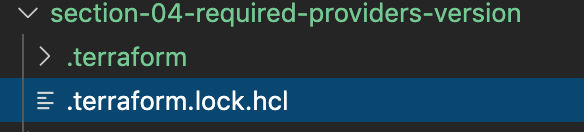

-   Within this file a validation of both the installed AWS provider version and the specification made in the Terraform manifest (I.e. \~\> 3.0) are visible
-   Additionally note Terraform logs to the console the initiation of this lock file when initialization (terraform init) is executed as depicted below

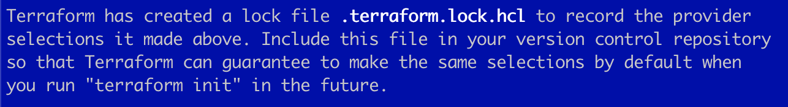

-   Final note of the lock file - the specification of the version in this lock file will prevent automatic provider software upgrades. Which is likely desirable in most circumstances to prevent new code from introducing issues. But if a provider software upgrade is desired - following the initial Terraform initialization - two options exist:
1.  Manually delete the lock file allowing the provider integration software to upgrade
2.  Provoke an initialization anew with the upgrade option (“terraform init -upgrade”

*Random Provider*

| *Random Provider Overview*  The Terraform random provider is defined as follows within the Terraform registry’s provider specific documentation  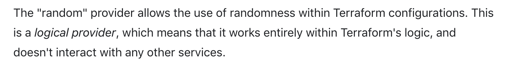  A use case for the random provider would be to generate randomized, unique IDs for created resources We do not need to be overly concerned further about the usage and details of the random provider as it will not be used in our manifest in future labs We are simply utilizing the random provider in this lab to further explore the version operators |
|----------------------------------------------------------------------------------------------------------------------------------------------------------------------------------------------------------------------------------------------------------------------------------------------------------------------------------------------------------------------------------------------------------------------------------------------------------------------------------------------------------------------------------------------------------------|

-   Within our current manifest the random provider version is set to a specific version (I.e. version = "3.0.1")
-   While we allowed the AWS provider to download/install the latest version of the 3.0 train using the operator of “\~\>” - the random provider version is hardcoded via the “=” operator and that specific version will be downloaded/installed

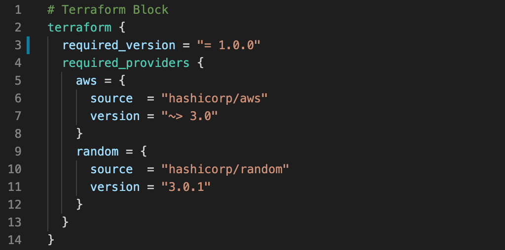

-   As we have already invoked the “terraform init” command with the random provider in place - we simply need to validate the provider version within the directory structure as we did prior for the AWS provider
-   To begin we need to navigate back to the providers directory
-   For clarity the desired current directory is captured/depicted below

-   Change directory into registry.terraform.io and then hashicorp - accomplished in one step below - and then list the contents of the directory

| cd registry.terraform.io/hashicorp/ ls |
|----------------------------------------|

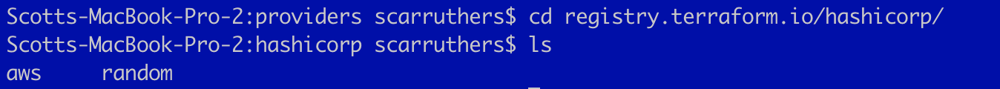

-   Change directory into random
-   List the contents of the random directory
-   Following execution of these commands \> it is revealed that a directory with the precise version specified in the manifest has been generated and thus proving the “=” operator of the version specification behaved as expected

| cd random ls |
|--------------|

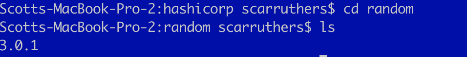

*Further Exploration of Provider Version Operators*

-   At the bottom of the manifest file exist a commented block detailing additional Provider Version operators as depicted below
-   If desired - change the random provider to one of these alternates for further operator exploration
-   Note the comment regarding the “terraform init -upgrade” necessity should you choose to actually provoke an upgrade/downgrade
-   Note - as mentioned in the manifest as well - the “terraform init -upgrade” command must be executed in the directory that “terraform init” was initially executed (I.e. lab-03-terraform-block/section-04-required-providers-version)

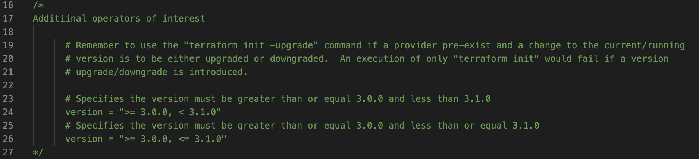

# Lab4 - **Fundamental Manifest Section - Providers Block**

## **Section-01: Overview**

*Section Overview*

-   Within this lab we will thoroughly explore the Providers Block of our HashiCorp Configuration Language (HCL) based manifests

| *Depth of Terraform Providers*  While the focus of this class and associated labs center on Terraform integrations with the AWS provider - a brief overview of the depth and scope of available providers is useful and illuminating for future needs Visit the following location for a listing of available Terraform providers: <https://registry.terraform.io/> From the landing page \> select the “Browse Providers” option as depicted below  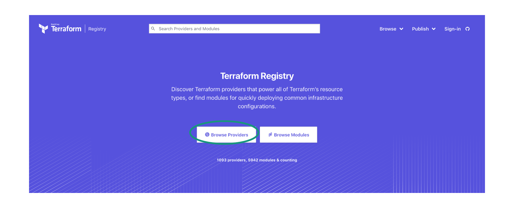  The resultant page provides a quick glimpse into the scope and depth of provider integrations available. Spanning across all major public cloud providers (AWS/Google Cloud/Azure) and into specific technologies like Cisco ASA’s, Active Directory, and DNS. Our labs will now proceed with the AWS provider exploration. We will revisit the registry documentation for AWS as the labs progress as knowledge of where to find provider specifications, options, and code examples is crucial for your Terraform projects.  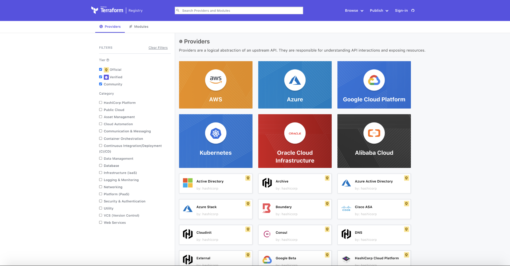 |
|--------------------------------------------------------------------------------------------------------------------------------------------------------------------------------------------------------------------------------------------------------------------------------------------------------------------------------------------------------------------------------------------------------------------------------------------------------------------------------------------------------------------------------------------------------------------------------------------------------------------------------------------------------------------------------------------------------------------------------------------------------------------------------------------------------------------------------------------------------------------------------------------------------------------------------------------------------------------------------------------------------------------------------------------------------------------------------------|

*GitHub Directory Code Location and Guidance*

-   The Github root directory for this lab and corresponding sub-directories are depicted below.
-   Use your own local copy of the repository for code execution and any code edits necessary.

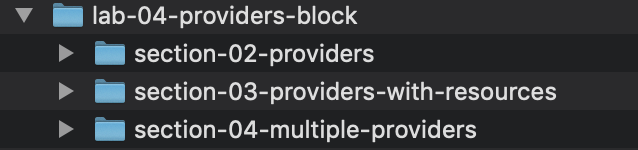

## **Section-02: Providers Block Template**

*Subdirectory for Lab Section*

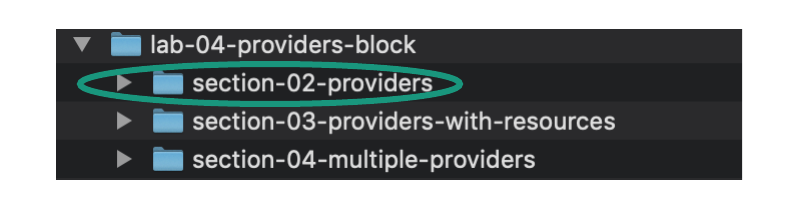

*Change Directory into Section Sub-Directory Containing Terraform Manifest Location*

| cd lab-04-providers-block/section-02-providers/ |
|-------------------------------------------------|

*Open the Current Manifest and Explore Contents*

| Open the following file in your local code editor for this section:  rproviders-block.tf  |
|-------------------------------------------------------------------------------------------|

| Within this section our focus will be on the following code and a simplistic providers block The Terraform manifest file is commented thoroughly providing details of each new statement introduced As the intent is to build upon previously introduced code - working towards a fully functional manifest - the prior lab’s Terraform block is included within source code To ensure clarity on the code segments as we progress - consider the relationships thus far as: Terraform Block - established Terraform version (optional), required providers and their software locations/version Provider Block - requisite details to connect to required providers declared previously (in Terraform block) such as authentication info to allow integration with provider |
|------------------------------------------------------------------------------------------------------------------------------------------------------------------------------------------------------------------------------------------------------------------------------------------------------------------------------------------------------------------------------------------------------------------------------------------------------------------------------------------------------------------------------------------------------------------------------------------------------------------------------------------------------------------------------------------------------------------------------------------------------------------------------|

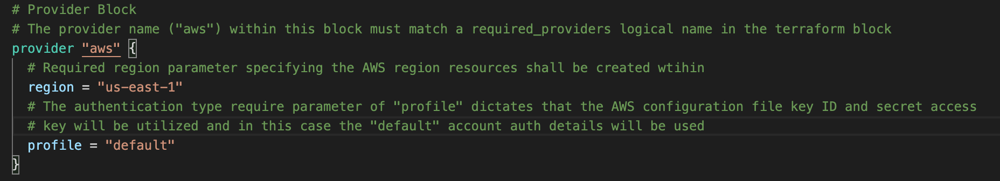

| *Authentication Types*  Within the following AWS provider documentation the snippet depicted provides guidance into our selection of an authentication type: <https://registry.terraform.io/providers/hashicorp/aws/latest/docs>   |
|-------------------------------------------------------------------------------------------------------------------------------------------------------------------------------------------------------------------------------------------------------------------------------------------------------------------------------------------------------------------------|

| *Shared Credentials File*  Within our example Providers block the use of the Shared Credentials File methodology will be utilized The Shared Credentials File comes from the AWS Configure utility which we ran during the AWS CLI setup As discussed in the AWS CLI setup - when the AWS Configure utility is run and user input is collected for access key ID, secret access key, region, and default output type - those settings are stored within an “.aws” directory within the user’s home directory. Examples of these settings are depicted below. The stored credentials in these files - and specifically the default account - are utilized within the Terraform Providers block and called via the “profile = "default" declaration  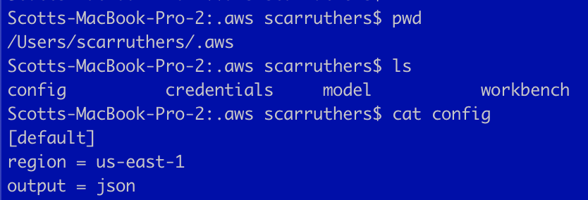  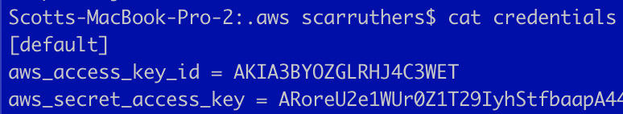 |
|-----------------------------------------------------------------------------------------------------------------------------------------------------------------------------------------------------------------------------------------------------------------------------------------------------------------------------------------------------------------------------------------------------------------------------------------------------------------------------------------------------------------------------------------------------------------------------------------------------------------------------------------------------------------------------------------------------------------------------------------------------------------------------------------------------------------------------------------------------|

*Workflow Command Execution*

-   Execute the following commands to initialize, validate, display plan, and eventually create the resources of the Terraform manifest
-   Expected outcome accompanies/follows each command set
-   The “terraform plan” execution will respond with “No changes. Your infrastructure matches the configuration.” as no resources are created in the manifest.

| terraform init |
|----------------|

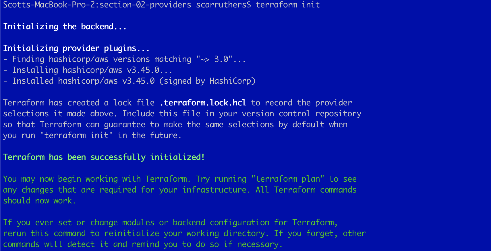

| terraform validate |
|--------------------|

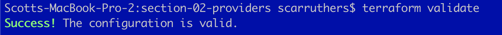

| terraform plan |
|----------------|

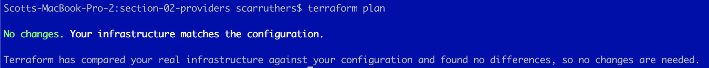

| Note that the terraform init, validate, and plan perform no actual validation of the connection/authentication in the provider (AWS in this circumstance) We could delete the .aws directory - which holds our AWS credentials - and “terraform plan” would succeed The subsequent sections in this lab will add resources - while not the focus of our Providers block exploration - for the purpose of validating provider connection/authentication |
|--------------------------------------------------------------------------------------------------------------------------------------------------------------------------------------------------------------------------------------------------------------------------------------------------------------------------------------------------------------------------------------------------------------------------------------------------------|

## **Section-03: Providers Block with Resources**

*Subdirectory for Lab Section*

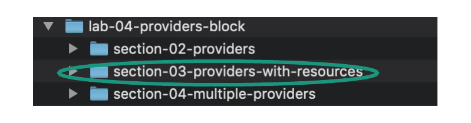

*Change Directory into Section Sub-Directory Containing Terraform Manifest Location*

| cd lab-04-providers-block/section-03-providers-with-resources/ |
|----------------------------------------------------------------|

*Open the Current Manifest and Explore Contents*

| Within this section our focus is on the Providers block with the introduction of a simple resource AWS resource creation and the Resource block will be explored in much deeper depth in subsequent labs The intent of this lab is to reinforce the Provider block syntax/usage and allow a resource to be created to ensure further that the provider block is configured properly and allows the resource creation in the specific AWS region (us-east-1) The Terraform manifest file is commented thoroughly providing details of each new statement introduced |
|--------------------------------------------------------------------------------------------------------------------------------------------------------------------------------------------------------------------------------------------------------------------------------------------------------------------------------------------------------------------------------------------------------------------------------------------------------------------------------------------------------------------------------------------------------------------|

| Open the following file in your local code editor for this section:  providers-block.tf  Edit the code as necessary for your own Student Pod as instructed in the commented section of the manifest that begins with - “\#\#\#Note regarding lab usage”. Visual highlights are provided in the depictions below for further clarification of the location of necessary per pod edits. |
|---------------------------------------------------------------------------------------------------------------------------------------------------------------------------------------------------------------------------------------------------------------------------------------------------------------------------------------------------------------------------------------|

| *AWS Resource Specifications*  While exploration of AWS resources is not the primary focus of this lab we introduce resource documentation/specifications briefly and reinforce such concepts later Pertaining to the AWS VPC resource in the above Terraform manifest - the specification may be explored via the following: Navigate to the Terraform Registry Providers page and select AWS <https://registry.terraform.io/browse/providers> From the AWS Provider page \> select Documentation as depicted below  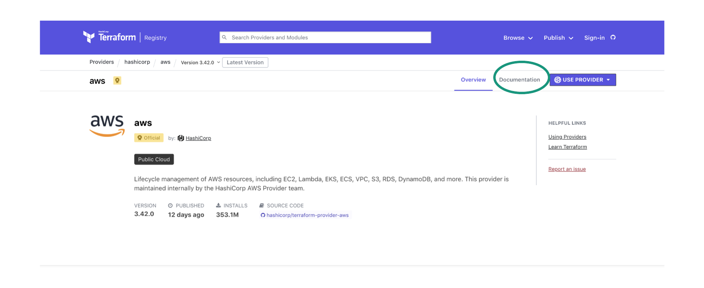  From the AWS documentation page \> scroll down on the Resources types listed in the left hand menu \> isolating “VPC” (open if necessary) \> Resources (open if necessary) \> aws_vpc Navigation described above is depicted below for additional clarity As our desire within this Terraform manifest is to create a VPC - aws_vpc is the resource of interest Once the resource is opened - explore the Basic Usage example Further explore the Argument Reference which specifies Required and Optional arguments. Note that we have specified the only required argument in our manifest file (cidr_block)  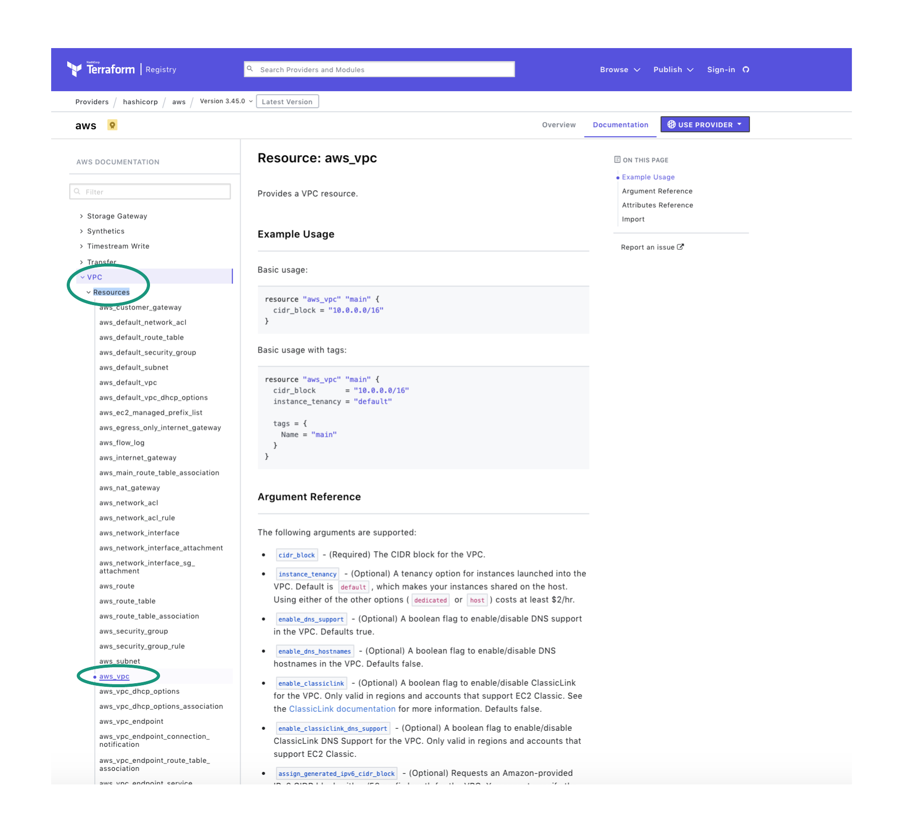 |
|--------------------------------------------------------------------------------------------------------------------------------------------------------------------------------------------------------------------------------------------------------------------------------------------------------------------------------------------------------------------------------------------------------------------------------------------------------------------------------------------------------------------------------------------------------------------------------------------------------------------------------------------------------------------------------------------------------------------------------------------------------------------------------------------------------------------------------------------------------------------------------------------------------------------------------------------------------------------------------------------------------------------------------------------------------------------------------------------------------------------------------------------------------------------------------------------------------------------------------------------------------------------------------------------------------------------------------------------------------------------------------------------------------------|

*Workflow Command Execution*

-   Execute the following commands to initialize, validate, display plan, and apply of Terraform manifest
-   Expected outcome accompanies/follows each command set

| terraform init |
|----------------|

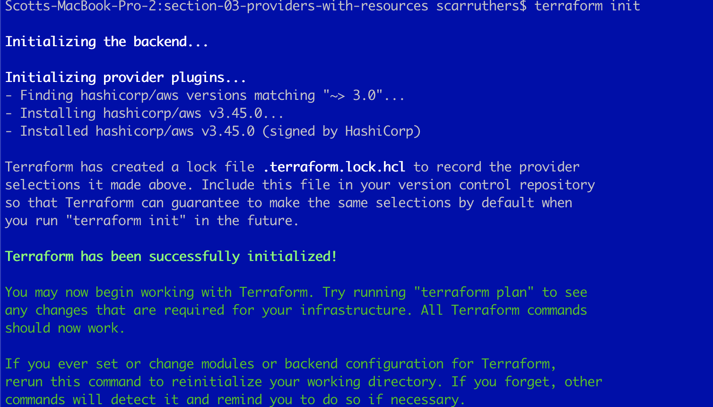

| terraform validate |
|--------------------|

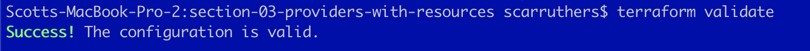

| terraform plan |
|----------------|

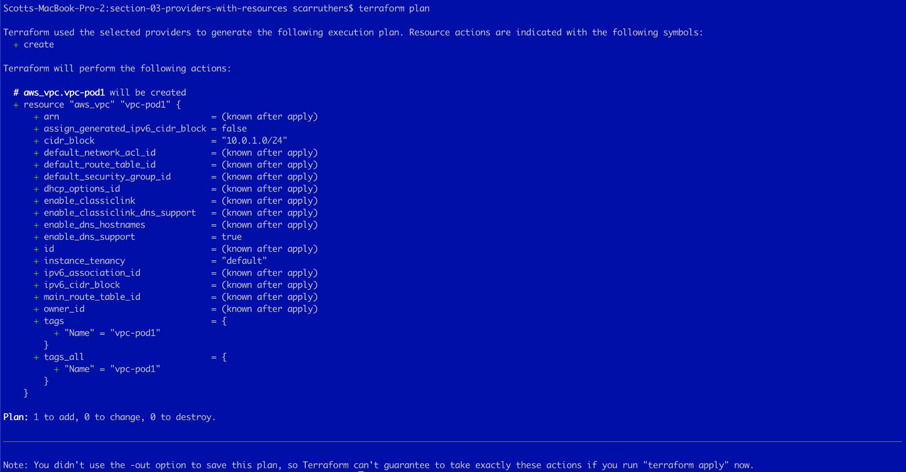

| terraform apply |
|-----------------|

-   Note - as seen in the depiction below - the apply command will pause and requires a user confirmation to process.
-   Respond “yes” to this prompt to allow resource creation
-   In future exercises - a switch of -auto-approve (“terraform apply -auto-approve”) is available if desired and will skip the user confirmation prompt and immediately create the resource

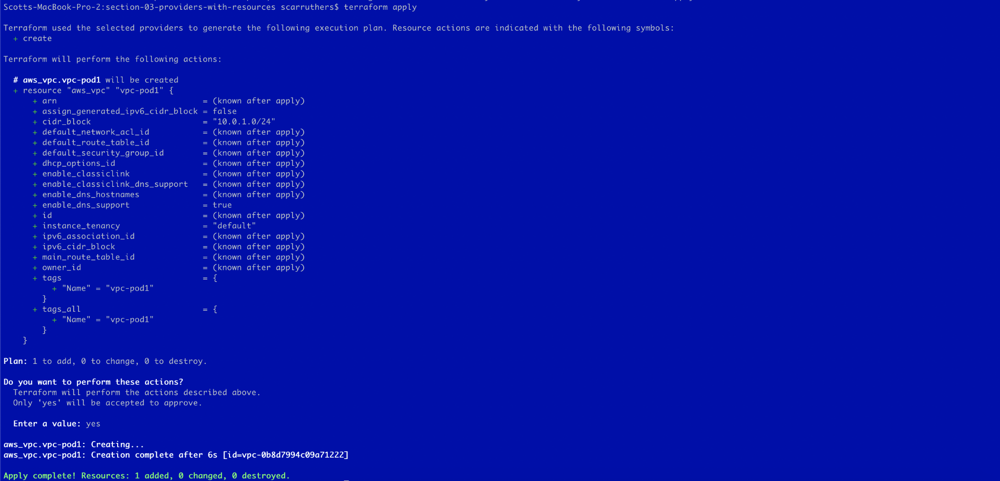

| With the apparent successful completion of our resource (VPC) creation - we now have validation that the Providers code block is executing properly and thru connectivity/authentication with the provider (AWS) We will go one step further subsequently with validation and confirm the resource creation from the AWS Console |
|----------------------------------------------------------------------------------------------------------------------------------------------------------------------------------------------------------------------------------------------------------------------------------------------------------------------------------|

*Confirm Resource Creation from AWS Console*

-   Within the AWS Console \> type “VPC” from the console’s search box \> and select the first search result (“VPC”) as depicted below

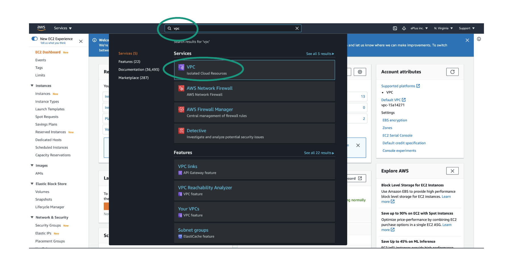

-   Select “VPCs” from the VPC Console page as depicted below

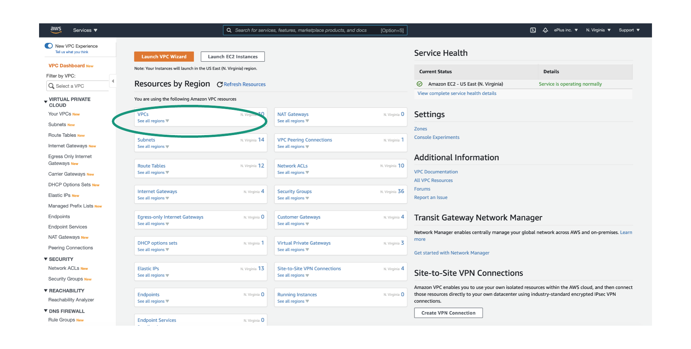

-   Isolate the VPC created in your lab instance typing the name of the VPC (I.e. vpc-pod-\<pod-number\>) into the VPC console search box and then select the returned search result as depicted below

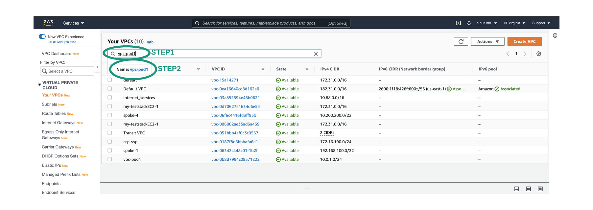

-   The existence of the VPC lab specific instance validates the Terraform resource creation was successful and this concludes our validation from with the AWS console

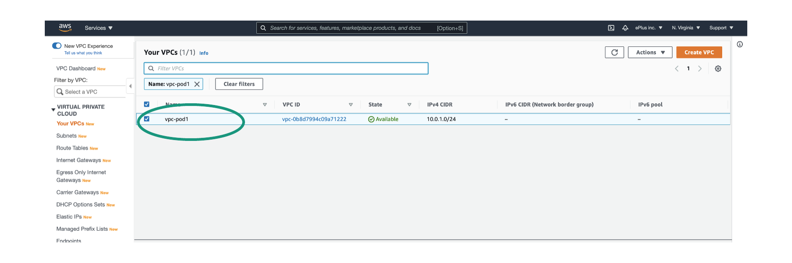

*Review “terraform.tfstate” File*

-   Following completion our first Terraform resource creation - we will briefly explore a JSON state file that is created representing the resource specs
-   From within the directory that the “terraform apply” command was executed from - notice the addition of a “terraform.tfstate” file as depicted below and within our code editor

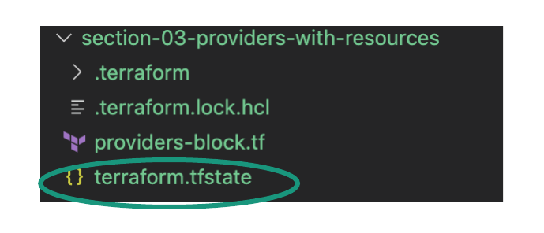

-   Open this file for a brief review

| No action is necessary in this step but it is valuable knowledge that this file exists and that represents the specs of the resource created by the apply command and including interesting intel such as: The AWS ARN (globally unique resource name) of the created instance The cidr_block (as specified in our manifest) VPC ID Tags associated with the resource allowing ease of isolation |
|--------------------------------------------------------------------------------------------------------------------------------------------------------------------------------------------------------------------------------------------------------------------------------------------------------------------------------------------------------------------------------------------------|

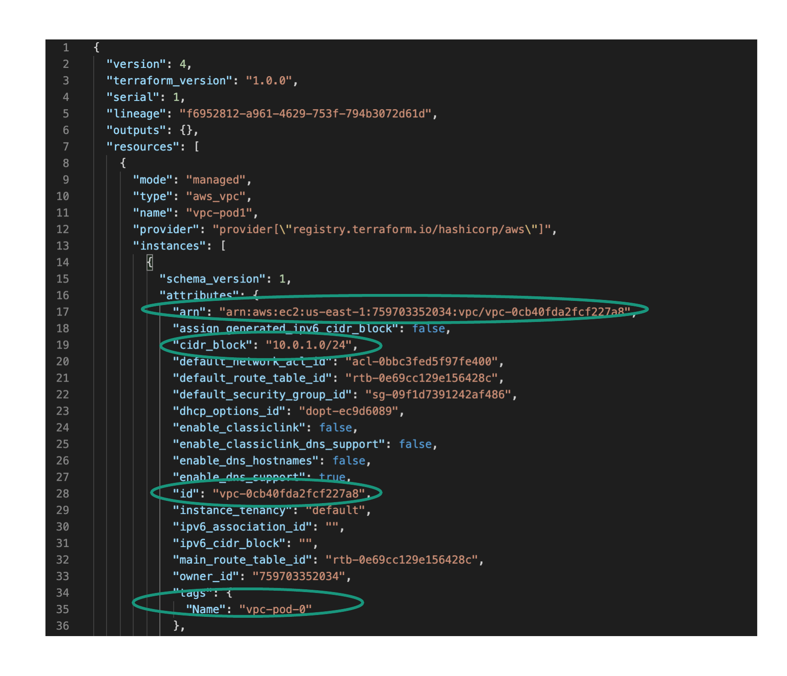

*Resource Deletion/Clean Up*

-   With our lab now complete we will delete the resources created within AWS
-   As with the apply command - the default behavior of the destroy command is to prompt the user to confirm deletion intent. Type “yes” to proceed.
-   The -auto-approve switch is available for the destroy command if desired in the future (terraform destroy -auto-approve)

| terraform destroy |
|-------------------|

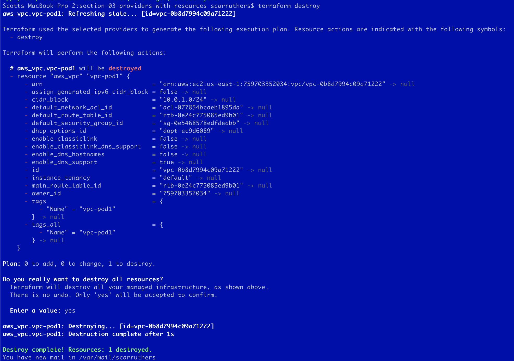

## **Section-04: Providers Block with Multiple Providers**

*Subdirectory for Lab Section*

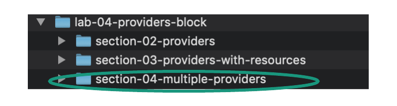

*Change Directory into Section Sub-Directory Containing Terraform Manifest Location*

| cd lab-04-providers-block/section-04-multiple-providers/ |
|----------------------------------------------------------|

*Open the Current Manifest and Explore Contents*

-   Open the Terraform manifest for this section within your code editor for initial exploration and familiarity as depicted below

| Two provider blocks exist in this code sample One provider block allows resource creation in the AWS “us-east-1” region while the other provider block allows resource creation in the AWS “us-east-2” region The introduction of the alias command will allow the calling of the non-default provider as desired |
|-------------------------------------------------------------------------------------------------------------------------------------------------------------------------------------------------------------------------------------------------------------------------------------------------------------------|

| Open the following file in your local code editor for this section:  providers-block.tf  Edit the code as necessary for your own Student Pod as instructed in the commented section of the manifest that begins with - “\#\#\#Note regarding lab usage”. Visual highlights are provided in the depictions below for further clarification of the location of necessary per pod edits. |
|---------------------------------------------------------------------------------------------------------------------------------------------------------------------------------------------------------------------------------------------------------------------------------------------------------------------------------------------------------------------------------------|

*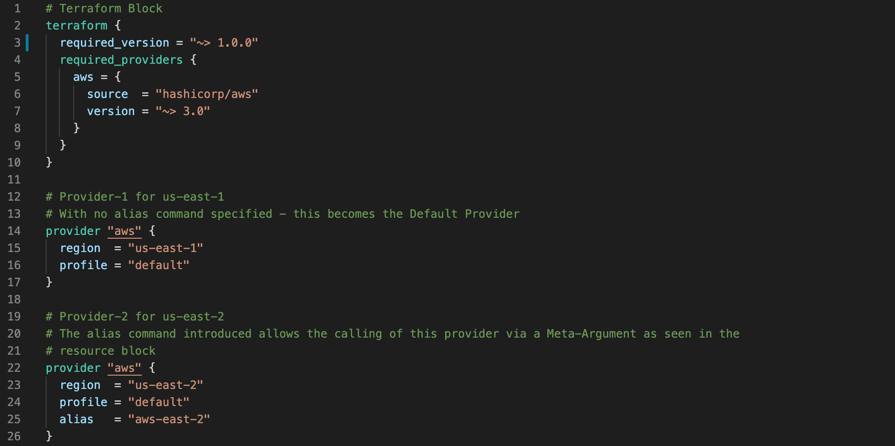*

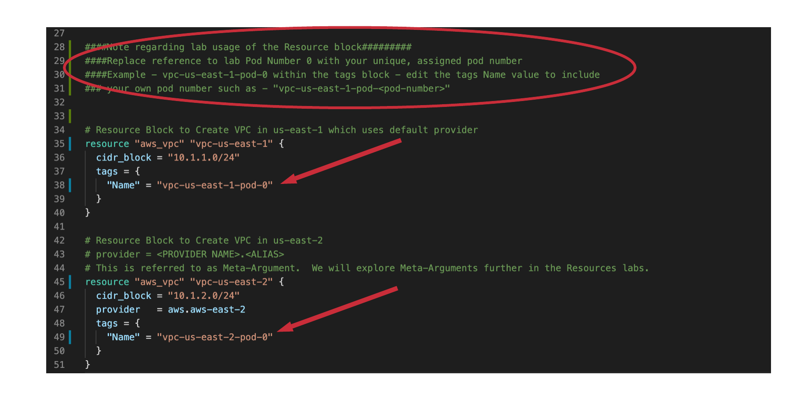

*Workflow Command Execution*

-   Execute the following commands to initialize, validate, display plan, and apply of Terraform manifest
-   Expected outcome accompanies/follows each command set

| terraform init |
|----------------|

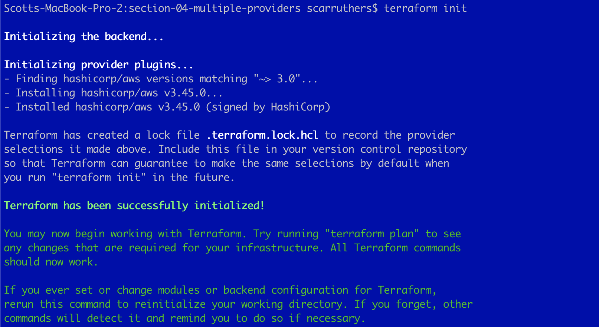

| terraform validate |
|--------------------|

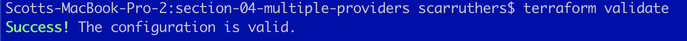

| terraform plan |
|----------------|

-   Terraform plan validates that two resources (VPCs) will be created - one in the region of us-east-1 and the other in region us-east-2

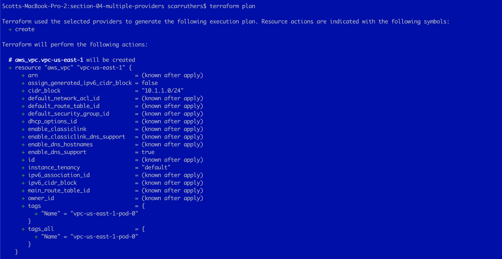

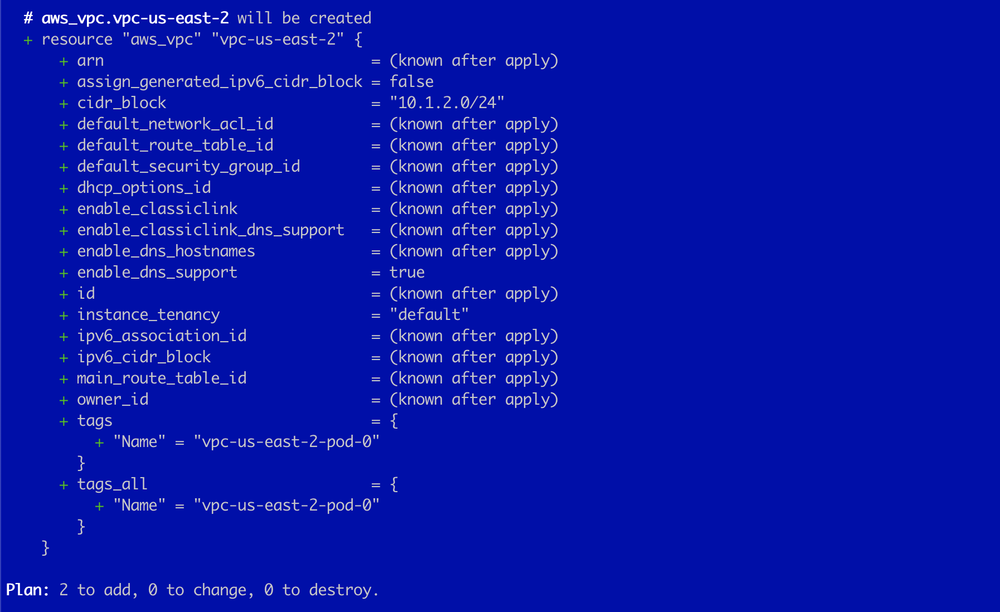

| terraform apply -auto-approve |
|-------------------------------|

-   Truncated output only displaying resultant

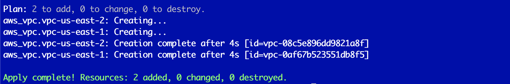

*Confirm Resource Creation from AWS Console*

-   \~Within the AWS Console \> type “VPC” from the console’s search box \> and select the first search result (“VPC”) as depicted below

-   Select “VPCs” from the VPC Console page as depicted below

-   First ensure that the us-east-1 region (also known as N.Virginia) is the selected region of the console as depicted in STEP1 below
-   Isolate the VPC created in your lab instance typing the name of the VPC (I.e. vpc-us-east-1-pod-\<pod-number\>) into the VPC console search box and then select the returned search result as depicted below

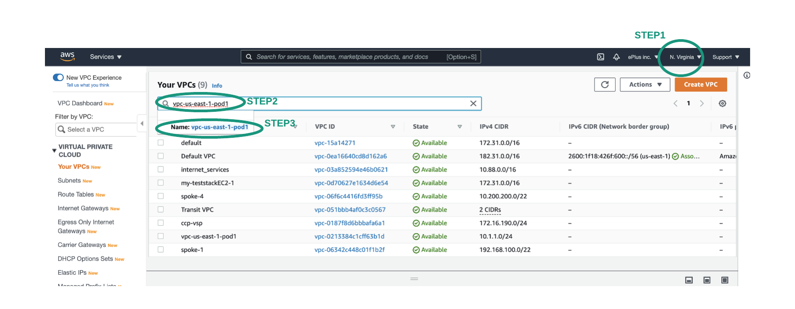

-   The existence of the VPC lab specific instance validates the Terraform resource creation was successful in us-east-1
-   We will proceed in making the same validation of the VPC destined for us-east-2
-   Ensure that the us-east-2 region (also known as Ohio) is the selected region of the console as depicted in STEP1 below
-   Note - prior to searching for the us-east-2 VPC in the next step - it may be necessary to clear the prior search for the us-east-1 VPC - this may be done by clicking “Clear Filters” as a cursory step
-   Isolate the VPC created in your lab instance typing the name of the VPC (I.e. vpc-us-east-2-pod-\<pod-number\>) into the VPC console search box and then select the returned search result as depicted below

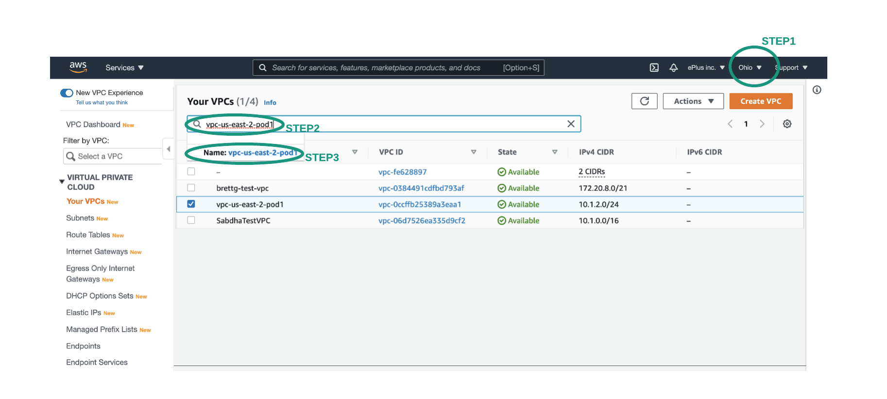

-   The existence of the VPC lab specific instance validates the Terraform resource creation was successful in us-east-2
-   In addition this validates the primary object of this lab section - use of a secondary provider (in this case a second AWS provider) defined with an alias and the technique to then create a resource by calling that secondary provider via the alias

*Clean Up*

-   As a majority of our labs provoke us-east-1 resources - set the AWS Console region back to us-east-1/N.Virginia as depicted below

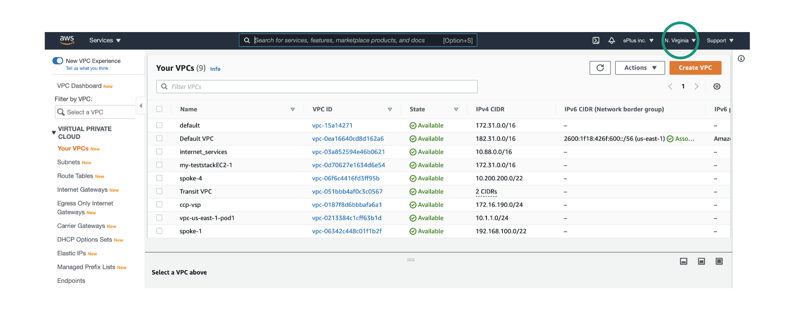

-   Destroy the Terraform provoked resources as we have reached the end of this lab with full validations conducted

| terraform destroy -auto-approve |
|---------------------------------|

-   Truncated output showing resultant only

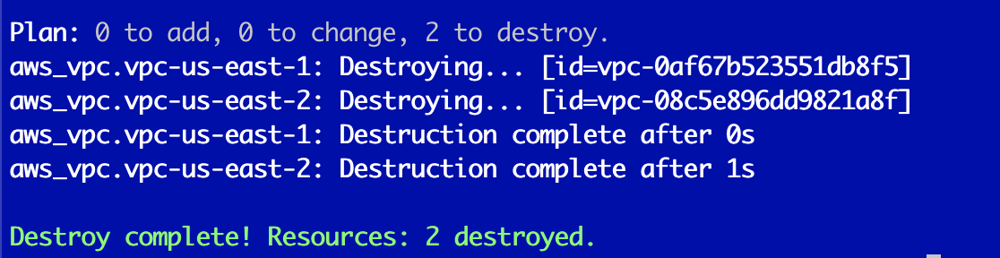

# Lab5 - **Fundamental Manifest Section - Resource Block**

## **Section-01: Overview**

*Section Overview*

-   Within this lab we will thoroughly explore the Resource Block of our HashiCorp Configuration Language (HCL) based manifests

*GitHub Directory Code Location and Guidance*

-   The Github root directory for this lab and corresponding sub-directories are depicted below.
-   Use your own local copy of the repository for code execution and any code edits necessary.

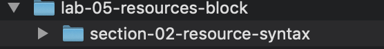

## **Section-02: Resource Block Template**

*Subdirectory for Lab Section*

*Change Directory into Section Sub-Directory Containing Terraform Manifest Location*

| cd lab-05-resources-block/section-02-resource-syntax/ |
|-------------------------------------------------------|

*Open the Current Manifest and Explore Contents*

| Within this section we use focus on a rather simplistic Resource block to break down the primary statements and intents The Terraform manifest file is commented thoroughly within the Resource block providing details of each new statement introduced As the intent is to build upon previously introduced code - working towards a fully functional manifest - the prior lab’s Terraform and Provider block are included within source code To ensure clarity on the code segments as we progress - consider the relationships thus far as: Terraform Block - established Terraform version (optional), required providers and their software locations/version Provider Block - requisite details to connect to required providers declared previously (in Terraform block) such as authentication info to allow integration with provider Resource Block - with only a single Provider (which is the default provider with no alias specification) the resources within this code block will be defined thoroughly and invoked within that default provider (AWS us-east-1) |
|-----------------------------------------------------------------------------------------------------------------------------------------------------------------------------------------------------------------------------------------------------------------------------------------------------------------------------------------------------------------------------------------------------------------------------------------------------------------------------------------------------------------------------------------------------------------------------------------------------------------------------------------------------------------------------------------------------------------------------------------------------------------------------------------------------------------------------------------------------------------------------------------------------------------------------------------------------------------------------------------------------------------------------------------------------------------------------------|

| Open the following file in your local code editor for this section:  resources-block.tf  Edit the code as necessary for your own Student Pod as instructed in the commented section of the manifest that begins with - “\#\#\#Note regarding lab usage”. Visual highlights are provided in the depictions below for further clarification of the location of necessary per pod edits. |
|---------------------------------------------------------------------------------------------------------------------------------------------------------------------------------------------------------------------------------------------------------------------------------------------------------------------------------------------------------------------------------------|

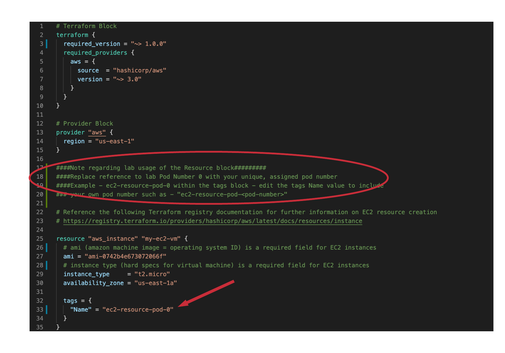

*Workflow Command Execution*

-   Execute the following commands to initialize, validate, display plan, and eventually create the resources of the Terraform manifest
-   Expected outcome accompanies/follows each command set

| terraform init |
|----------------|

| terraform validate |
|--------------------|

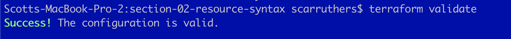

| terraform fmt |
|---------------|

| The “terraform fmt” option has not been used in prior labs and is introduced for future use “fmt” is a formatting option which structures a Terraform manifest into proper spacing/structuring The “fmt” option will not cure syntaxical errors - I.e. if an argument is not spelled properly or a required argument is missing - but only aids in alignment and structuring of the code When manifests are written in a code editor (I.e. Visual Studio Code) with a Terraform plugin - as discussed in prior labs - the “fmt” option may be of little value as the code editor/plugin likely will auto format and correct structuring issues In the example below - the Visual Studio Code \> Hashicorp Terraform plug was disabled to negate auto-correction and then structuring/spacing was intentionally skewed to allow the “fmt” option the opportunity to make a correction - thus the output of “resources-block.tf” indicating that file was formatted Most likely in your scenario - if a code editor is in use and no structural issues need adjustment - the “terraform fmt” command will return will no output - indicating no formatting adjustments were made but introducing the command for possible future use when a code editor is not available |
|------------------------------------------------------------------------------------------------------------------------------------------------------------------------------------------------------------------------------------------------------------------------------------------------------------------------------------------------------------------------------------------------------------------------------------------------------------------------------------------------------------------------------------------------------------------------------------------------------------------------------------------------------------------------------------------------------------------------------------------------------------------------------------------------------------------------------------------------------------------------------------------------------------------------------------------------------------------------------------------------------------------------------------------------------------------------------------------------------------------------------------------------------------------------------------------------------------------------------------------------------------------------|

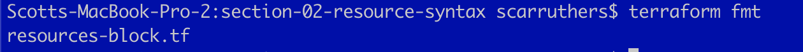

| terraform plan |
|----------------|

| Terraform plan validates that one resources (EC2) will be created with the AMI, Availability Zone, Instance Type, and Tags specified in the Terraform manifest Additionally note the appearance and display of the block labels from the manifest as highlighted in the depiction below "aws_instance" "my-ec2-vm" from manifest aws_instance.my-ec2-vm in dot notation in the output Output truncated to only display EC2 primary attributes to be created |
|-------------------------------------------------------------------------------------------------------------------------------------------------------------------------------------------------------------------------------------------------------------------------------------------------------------------------------------------------------------------------------------------------------------------------------------------------------------|

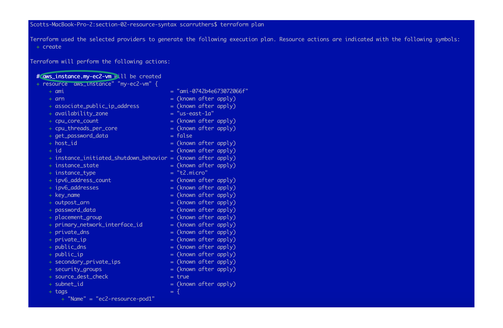

| terraform apply -auto-approve |
|-------------------------------|

-   Truncated output only displaying resultant

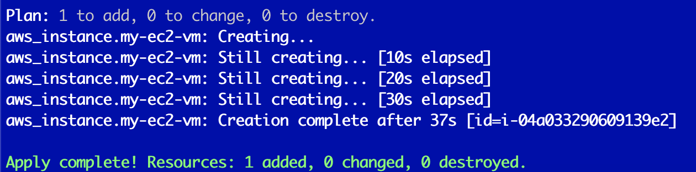

-   From your terminal - list the contents of the current working directory to display the creation of the following files provoked by “terraform apply”

| Expected files/directories and their purpose: Terraform.tfstate File containing Terraform state and resource spec/configuration info .terraform Directory containing providers and their installed versions .terraform.lock.hcl File containing provider versions, constraints for provider versions, and provider hash values used to ensure software has not been tampered with |
|-----------------------------------------------------------------------------------------------------------------------------------------------------------------------------------------------------------------------------------------------------------------------------------------------------------------------------------------------------------------------------------|

-   Note - from Windows PowerShell use “ls” instead of the command displayed below

| ls -al |
|--------|

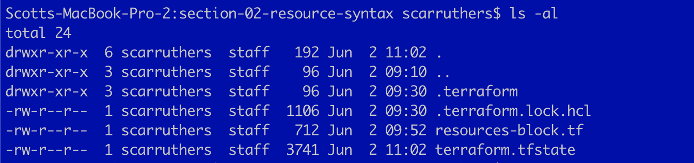

*Confirm Resource Creation from AWS Console*

-   Within the AWS Console \> type “EC2” from the console’s search box \> and select the first search result (“EC2”) as depicted below

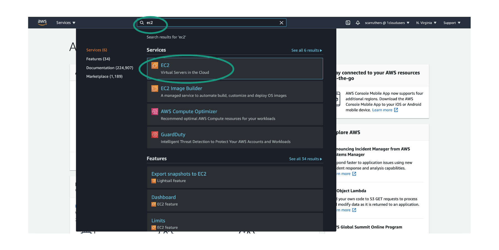

-   Select “Instances (running)” from the EC2 Console page as depicted below

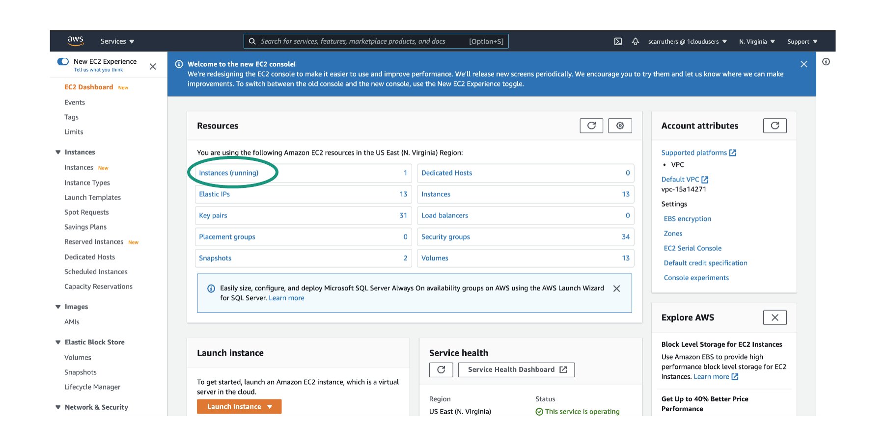

-   Within the Terraform manifest we assigned a Tag which may be used for ease of isolating our specific resource
-   From the EC2 Console’s \> “Filter instances” search box \> type the Name tag value defined within the manifest (I.e. ec2-resource-pod-\<pod-number\>) and then select the returned search result as depicted below

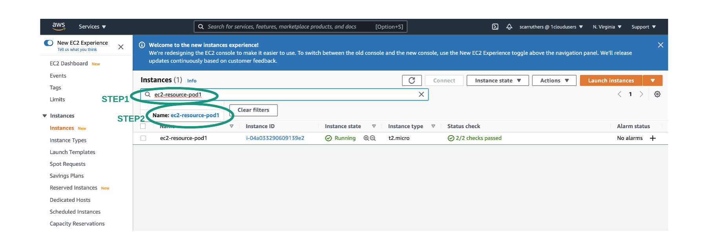

-   With the EC2 instance isolated \> check the box next to the instance to reveal additional details
-   We now have confirmation of the following as depicted below:
    -   The EC2 instance was created and is running
    -   The Instance Type is t2.micro as specified in the manifest
    -   With the Networking tab selected \> validation that the availability zone is us-east-1a as specified in the manifest

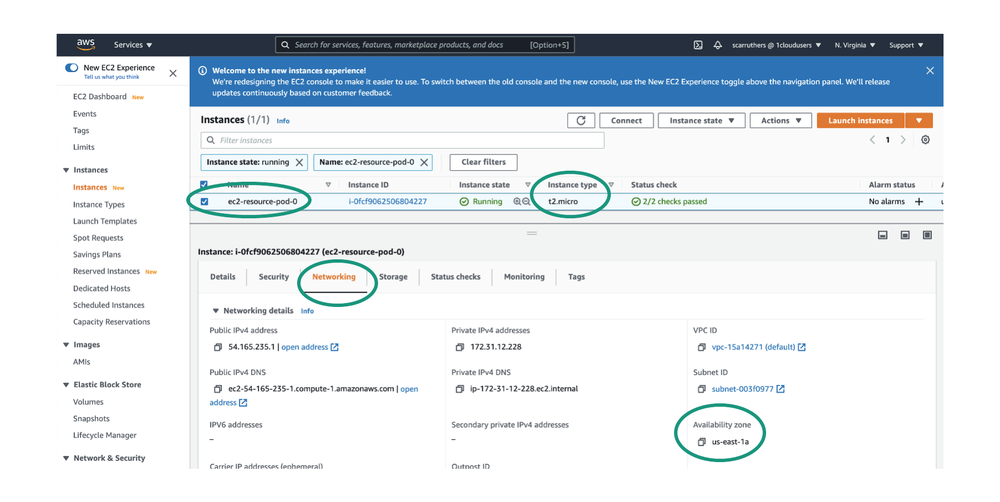

| Do NOT use the “terraform destroy” command within this section as we will use the pre-existing EC2 resource as the target and demonstration of a Terraform upgrade activity in the next section |
|-------------------------------------------------------------------------------------------------------------------------------------------------------------------------------------------------|

## **Section-03: Resource Update in Place**

| *Section Overview*  Within this section our focus is a minor update of the prior section’s Terraform manifest When deployed the minor update will provoke a Terraform “Update in Place” sequence The essence of an “Update in Place” resource modification is provoking a change that does not interrupt resource service and does not require replacement of the instance Only certain change activities are capable of Update in Place - typically minor updates - whereas more significant updates such as a change in hardware/instance type will require a “Destroy and Replace” activity type which will be the topic of the next section |
|-------------------------------------------------------------------------------------------------------------------------------------------------------------------------------------------------------------------------------------------------------------------------------------------------------------------------------------------------------------------------------------------------------------------------------------------------------------------------------------------------------------------------------------------------------------------------------------------------------------------------------------------------|

*Subdirectory for Lab Section*

*Open the Section’s Terraform Manifest and Explore Contents*

| As the file from last section (Lab5 \> Section-02) will be utilized in this section to demonstrate a Terraform Resource Update - it is likely the file is open within your code editor.  If the file has been closed - re-open the Terraform file in the code editor. |
|-----------------------------------------------------------------------------------------------------------------------------------------------------------------------------------------------------------------------------------------------------------------------|

-   Make the following minor edit to the resource \> tags block
-   Edit is represented in the depiction that follows

| "Name" = "ec2-resource-update-pod-\<pod-number\>" |
|---------------------------------------------------|

-   Only the Resource block - the target of the necessary change - is displayed below with updated field highlighted

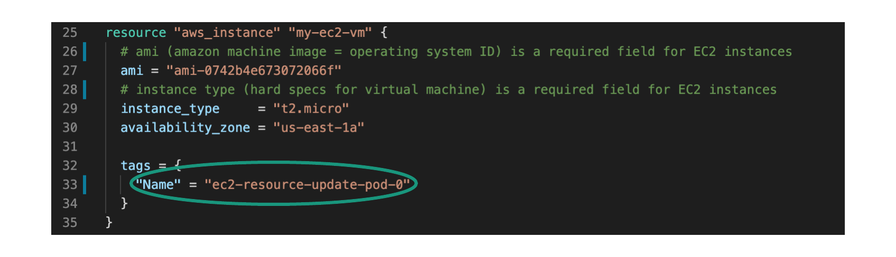

*Review Terraform State Prior to Update*

-   In your code editor and within the current working directory (section-02-resource-syntax) \> open the “terraform.tfstate” file
-   As discussed prior - the tfstate file is created after the “terraform apply” command is executed and represents the Terraform desired state of the AWS resource
-   Note specifically the value of the tags \> Name value as depicted below
    -   For ease of location in the state file - note that tags definitions are near line 92
    -   The tag of Name will have a different value in your environment based on pod number (I.e. “ec2-resource-pod-\<pod-number\>”)
-   The state file will be revisited post Terraform update in place activity as one of our validation points of the intended change

*Workflow Command Execution*

-   Note that we are not executing the “terraform init” nor “terraform validate” commands in this circumstance as we are updating a pre-existing resource
-   Execute the “terraform plan” command and observe the output as it relates to an update activity

| terraform plan |
|----------------|

-   Terraform plan in an update in place scenario will display precisely the attributes that will be modified if the manifest is applied
-   In the summation near the bottom of the output - plan clearly indicates that 1 resource will be changed and no new resources will be created in this plan is executed

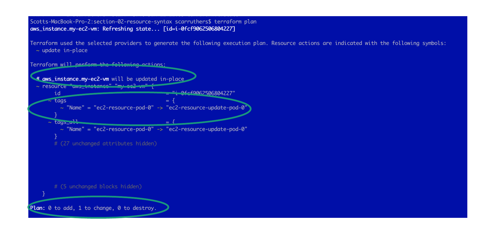

-   Invoke the resource update with terraform apply

| terraform apply -auto-approve |
|-------------------------------|

-   Note the highlighted sections of the depiction below and within your own output from the “terraform apply” command when conducting an “Update in Place”

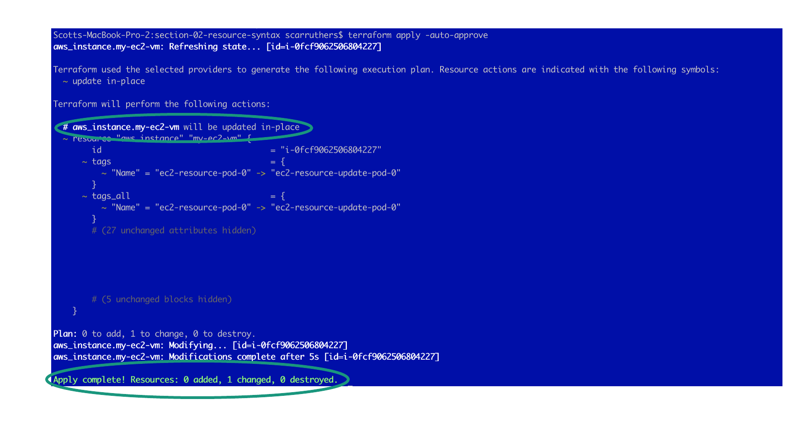

| *Review of Desired State and Current State*  The Update in Place operation allows a review of concepts within Terraform referred to as: Desired State The state represented in the .tfstate file in the local Terraform directory Current State The actual state of the resource as it exists within AWS We will ensure that both the Desired State and the Current State were updated properly by the Update in Place procedure |
|----------------------------------------------------------------------------------------------------------------------------------------------------------------------------------------------------------------------------------------------------------------------------------------------------------------------------------------------------------------------------------------------------------------------------------|

*Desired State*

-   Within your code editor \> open the “terraform.tfstate” file in the current working directory (section-02-resource-syntax)
-   Note that our Desired State has been updated as depicted below

*Current State*

-   If your AWS console remains where we left off in prior steps the depiction below should be displayed
-   If your AWS console timed out or there has been navigation away from the EC2 console \> follow the AWS console navigation within Section-02 of this lab to gain access to the EC2 console

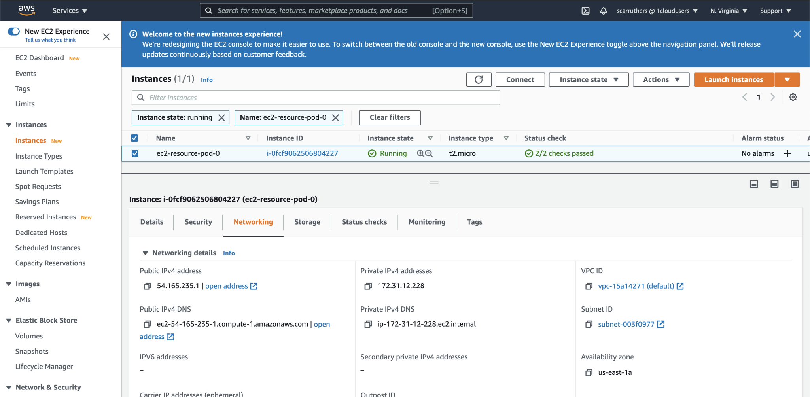

-   Press the refresh button as depicted in STEP1 below
-   Then clear the current filters as depicted in STEP2 below

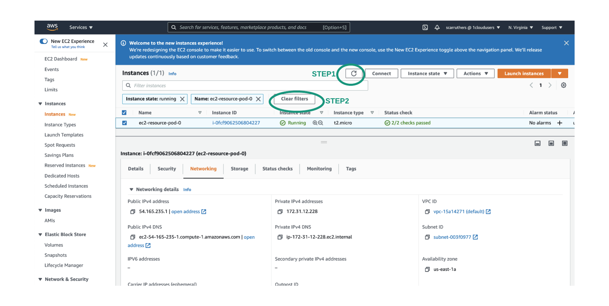

-   Enter the Name tag of the EC2 Resource as should have updated “ec2-resource-update-pod-\<pod-number\>” into the “Filter instance” box and pressing enter as depicted below
-   Confirmation of the Desired State has been completed with the validation that the running AWS resource has been impacted by the Terraform Update in Place activity which was the simple change to the Name tag value

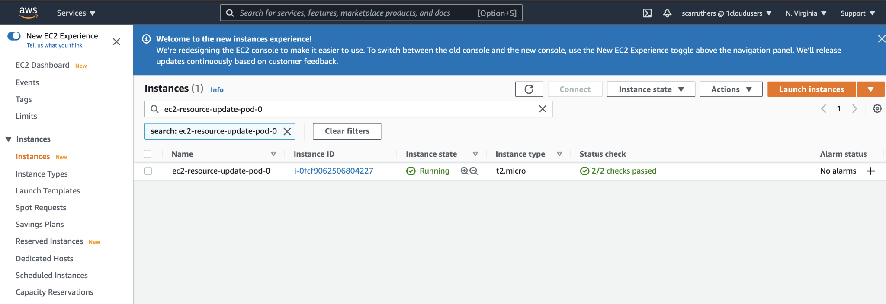

| Do NOT use the “terraform destroy” command within this section as the pre-existing EC2 resource will be utilized to explore the concept of Terraform “Destroy and Recreate” in the next section |
|-------------------------------------------------------------------------------------------------------------------------------------------------------------------------------------------------|

## **Section-04: Resource Destroy and Replace**

| *Section Overview*  Within this section our focus is a significant update - change of the EC2 instance’s Availability Zone - of the prior section’s Terraform manifest and active resource When deployed the significant update will provoke a Terraform “Destroy and Replace” sequence |
|-----------------------------------------------------------------------------------------------------------------------------------------------------------------------------------------------------------------------------------------------------------------------------------------|

*Subdirectory for Lab Section*

*Open the Section’s Terraform Manifest and Explore Contents*

| As the file from last section (Lab5 \> Section-02) will be utilized in this section to demonstrate a Terraform Resource Update - it is likely the file is open within your code editor.  If the file has been closed - re-open the Terraform file in the code editor.  |
|------------------------------------------------------------------------------------------------------------------------------------------------------------------------------------------------------------------------------------------------------------------------|

| *Further Comparison of “Update in Place” and “Destroy and Replace” Activities*  Update in Place: In the previous section we introduced a change to a Tag value in the Terraform manifest. The tag value change is an example of an update that Terraform may provoke on a running AWS EC2 instance without causing interruption to the resource by simply updating a minor attribute This type of non-impactful change invoked in an “Update in Place” methodology Destroy and Replace: In this section we will introduce a more impactful change When the AWS Availability Zone of the EC2 resource is edited in this lab section - AWS must tear down the prior instance and build a new compute instance in the new Availability Zone Impactful, service impacting, replacement events are thus referred to as “Destroy and Replace” |
|-----------------------------------------------------------------------------------------------------------------------------------------------------------------------------------------------------------------------------------------------------------------------------------------------------------------------------------------------------------------------------------------------------------------------------------------------------------------------------------------------------------------------------------------------------------------------------------------------------------------------------------------------------------------------------------------------------------------------------------------------------------------------------------------------------------------------------------------|

-   Make the following edit to the resource \> availability_zone attribute
-   Edit is represented in the depiction that follows

| availability_zone = "us-east-1b" |
|----------------------------------|

-   Only the Resource block - the target of the necessary change - is displayed below with updated field highlighted

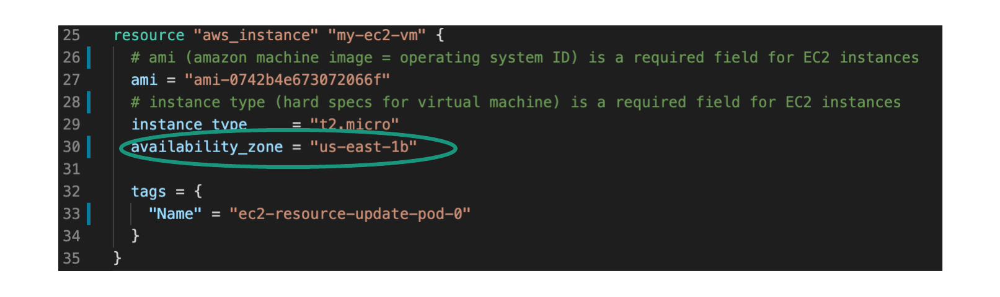

*Workflow Command Execution*

-   Note that we are not executing the “terraform init” nor “terraform validate” commands in this circumstance as we are updating a pre-existing resource
-   Execute the “terraform plan” command and observe the output as it relates to an update activity

| terraform plan |
|----------------|

-   Terraform plan in a Replace and Destroy scenario will display precisely the attributes that will be changed if the manifest is applied
-   Further the plan output clearly calls to our attention the fact that the resource must be replaced to proceed with the intended change
-   Output truncated to display prominent messaging

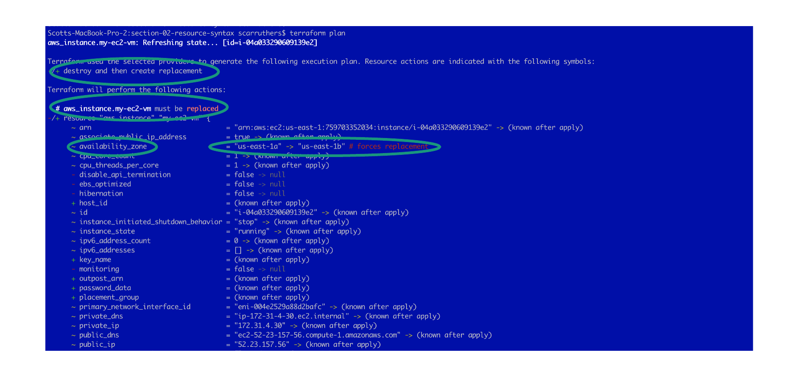

| terraform apply -auto-approve |
|-------------------------------|

-   Output truncated to highlight result of “terraform apply”
-   Note that this procedure may take 1-2 minutes to complete as is evident in the depiction below

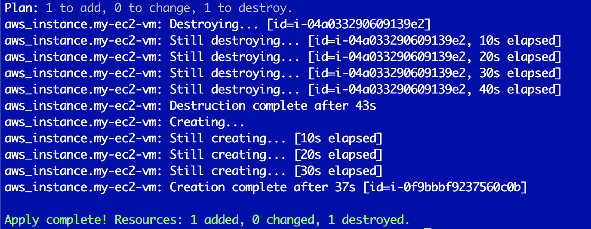

-   While in the destroying phase \> the EC2 console will indicate that the prior resource is in a “Shutting-down” phase as depicted below

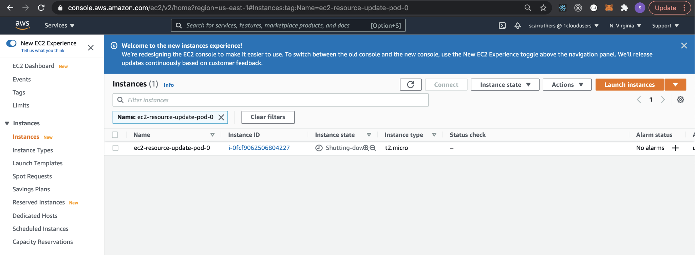

| *Review of Desired State and Current State*  The Destroy and Replace operation allows additional review of concepts within Terraform State which again are referred to as: Desired State The state represented in the .tfstate file in the local Terraform directory Current State The actual state of the resource as it exists within AWS We will ensure that both the Desired State and the Current State were updated properly by the Destroy and Replace procedure |
|-------------------------------------------------------------------------------------------------------------------------------------------------------------------------------------------------------------------------------------------------------------------------------------------------------------------------------------------------------------------------------------------------------------------------------------------------------------------------|

*Desired State*

-   Within your code editor \> open the “terraform.tfstate” file in the current working directory (section-02-resource-syntax)
-   Note that our Desired State has been updated as depicted below
-   As viewed in the capture \> the Availability Zone piece of state is in proximity to line 20 within the tfstate file
-   We find that the Availability Zone - in Terraform Desired State - has been updated to “us-east-1b” whereas the resource existed in Availability Zone us-east-1 prior

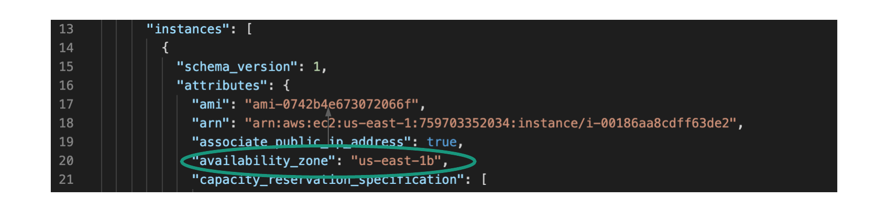

*Current State*

-   If your AWS console remains where we left off in prior steps the depiction below should be displayed
-   If your AWS console timed out or there has been navigation away from the EC2 console \> follow the AWS console navigation within Section-02 of this lab to gain access to the EC2 console and isolate your EC2 instance

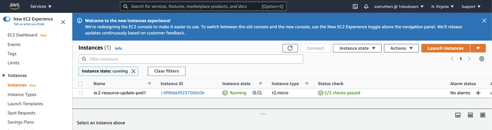

-   Press the refresh button as depicted in STEP1 below
-   Once refreshed \> select the checkbox next the resource as depicted by STEP2 below
-   With the EC2 instance details now revealed \> open the Networking tab and confirm that the Availability Zone successfully updated to “us-east-1b”
-   This validates the Destroy and Replace of the instance completed successfully and updated the Desired State as desired
-   Note - it is possible that your EC2 console may show two instances - the previous instance which is in a “Terminated” status and an instance which is in a “Running” status. Ensure to select the Running instance to make the state validations described above.

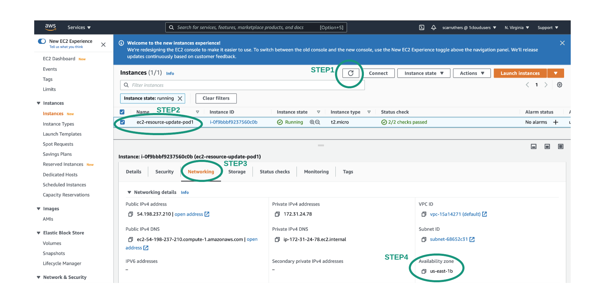

*Resource Deletion/Clean Up*

-   With our lab now complete we will delete the resources created within AWS

| terraform destroy -auto-approve |
|---------------------------------|

-   Output truncated to only display resultant

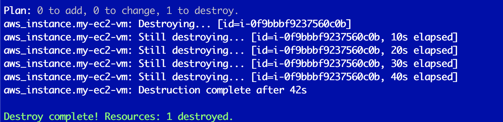

| Note - the observed sequencing of Destroy and Replace may seem less than ideal The process steps demonstrated that the prior EC2 instance was terminated and the termination process needed to complete prior to the initiation of the replacement instance build In the interim - stage and time period between when the termination was initiated and the new instance build was completed - down time was introduced We will explore techniques in upcoming labs to limit - if not eliminate - such down time by requesting the replacement instance creation to occur first |
|---------------------------------------------------------------------------------------------------------------------------------------------------------------------------------------------------------------------------------------------------------------------------------------------------------------------------------------------------------------------------------------------------------------------------------------------------------------------------------------------------------------------------------------------------------------------------------|
