# Lab6 - **Resource Meta-Argument - depends_on**

## **Section-01: Lab Overview**

| *Current Resource Lab will serve two purposes*  Build a large number of AWS networking constructs via Terraform Manifests for significant, additional exposure to Resource manifest blocks. The AWS constructs to be created include: VPC  Subnet Internet Gateway Route Table Route in Route Table for Internet Access Associate Route Table with Subnet Create Security Group with in the VPC allowing ports 80 and 22 inbound Create EC2 Instance in VPC with a static key pair and with association of Security Group created prior Create Elastic IP Address and Associate to EC2 Instance Exposure to the Resource depends_on meta-argument when creating the Elastic IP |
|--------------------------------------------------------------------------------------------------------------------------------------------------------------------------------------------------------------------------------------------------------------------------------------------------------------------------------------------------------------------------------------------------------------------------------------------------------------------------------------------------------------------------------------------------------------------------------------------------------------------------------------------------------------------------------|

*GitHub Directory Code Location and Guidance*

-   The Github root directory for this lab and corresponding sub-directories are depicted below.
-   Use your own local copy of the repository for code execution and any code edits necessary.

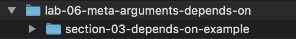

## **Section-02: Create AWS EC2 Key Pairs for Lab Use**

-   Prior to our focus on the Terraform sections of this lab - an AWS key pair will be created for later usage in connecting to AWS EC2 compute instances
-   From within the AWS Console and for navigation to the EC2 Key Pairs creation screen:
    -   Type “key pairs” in the console search bar
    -   In the results returned - select “Key Pairs - EC2 feature” under the Features section
    -   The depiction below further clarifies selections

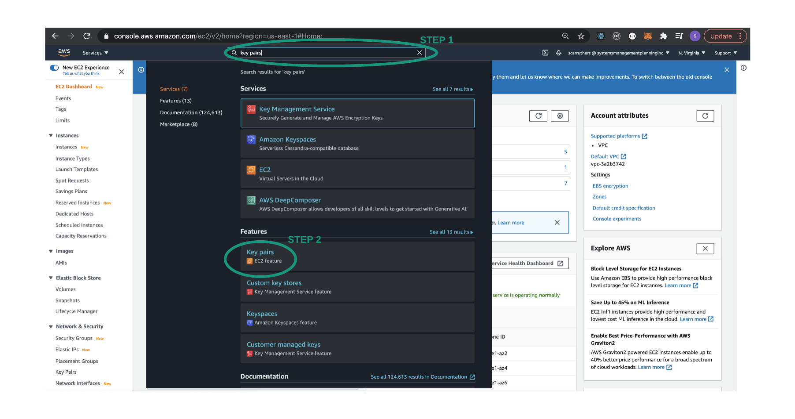

-   From the subsequent screen - select the “Create key pair” button as depicted below

-   Create a unique key pair for your lab pod with the following attributes:
    -   Name: terraform-key-\<pod-number\>
    -   File Format: The File format should be pem (which is likely selected by default)
-   Click the “Create key pair” button when above attributes are set
-   When the Key Pair is created - a copy will automatically download to your PC and likely into your Downloads folder. This file will be used in later labs so note the location of the file for future use and copy to a different directory (I.e. a AWS key pair local directory you may want to create for this class) for ease of location in the future if desired.

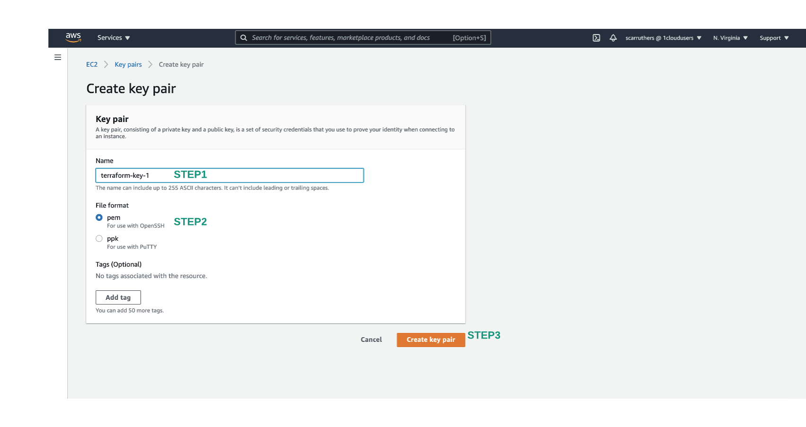

## **Section-03: AWS VPC Resources Creation**

*Subdirectory for Lab Section*

*Change Directory into Section Sub-Directory Containing Terraform Manifest Location*

| cd lab-06-meta-arguments-depends-on/section-03-depends-on-example/ |
|--------------------------------------------------------------------|

*Source code overview*

-   Within this section we will create a number of AWS network/VPC (Virtual Private Cloud) resources
-   These exercises will provide considerably more experience in Terraform resource creation and specific resource types within AWS

| *Terraform Resource Documentation* For your reference while reviewing the code in this lab and for future needs - the Terraform AWS Provider documentation for each resource type are provided below VPC <https://registry.terraform.io/providers/hashicorp/aws/latest/docs/resources/vpc>  Subnet <https://registry.terraform.io/providers/hashicorp/aws/latest/docs/resources/subnet> Internet Gateway <https://registry.terraform.io/providers/hashicorp/aws/latest/docs/resources/internet_gateway> Route Table <https://registry.terraform.io/providers/hashicorp/aws/latest/docs/resources/route_table> Route in Route Table for Internet Access <https://registry.terraform.io/providers/hashicorp/aws/latest/docs/resources/route> Associate Route Table with Subnet <https://registry.terraform.io/providers/hashicorp/aws/latest/docs/resources/subnet> Create Security Group with in the VPC allowing ports 80 and 22 inbound <https://registry.terraform.io/providers/hashicorp/aws/latest/docs/data-sources/security_group> Create EC2 Instance in VPC with a static key pair and with association of Security Group created prior <https://registry.terraform.io/providers/hashicorp/aws/latest/docs/resources/instance> |
|----------------------------------------------------------------------------------------------------------------------------------------------------------------------------------------------------------------------------------------------------------------------------------------------------------------------------------------------------------------------------------------------------------------------------------------------------------------------------------------------------------------------------------------------------------------------------------------------------------------------------------------------------------------------------------------------------------------------------------------------------------------------------------------------------------------------------------------------------------------------------------------------------------------------------------------------------------------------------------------------------------------------------------------------------------------------------------------------------------------------------------------------------------------------------------------------------------------------------------------|

*Overview of Terraform Manifest*

| Open the following file in your local code editor for this section:  aws-vpc-resources.tf  Edit the code as necessary for your own Student Pod as instructed in the commented section of the manifest that begins with - “\#\#\#Note regarding lab usage”. Visual highlights are provided in the depictions below for further clarification of the location of necessary per pod edits. |
|-----------------------------------------------------------------------------------------------------------------------------------------------------------------------------------------------------------------------------------------------------------------------------------------------------------------------------------------------------------------------------------------|

| For the purpose of breaking down the Terraform Resource blocks within this manifest the following are provided: In this section an uncommented view of the entire manifest (Terraform block, Providers block, all Resource blocks) are provided to allow review of how the blocks are structured and correlated In the subsequent sections per Resource code blocks are provided with significant commenting to deep dive into the intent, purpose, and syntax of each resource |
|---------------------------------------------------------------------------------------------------------------------------------------------------------------------------------------------------------------------------------------------------------------------------------------------------------------------------------------------------------------------------------------------------------------------------------------------------------------------------------|

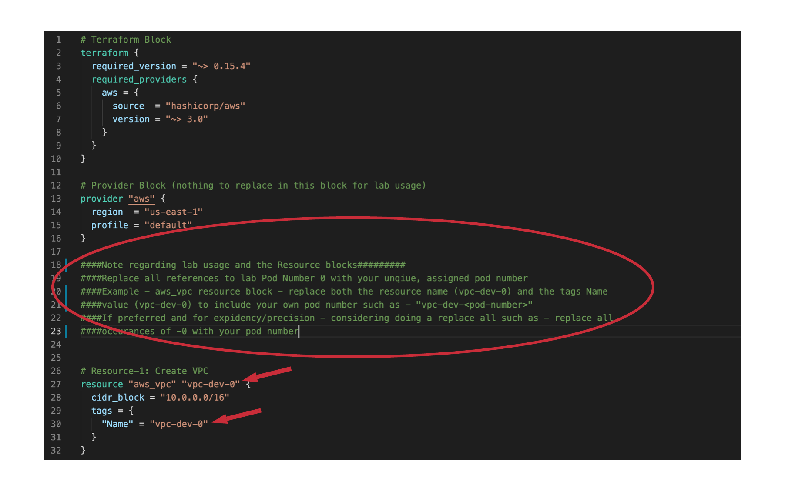

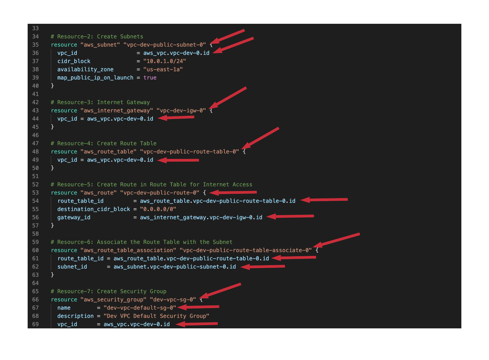

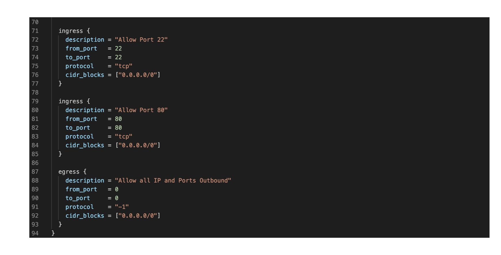

*Manifest Per Resource Review*

| Note - no action is necessary by the student in this section but rather this serves as a very granular break down of to be created Terraform resources  The code block comments/breakdowns are also found in the GitHub repo for this lab and within the “commented” directory |
|--------------------------------------------------------------------------------------------------------------------------------------------------------------------------------------------------------------------------------------------------------------------------------|

-   AWS VPC (Virtual Private Cloud) Resource

*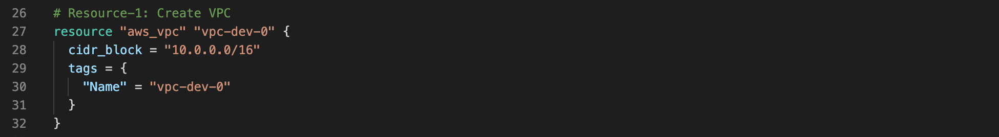*

-   AWS Subnet Resource

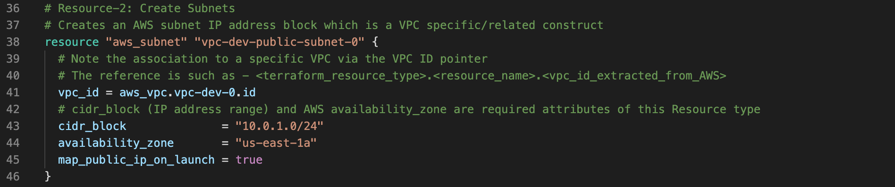

-   AWS Internet Gateway

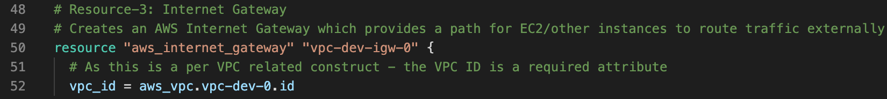

-   AWS Route Table

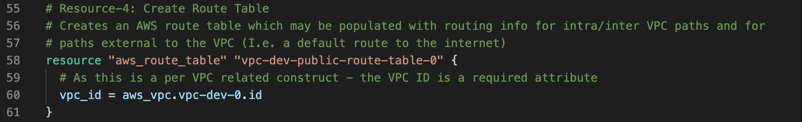

-   Route Table Entry

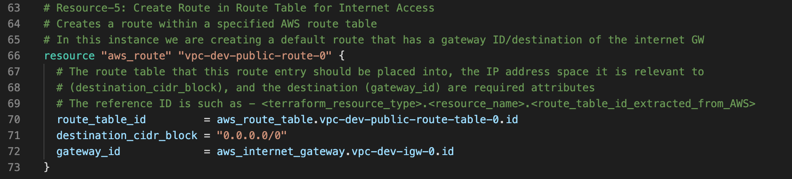

-   Route Table to Subnet ID Association

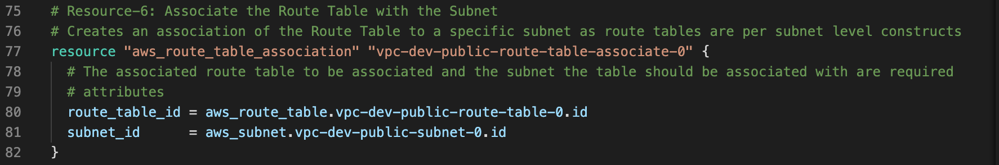

-   Security Group Creations to Allow Authorized Ingress/Egress Traffic Flows

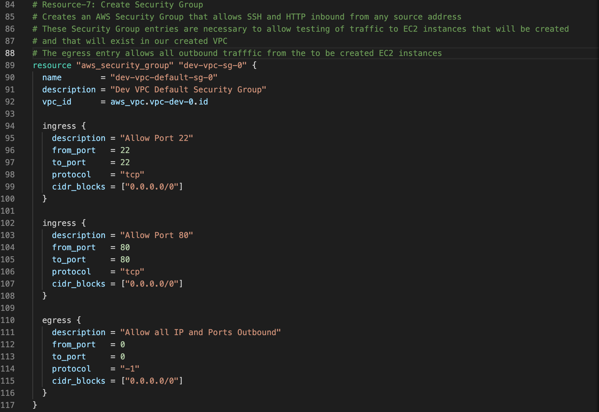

| *Note on Completion of this Section and Entry Into Next Section*  We will not execute a Terraform workflow at this juncture In other words - the Terraform init, validate, plan, and apply commands will not be executed in this section Rather - we will build additional Terraform manifests for the full build and then will execute the Terraform workflow when all manifests have been created This is a bit of a departure from our prior lab patterns in which all resources were contained within a single manifest. This architecture is our first exposure to building Terraform manifests in a modular manner and we will explore deeper Terraform module use in a dedicated section subsequently. In short and for our current understanding - all Terraform files (.tf files) - that exist in a directory inherently have access to Resources and Variables within other files in that same directory. Such as: Resource exists in a file named “ex1.tf” in directory named “mydir” Resource which exists in a file named “ex2.tf” in the same directory of “mydir” can refer to and access the Resource in file “ex1.tf” |
|----------------------------------------------------------------------------------------------------------------------------------------------------------------------------------------------------------------------------------------------------------------------------------------------------------------------------------------------------------------------------------------------------------------------------------------------------------------------------------------------------------------------------------------------------------------------------------------------------------------------------------------------------------------------------------------------------------------------------------------------------------------------------------------------------------------------------------------------------------------------------------------------------------------------------------------------------------------------------------------------------------------------------------------------------------------------------------------------------------------------------------------|

## **Section-04: AWS EC2 Resource Creation**

*Subdirectory for Lab Section*

*Source code overview*

-   Within this section we will create an EC2 compute Terraform Resource
-   The Resource will reference a number of Resources created in the VPC manifest of this lab including: subnet ID and Security Group ID.
-   A previously unexplored user_data block will be utilized in this manifest to install a simple Apache web server and which will serve as an additional validation point of ingress traffic and related VPC resources.

*Overview of Terraform Manifest*

| Open the following file in your local code editor for this section:  aws-ec2-resource.tf  Edit the code as necessary for your own Student Pod as instructed in the commented section of the manifest that begins with - “\#\#\#Note regarding lab usage”. Visual highlights are provided in the depictions below for further clarification of the location of necessary per pod edits. |
|----------------------------------------------------------------------------------------------------------------------------------------------------------------------------------------------------------------------------------------------------------------------------------------------------------------------------------------------------------------------------------------|

| For the purpose of breaking down the Terraform Resource blocks within this manifest the following are provided: In this section an uncommented view of the entire manifest (Terraform block, Providers block, all Resource blocks) are provided to allow review of how the blocks are structured and correlated In the subsequent sections per Resource code blocks are provided with significant commenting to deep dive into the intent, purpose, and syntax of each resource |
|---------------------------------------------------------------------------------------------------------------------------------------------------------------------------------------------------------------------------------------------------------------------------------------------------------------------------------------------------------------------------------------------------------------------------------------------------------------------------------|

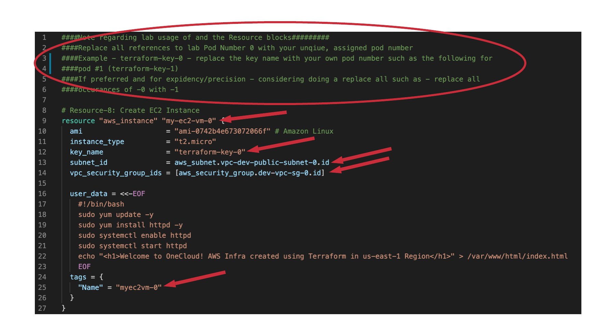

*Manifest Per Section Review*

| Note - no action is necessary by the student in this section but rather this serves as a very granular break down of to be created Terraform resources  The code block comments/breakdowns are also found in the GitHub repo for this lab and within the “commented” directory |
|--------------------------------------------------------------------------------------------------------------------------------------------------------------------------------------------------------------------------------------------------------------------------------|

*AWS EC2 Resource*

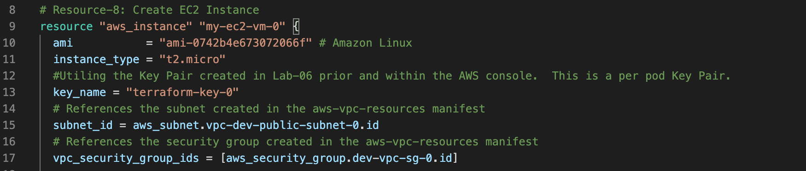

*User Data Section For Operating System Updates and Apache Web Server Install*

| *Note on Completion of this Section and Entry Into Next Section*  We will not execute a Terraform workflow at this juncture In other words - the Terraform init, validate, plan, and apply commands will not be executed in this section Rather - we will build additional Terraform manifests for the full build and then will execute the Terraform workflow when all manifests have been created |
|-----------------------------------------------------------------------------------------------------------------------------------------------------------------------------------------------------------------------------------------------------------------------------------------------------------------------------------------------------------------------------------------------------|

## **Section-05: AWS Elastic IP Resource Creation With Meta-Argument Depends_On**

*Overview*

| Per AWS provided documentation segment below - extracted from the Elastic IP (EIP) address Resource section of the AWS Provider documentation - an ElP may fail to create and associate properly if the Internet Gateway of which it is dependent on does not exist prior.  In such circumstances and as will demonstrated in this example - we cannot simply refer to another dependency within the manifest - but must use the depends_on Meta-Argument option to ensure that the resource (EIP in this example) will not attempt to create until the dependency (IGW in this case) is fully created prior.  Note that there are many resource dependencies that are built into Terraform logic and do not require the depends_on explicit declaration. Example - there are many VPC constructs created in this lab that depend on the base VPC being created prior - such as Route Tables and Subnets. Based on built in dependencies and Terraform logic these entities will be scheduled for creation following the VPC creation itself. It is only when such dependencies are not in default Terraform logic and needs arise to orchestrate creation ordering that we must utilize the depends_on Meta-Argument. |
|------------------------------------------------------------------------------------------------------------------------------------------------------------------------------------------------------------------------------------------------------------------------------------------------------------------------------------------------------------------------------------------------------------------------------------------------------------------------------------------------------------------------------------------------------------------------------------------------------------------------------------------------------------------------------------------------------------------------------------------------------------------------------------------------------------------------------------------------------------------------------------------------------------------------------------------------------------------------------------------------------------------------------------------------------------------------------------------------------------------------------------------------------------------------------------------------------------------------|

| 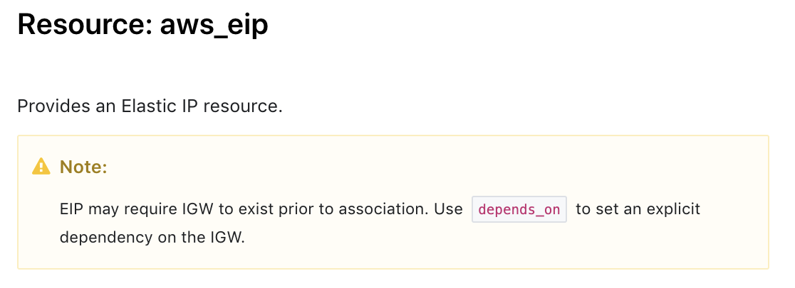 |
|-------------------------------------------------|

*Subdirectory for Lab Section*

*Source code overview*

-   Within this section we will create an Elastic IP (EIP) Terraform Resource
-   The Resource will reference a number of Resources created in the VPC manifest of this lab including: EC2 instance ID and Internet Gateway ID
-   We will additionally introduce the usage of the depends_on Meta-Argument

*Overview of Terraform Manifest*

| Open the following file in your local code editor for this section:  aws-eip-with-depends-on.tf  Edit the code as necessary for your own Student Pod as instructed in the commented section of the manifest that begins with - “\#\#\#Note regarding lab usage”. Visual highlights are provided in the depictions below for further clarification of the location of necessary per pod edits. |
|-----------------------------------------------------------------------------------------------------------------------------------------------------------------------------------------------------------------------------------------------------------------------------------------------------------------------------------------------------------------------------------------------|

| For the purpose of breaking down the Terraform Resource blocks within this manifest the following are provided: In this section an uncommented view of the entire manifest (Terraform block, Providers block, all Resource blocks) are provided to allow review of how the blocks are structured and correlated In the subsequent sections per Resource code blocks are provided with significant commenting to deep dive into the intent, purpose, and syntax of each resource |
|---------------------------------------------------------------------------------------------------------------------------------------------------------------------------------------------------------------------------------------------------------------------------------------------------------------------------------------------------------------------------------------------------------------------------------------------------------------------------------|

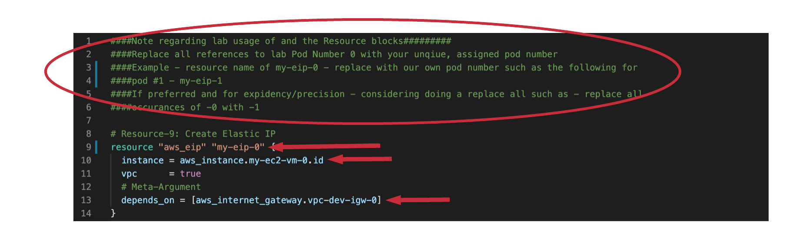

*Manifest Per Section Review*

| Note - no action is necessary by the student in this section but rather this serves as a very granular break down of to be created Terraform resources  The code block comments/breakdowns are also found in the GitHub repo for this lab and within the “commented” directory |
|--------------------------------------------------------------------------------------------------------------------------------------------------------------------------------------------------------------------------------------------------------------------------------|

*AWS Elastic IP Address Resource with Depends_On*

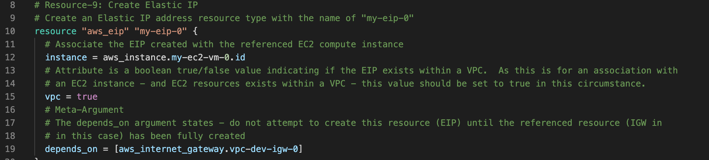

*Workflow Command Execution*

-   Execute the following commands to initialize, validate, display plan, and eventually create the resources of the Terraform manifest
-   Expected outcome accompanies/follows each command set
-   The commands in this workflow are executed against all of the Terraform files (\*.tf files) that exist in the directory the commands are initiated within

| terraform init |
|----------------|

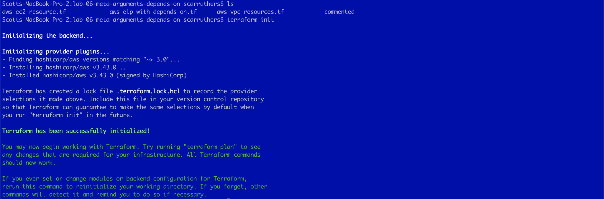

| terraform validate |
|--------------------|

| terraform fmt |
|---------------|

-   No output is returned from the Terraform format command - indicating no spacing/alignment adjustments were necessary across the three manifests in the current working directory - which is rather typical when developing within a code editor that adjusts formatting in real time.

| terraform plan |
|----------------|

-   Output truncated as the plan output is a rather lengthy list of resources and associated attributes across the three manifest files and nine total resources specified.
-   Top portion of the plan output and the trailing output displaying 9 resources to be added depicted below and is the expected plan result.

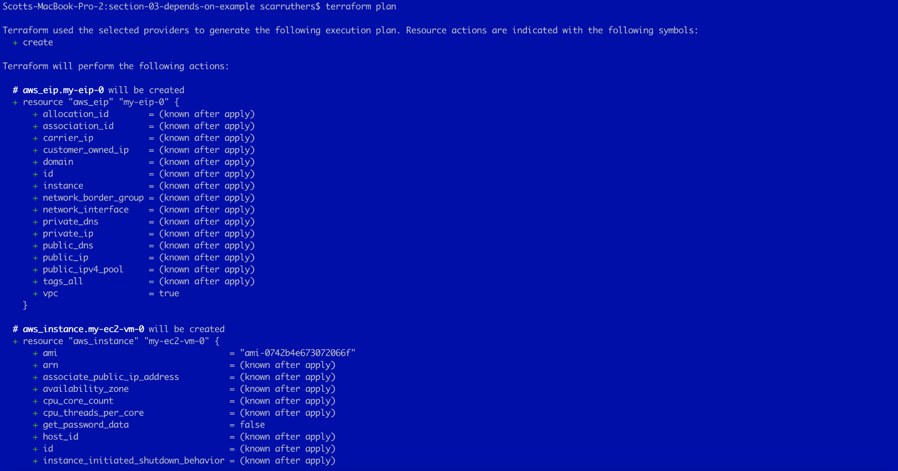

| terraform apply -auto-approve |
|-------------------------------|

-   Truncated output displaying resultant only
-   Note that the creation of the entire list of nine resources may take a 1-2 minutes to complete

-   Following the successful creation of the full stack of manifest declared resources - we will move into the next lab section in which we will validate resource creations and ability to reach the EC2 resources as expected via SSH and HTTP

## **Section-06: Resource Creation and Access Validations**

*Overview*

-   The steps that follow in this section will ensure that the resources specified in our Terraform manifest of this lab were created successfully and are behaving as expected

*VPC Confirmation*

-   Within the AWS Console \> type “VPC” from the console’s search box \> and select the first search result (“VPC”) as depicted below

-   Select “VPCs” from the VPC Console page as depicted below

-   First ensure that the us-east-1 region (also known as N.Virginia) is the selected region of the console as depicted in STEP1 below
-   Isolate the VPC created in your lab instance typing the name of the VPC (I.e.vpc-dev-\<pod-number\>) into the VPC console search box and then select the returned search result as depicted below

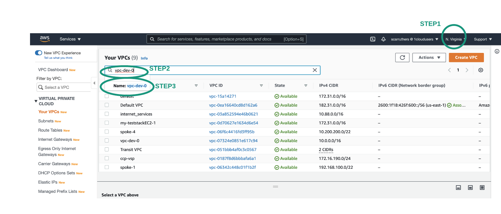

-   The existence of the VPC specific instance validates the Terraform resource creation was successful in AWS Region “us-east-1”
-   With the VPC selected we also have validation that the VPC was created with the correct/specified CIDR block (10.0.0.0/16) as depicted below

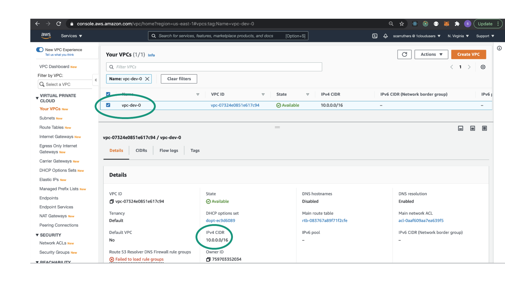

*Subnet Confirmation*

-   For validation of the subnet specified in the Terraform manifest - select Subnets from within the VPC Management Console (which should be current location from the prior step) as depicted in Step 1 below
-   From the Subnets console \> enter the name of your VPC (I.e. vpc-dev-\<pod-number\>) in “Filter subnets” box as depicted by Step 2 below and press enter
-   With the Subnet of your VPC selected \> confirm that the Subnet was created with the CIDR block specified in the manifest (10.0.1.0/24) as depicted by Step 3 below

*Route Table, Specific Route Table Entry, & Internet Gateway Confirmations*

-   Still within the VPC Management Console \> select Route Tables as depicted by Step 1 below
-   Type your VPC name (I.e. vpc-dev-\<pod-number\>) into the “Filter route tables” box as depicted by Step 2 below and press enter
-   There are likely two Route Tables currently associated with your VPC - the default Route Table automatically invoked during VPC creation (which is classified as the Main route table) and the Route Table we specified in the Terraform manifest. Select the non-main/custom created Route Table as depicted by Step 3 below
-   With the targeted Route Table selected \> open the Routes tab as depicted by Step 4 below
-   Note the appearance of the default route (0.0.0.0/0) specified in the Terraform manifest and that it points to the manifest provoked IGW (Internet Gateway) which was additionally provoked by the manifest as depicted by Step 5 below

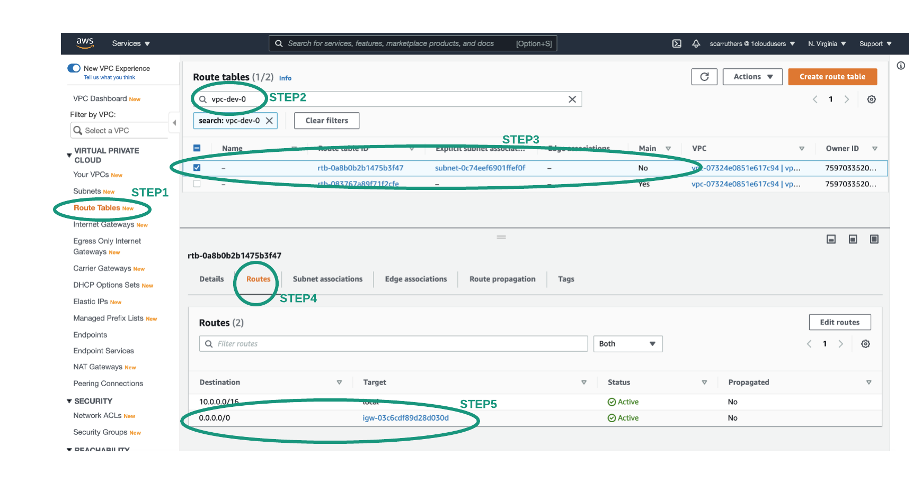

*Security Group Validation*

-   Still within the VPC Management Console \> select Security Groups as depicted by Step 1 below
-   Within the “Filter security groups” box type “Security group name” as depicted by Step 2 below
-   Select the search result of “Security group name” as depicted by Step 3 below

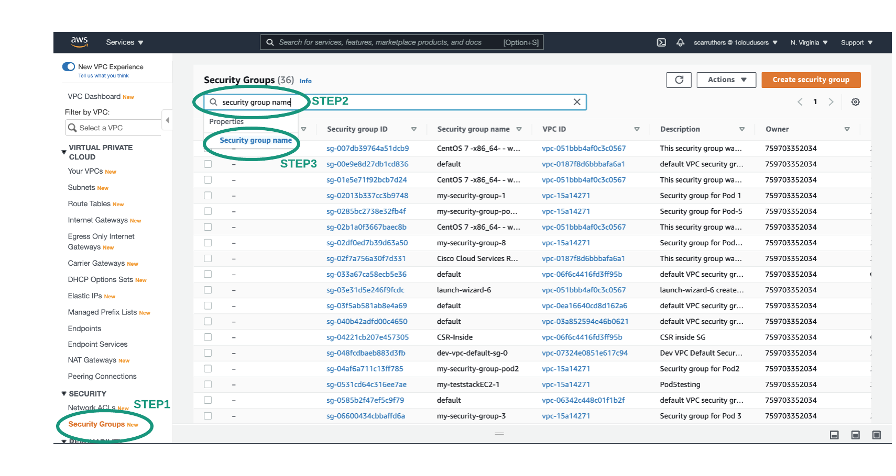

-   Type the name of the Security Group (I.e. dev-vpc-default-sg-\<pod-number\>) as a postpend to the text in the search box as depicted by Step 4 below and press enter
-   Select the search result as depicted by Step 5 below

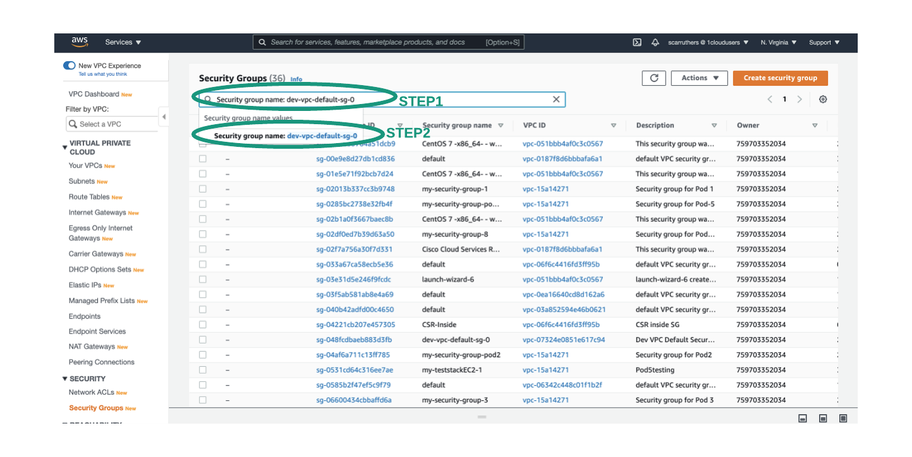

-   With the isolated Security Group selected \> open the “Inbound rules” tab \> and confirm that inbound rules allowing all source addresses access to SSH (port 22) and HTTP (port 80) as specified in the Terraform manifest

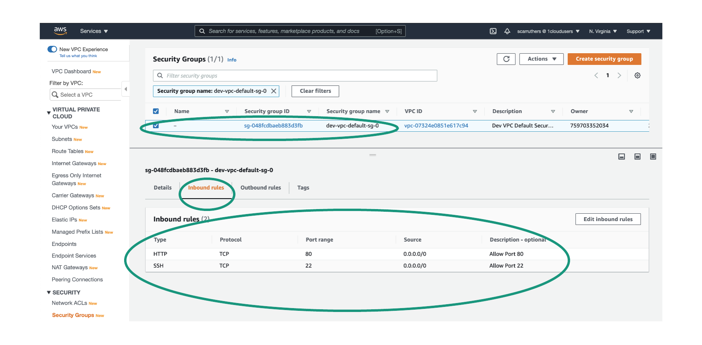

*Confirm EC2 Instance Creation*

-   Within the AWS Console \> type “EC2” from the console’s search box \> and select the first search result (“EC2”) as depicted below

-   Select “Instances (running)” from the EC2 Console page as depicted below

-   Within the Terraform manifest we assigned a Tag which may be used for ease of isolating our specific resource
-   Within the EC2 Console’s \> “Filter instances” search box \> type the Name tag defined within the manifest (I.e. myec2vm-\<pod-number\>) and press enter as depicted below
-   With the isolated EC2 instance selected \> use the Copy icon to the left of “Public IPv4 address” as depicted below \> we will use the captured value of this address to confirm that it is associated with the created Elastic IP Address in the subsequent step

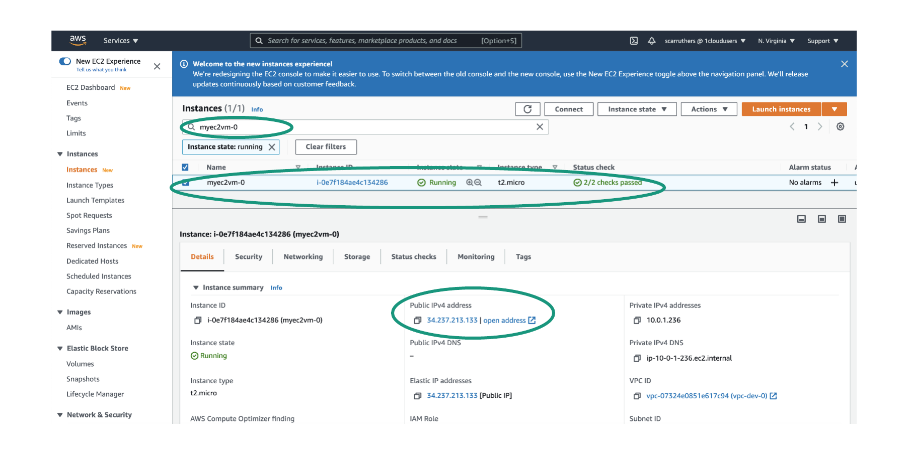

*Confirm Elastic IP Address (EIP) Creation*

-   From within the EC2 Console \> select Elastic IPs as depicted by Step 1 below
-   Paste the public IP address captured in the prior step into the “Filter Elastic IP address” box as depicted by Step 2 below
-   Select the “Allocated IPv4 address” search results as depicted by Step 3 below

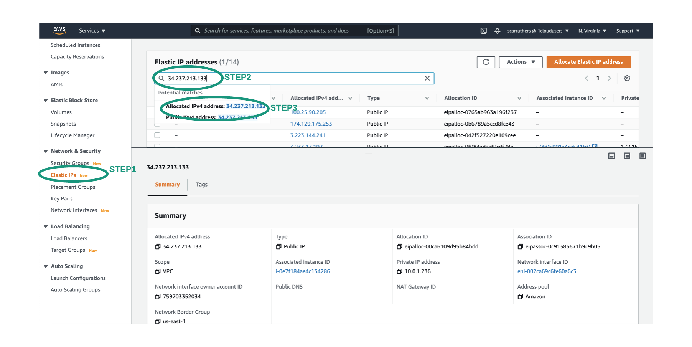

-   From the resultant screen \> select the “Associated instance ID” hyperlink as depicted below.
-   Selection of this link will navigate to the instance that this EIP is currently associated with

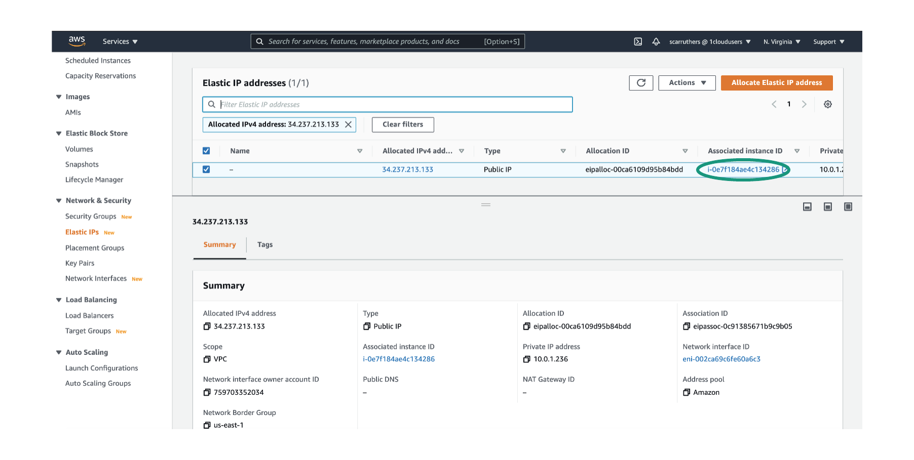

-   From the resultant screen and as depicted below \> we have validated that the EIP was created successfully and it is currently associated with the EC2 instance of the Terraform manifest (I.e. myec2vm-\<pod-number\>)

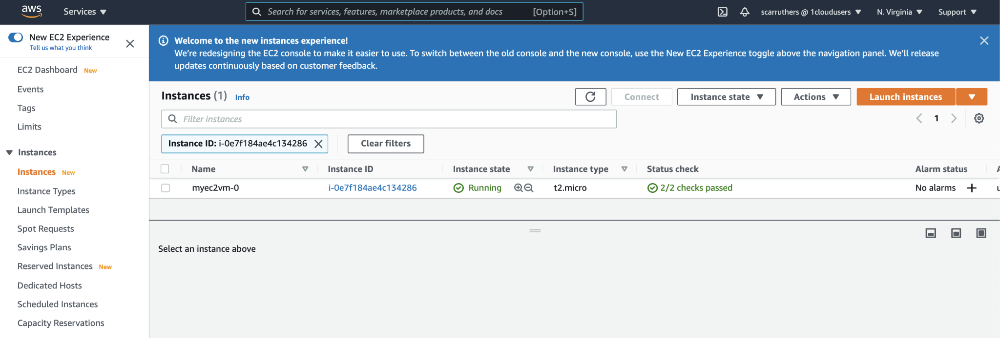

*Validation of Security Group Rules and EC2 Instance Access - HTTP*

-   Our next validation will be of Security Group association with the EC2 instance and that associated ingress rules are functioning properly
-   If not already captured - copy the public IP address from either the Elastic IP Address or EC2 instance page
-   Reviewing the capture from the Elastic IP Address page - click on the Copy icon to the left of the “Associated IPv4 address as depicted below.

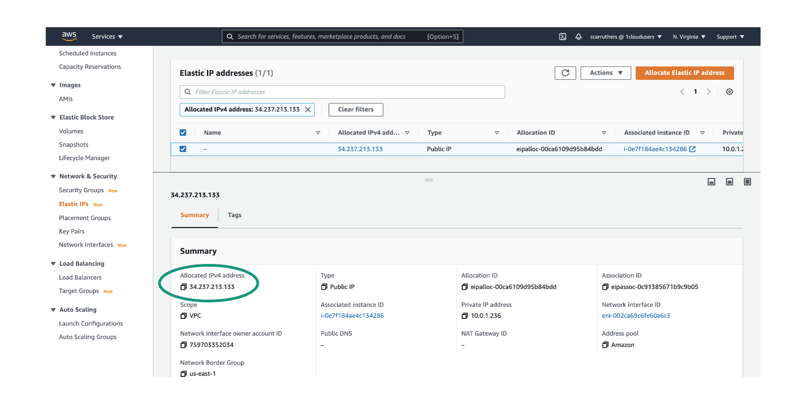

-   Open a web browser and paste the EC2 instance/public IP address captured into the browser’s address bar as depicted below
-   Receipt of the “Welcome to OneCloud …. “ text in the browser validates:
    -   The Security Group was assigned to the EC2 instance properly and is allowing port 80 traffic from all source addresses
    -   The User Data section of the EC2 Resource manifest created the Apache web server and created a simple landing page properly

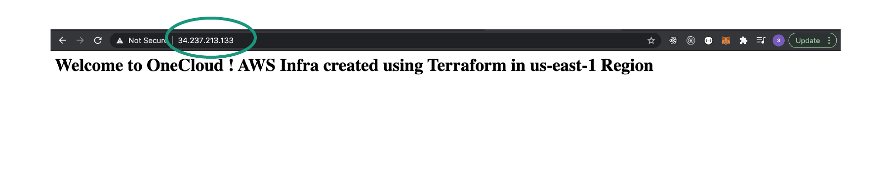

*Validation of Security Groups and EC2 Instance Access - SSH*

-   Within the AWS Console \> type “EC2” from the console’s search box \> and select the first search result (“EC2”) as depicted below

-   Select “Instances (running)” from the EC2 Console page as depicted below

*Destroy Terraform Resources*

-   With the validations now complete of Terraform Resource creation, ordering provoked by the depends_on Mega-Argument, and access to the compute instance - we will proceed in removing all associated resources from AWS
-   Ensure that your terminal is within the lab6 directory and this section's sub-directory prior to issuing the destroy command

| terraform destroy -auto-approve |
|---------------------------------|

-   Output truncated to only display command invoke and completion segments

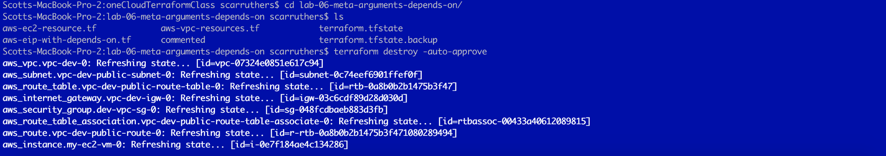

# Lab7 - **Resource Meta-Argument - Count**

## **Section-01: Lab Overview**

Within this lab we will explore the Terraform Meta-Argument Count feature allowing:

-   Utilization of the Meta-Argument Count option to elicit the creation of many identical EC2 compute instances within a single Terraform execution
-   A practical example of implementing Count and Count Index

*GitHub Directory Code Location and Guidance*

-   The Github root directory for this lab and corresponding sub-directories are depicted below.
-   Use your own local copy of the repository for code execution and any code edits necessary.

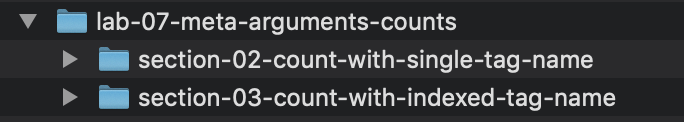

## **Section-02: Create Multiple AWS EC2 Instances using Meta-Argument Count**

*Subdirectory for Lab Section*

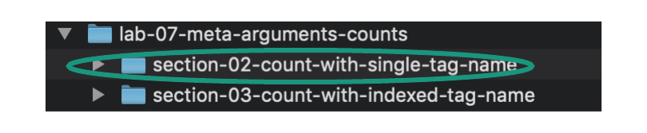

*Change Directory into Section Sub-Directory Containing Terraform Manifest Location*

| cd lab-07-meta-arguments-counts/section-02-count-with-single-tag-name/ |
|------------------------------------------------------------------------|

*Source code overview*

-   Within this source code we will create five (5) EC2 using a single manifest Resource block via the utilization of the Count argument

*Overview of Terraform Manifest*

| Open the following file in your local code editor for this section:  aws-ec2-resource.tf  Edit the code as necessary for your own Student Pod as instructed in the commented section of the manifest that begins with - “\#\#\#Note regarding lab usage”. Visual highlights are provided in the depictions below for further clarification of the location of necessary per pod edits. |
|----------------------------------------------------------------------------------------------------------------------------------------------------------------------------------------------------------------------------------------------------------------------------------------------------------------------------------------------------------------------------------------|

| For the purpose of breaking down the Terraform Resource blocks within this manifest the following are provided: In this section an uncommented view of the entire manifest (Terraform block, Providers block, all Resource blocks) are provided to allow review of how the blocks are structured and correlated In the subsequent sections per Resource code blocks are provided with significant commenting to deep dive into the intent, purpose, and syntax of each resource |
|---------------------------------------------------------------------------------------------------------------------------------------------------------------------------------------------------------------------------------------------------------------------------------------------------------------------------------------------------------------------------------------------------------------------------------------------------------------------------------|

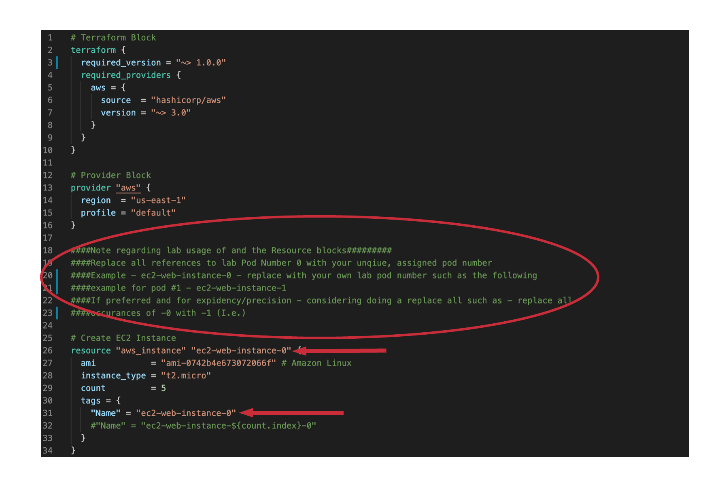

*Manifest Per Resource Review*

| Note - no action is necessary by the student in this section but rather this serves as a very granular break down of to be created Terraform resources  The code block comments/breakdowns are also found in the GitHub repo for this lab and within the “commented” directory |
|--------------------------------------------------------------------------------------------------------------------------------------------------------------------------------------------------------------------------------------------------------------------------------|

-   AWS EC2 Compute Resource

*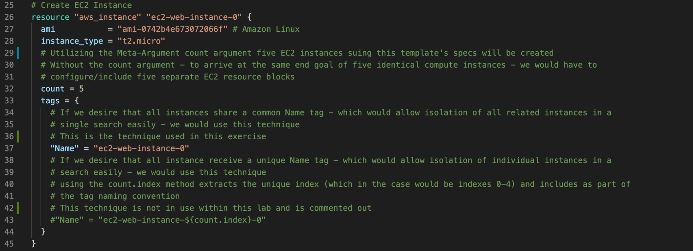*

*Workflow Command Execution*

-   Execute the following commands to initialize, validate, display plan, and eventually create the resources of the Terraform manifest
-   Expected outcome accompanies/follows each command set

| terraform init |
|----------------|

| terraform validate |
|--------------------|

| terraform fmt |
|---------------|

-   No output is returned from the Terraform format command - indicating no spacing/alignment adjustments were necessary across the three manifests in the current working directory - which is rather typical when developing within a code editor that adjusts formatting in real time.

| terraform plan |
|----------------|

-   Output truncated as the plan output is a rather lengthy list of resources and associated attributes across the five total resources to be created.
-   Note that while only a single manifest Resource block was declared - plan indicates 5 resources are to be added. Thus validating the intended impact of the Count argument.
-   Additionally the middle output snippet displays an example of one of the five EC2 instances to be created and the specific instance displayed is at index 2 (denoted as instance-name[index-number].

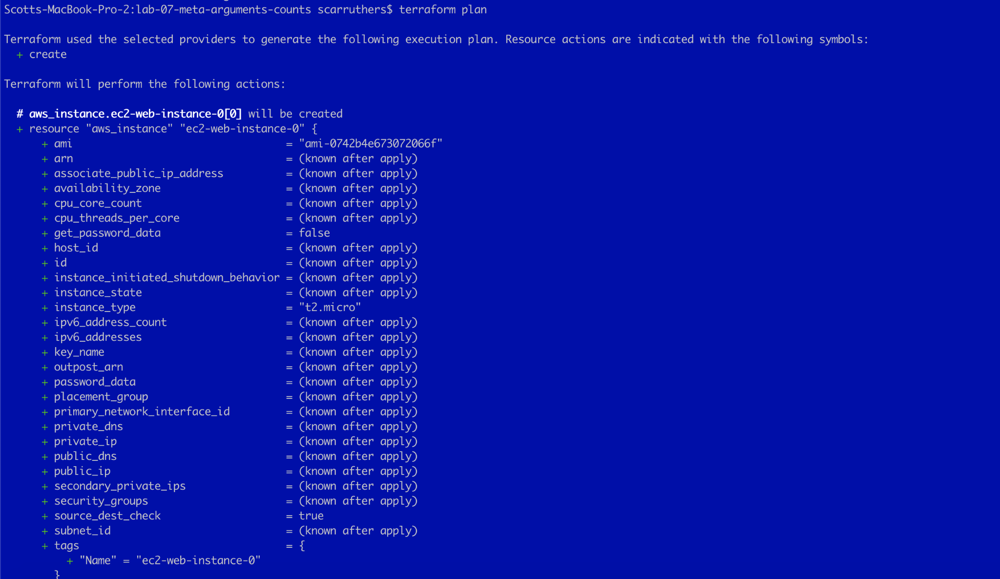

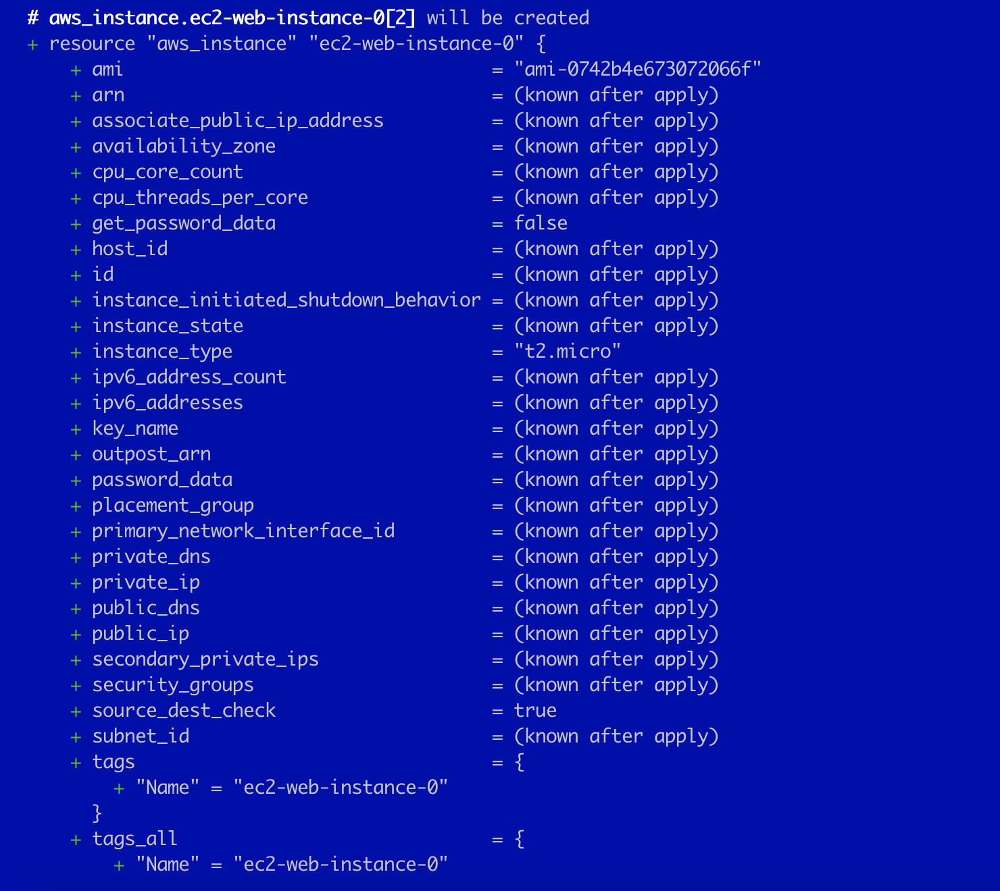

| terraform apply -auto-approve |
|-------------------------------|

-   Truncated output displaying resultant only
-   Note that the creation of the entire list of five resources may take a 1-2 minutes to complete

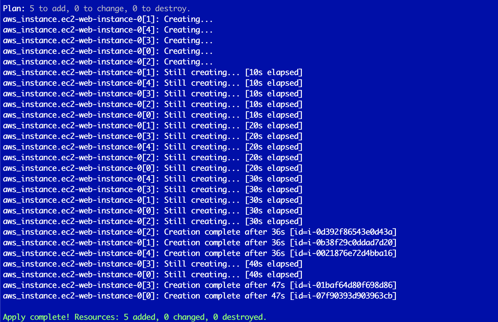

*Confirm Resource Creation from AWS Console*

-   Within the AWS Console \> type “EC2” from the console’s search box \> and select the first search result (“EC2”) as depicted below

-   Select “Instances (running)” from the EC2 Console page as depicted below

-   Within the Terraform manifest we assigned a Tag which may be used for ease of isolating our specific resource
-   Within the EC2 Console’s \> “Filter instances” search box \> type the Name tag defined within the manifest (I.e.ec2-web-instance-\<pod-number\>) and then select the returned search result as depicted below

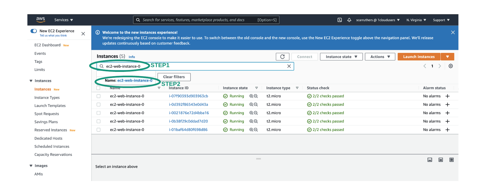

-   We now have confirmation of the following as depicted below:
    -   The five EC2 instance were created successfully and are in a running state matching the desired state in Terraform manifest
    -   The Meta_Argument Count variable behaved as expected and desired - creating a number of identical instances using a single Resource block in the manifest

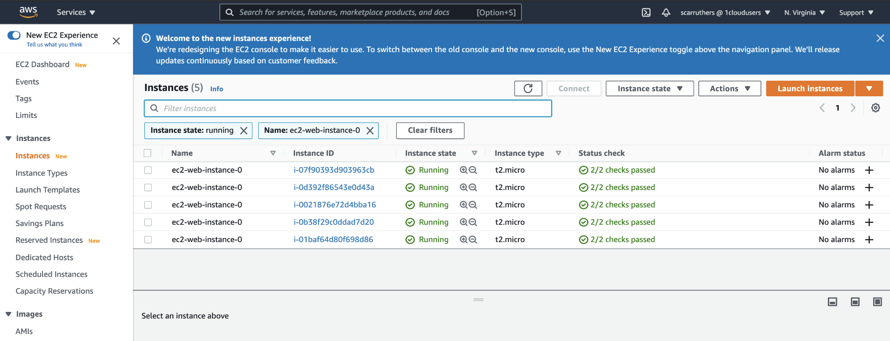

*Destroy Terraform Resources*

-   With the validations now complete of Terraform Resource creation duplication via the Count argument we will proceed in removing all associated resources from AWS
-   Ensure that your terminal is within the lab7 directory and this section's sub-directory prior to issuing the destroy command

| terraform destroy -auto-approve |
|---------------------------------|

-   Output truncated to only display command invoke and completion segments
-   Note it may take a few minutes to complete the destruction of all five instances as seen in the depiction

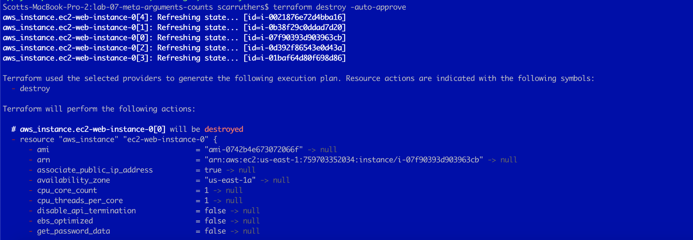

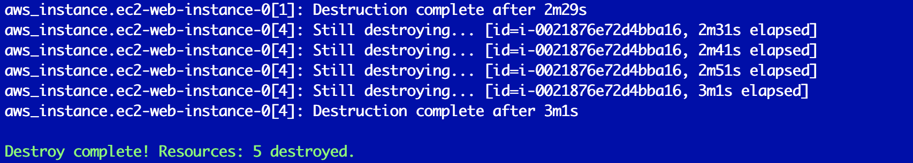

## **Section-03: Create Multiple AWS EC2 Instances using Meta-Argument Count with Indexed Tag Names**

*Subdirectory for Lab Section*

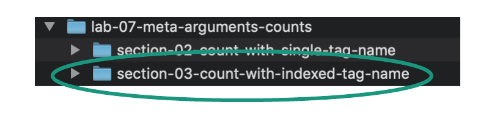

*Change Directory into Section Sub-Directory Containing Terraform Manifest Location*

| cd lab-07-meta-arguments-counts/section-03-count-with-indexed-tag-name/ |
|-------------------------------------------------------------------------|

*Source code overview*

-   Within this source code we will create five (5) EC2 using a single manifest Resource block via the utilization of the Count argument
-   This section will be identical to Section-02 of this lab but in this invoke we will utilize the Count’s index to uniquely tag each EC2 instance
-   Note that while this lab uses the Count’s index for the tag name - the index may be used within other segments/purposes of the manifest as necessary

*Overview of Terraform Manifest*

| Open the following file in your local code editor for this section:  aws-ec2-resource.tf  Edit the code as necessary for your own Student Pod as instructed in the commented section of the manifest that begins with - “\#\#\#Note regarding lab usage”. Visual highlights are provided in the depictions below for further clarification of the location of necessary per pod edits. |
|----------------------------------------------------------------------------------------------------------------------------------------------------------------------------------------------------------------------------------------------------------------------------------------------------------------------------------------------------------------------------------------|

| For the purpose of breaking down the Terraform Resource blocks within this manifest the following are provided: In this section an uncommented view of the entire manifest (Terraform block, Providers block, all Resource blocks) are provided to allow review of how the blocks are structured and correlated In the subsequent sections per Resource code blocks are provided with significant commenting to deep dive into the intent, purpose, and syntax of each resource |
|---------------------------------------------------------------------------------------------------------------------------------------------------------------------------------------------------------------------------------------------------------------------------------------------------------------------------------------------------------------------------------------------------------------------------------------------------------------------------------|

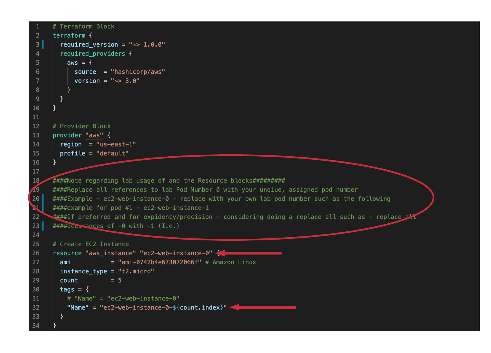

*Manifest Per Resource Review*

| Note - no action is necessary by the student in this section but rather this serves as a very granular break down of to be created Terraform resources  The code block comments/breakdowns are also found in the GitHub repo for this lab and within the “commented” directory |
|--------------------------------------------------------------------------------------------------------------------------------------------------------------------------------------------------------------------------------------------------------------------------------|

-   AWS EC2 Compute Resource

*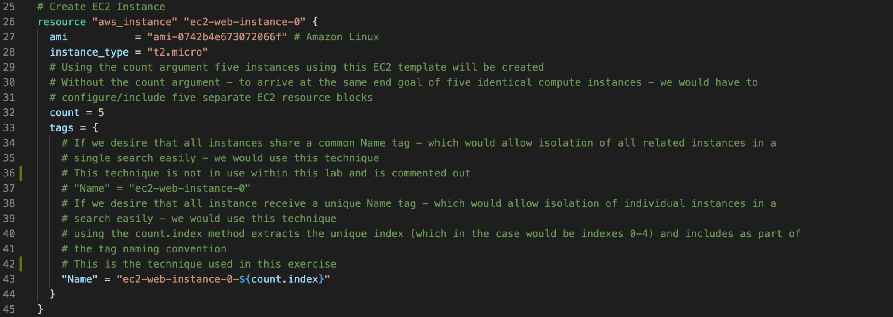*

*Workflow Command Execution*

-   Execute the following commands to initialize, validate, display plan, and eventually create the resources of the Terraform manifest
-   Expected outcome accompanies/follows each command set

| terraform init |
|----------------|

| terraform validate |
|--------------------|

| terraform fmt |
|---------------|

-   No output is returned from the Terraform format command - indicating no spacing/alignment adjustments were necessary across the three manifests in the current working directory - which is rather typical when developing within a code editor that adjusts formatting in real time.

| terraform plan |
|----------------|

-   Output truncated as the plan output is a rather lengthy list of resources and associated attributes across five resources
-   Note that while only a single manifest Resource block was declared - plan indicates 5 resources are to be added. Thus validating the intended impact of the Count argument.
-   Additionally the snippet displays an example of one of the five EC2 instances to be created and the specific instance displayed is at index 0.

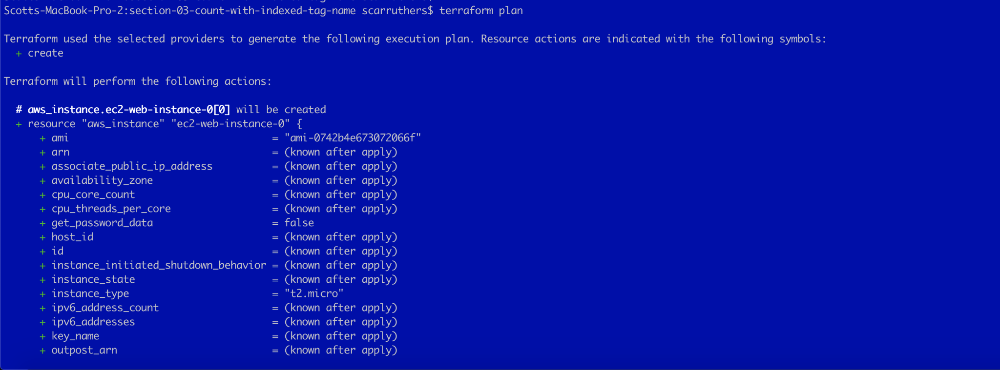

| terraform apply -auto-approve |
|-------------------------------|

-   Truncated output displaying resultant only
-   Note that the creation of the entire list of nine resources may take a 1-2 minutes to complete

*Confirm Resource Creation from AWS Console*

-   Within the AWS Console \> type “EC2” from the console’s search box \> and select the first search result (“EC2”) as depicted below

-   Select “Instances (running)” from the EC2 Console page as depicted below

-   Within the Terraform manifest we assigned a Tag which may be used for ease of isolating our specific resource
-   Within the EC2 Console’s \> “Filter instances” search box \> type the Name tag defined within the manifest (I.e.ec2-web-instance-\<pod-number\>) and then select first result in the returned list as depicted below

-   We now have confirmation of the following as depicted below:
    -   The five EC2 instance were created successfully and are in a running state matching the desired state in Terraform manifest
    -   The Meta_Argument Count variable behaved as expected and desired - creating a number of identical instances using a single Resource block in the manifest
    -   The count.index variable successfully labeled each resource uniquely with the tag Name

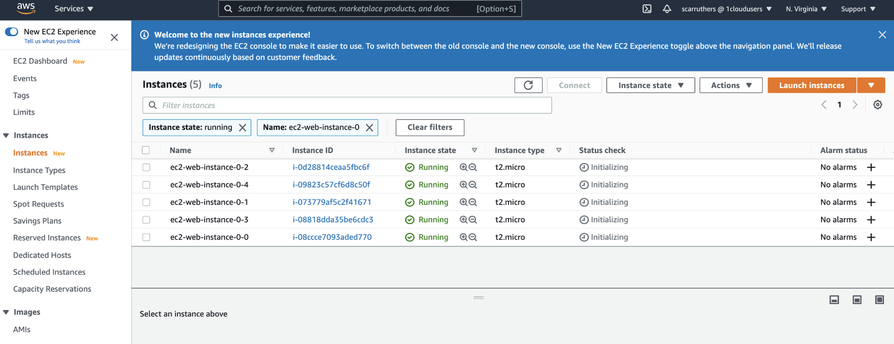

*Destroy Terraform Resources*

-   With the validations now complete of Terraform Resource creation duplication via the Count argument and the use of the count.index variable with resource tagging - we will proceed in removing all associated resources from AWS
-   Ensure that your terminal is within the lab7 directory and this section's sub-directory prior to issuing the destroy command

| terraform destroy -auto-approve |
|---------------------------------|

-   Output truncated to only display command invoke and completion segments

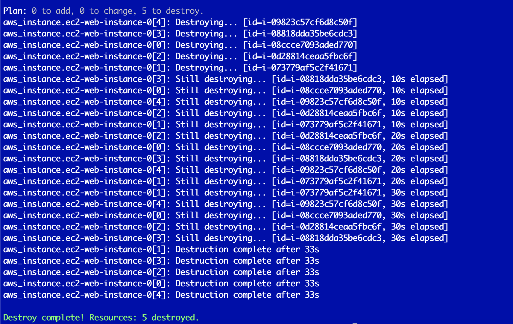

# Lab8 - **Resource Meta-Argument - For_Each**

## **Section-01: Lab Overview**

Within this lab we will explore the Terraform Meta-Argument For_Each feature allowing:

-   Creation of a number of resources based on either a supplied map or string set
-   A defined map utilized within a for_each iteration would be made up key-value pairs such as:

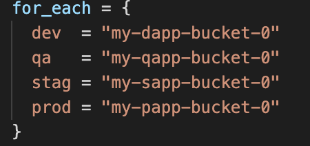

-   Alternatively a simple string set utilized within a for_each iteration would be made up of an array of strings such as:

-   The map and string set examples provided will be provoked within our manifest of this lab to demonstrate their unique use cases and the greater power of for_each loops in resource creation

*GitHub Directory Code Location and Guidance*

-   The Github root directory for this lab and corresponding sub-directories are depicted below.
-   Use your own local copy of the repository for code execution and any code edits necessary.

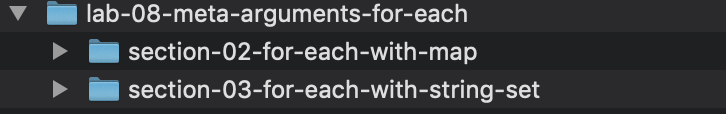

## **Section-02: Create Multiple AWS S3 Buckets using Meta-Argument For_Each with Maps**

*Subdirectory for Lab Section*

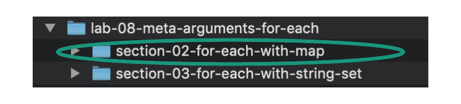

*Change Directory into Section Sub-Directory Containing Terraform Manifest Location*

| cd lab-08-meta-arguments-for-each/section-02-for-each-with-map/ |
|-----------------------------------------------------------------|

*Source code overview*

-   Within this source code we will create four (4) AWS S3 storage buckets via a for_each loop
-   The for_each loop will obtain it’s bucket name and tag attributes via a map

*Overview of Terraform Manifest*

| Open the following file in your local code editor for this section:  aws-s3-buckets.tf  Edit the code as necessary for your own Student Pod as instructed in the commented section of the manifest that begins with - “\#\#\#Note regarding lab usage”. Visual highlights are provided in the depictions below for further clarification of the location of necessary per pod edits. |
|--------------------------------------------------------------------------------------------------------------------------------------------------------------------------------------------------------------------------------------------------------------------------------------------------------------------------------------------------------------------------------------|

| For the purpose of breaking down the Terraform Resource blocks within this manifest the following are provided: In this section an uncommented view of the entire manifest (Terraform block, Providers block, all Resource blocks) are provided to allow review of how the blocks are structured and correlated In the subsequent sections per Resource code blocks are provided with significant commenting to deep dive into the intent, purpose, and syntax of each resource |
|---------------------------------------------------------------------------------------------------------------------------------------------------------------------------------------------------------------------------------------------------------------------------------------------------------------------------------------------------------------------------------------------------------------------------------------------------------------------------------|

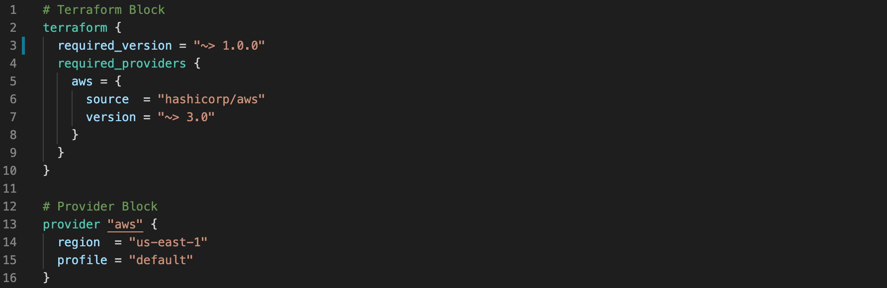

*Manifest Per Resource Review*

| Note - no action is necessary by the student in this section but rather this serves as a very granular break down of to be created Terraform resources  The code block comments/breakdowns are also found in the GitHub repo for this lab and within the “commented” directory |
|--------------------------------------------------------------------------------------------------------------------------------------------------------------------------------------------------------------------------------------------------------------------------------|

-   AWS S3 Bucket Resource

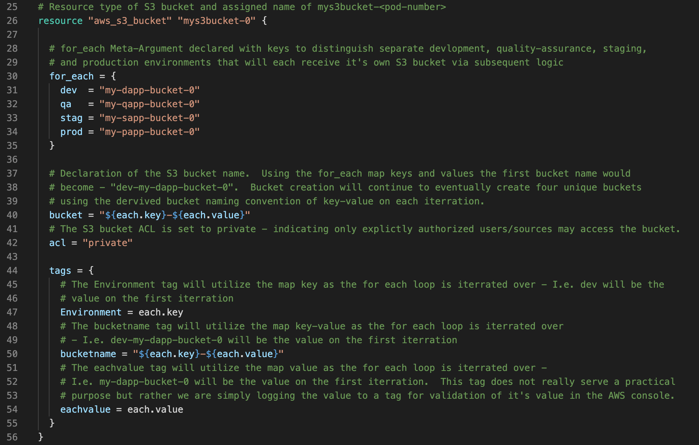

*Workflow Command Execution*

-   Execute the following commands to initialize, validate, display plan, and eventually create the resources of the Terraform manifest
-   Expected outcome accompanies/follows each command set

| terraform init |
|----------------|

| terraform validate |
|--------------------|

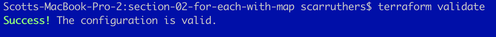

| terraform fmt |
|---------------|

-   No output is returned from the Terraform format command - indicating no spacing/alignment adjustments were necessary across the three manifests in the current working directory - which is rather typical when developing within a code editor that adjusts formatting in real time.

| terraform plan |
|----------------|

-   Output truncated as the plan output is a rather lengthy list of resources and associated attributes across four resources to be created
-   Note that while only a single manifest Resource block was declared - plan indicates 4 resources are to be added. Thus validating the intended impact of the for_each argument.
-   Additionally the snippet displays an example of one of the four S3 instances to be created and the specific instance displayed is associated with the map key of “dev”
-   The output additionally displays the unique tag values that are generated via the map usage

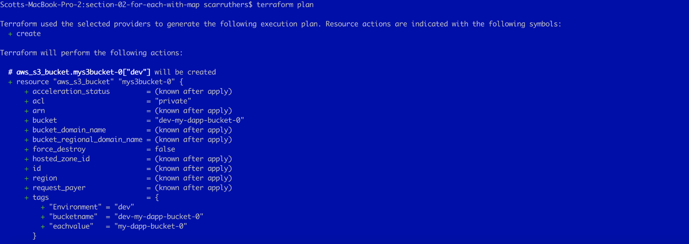

| terraform apply -auto-approve |
|-------------------------------|

-   Truncated output displaying resultant only

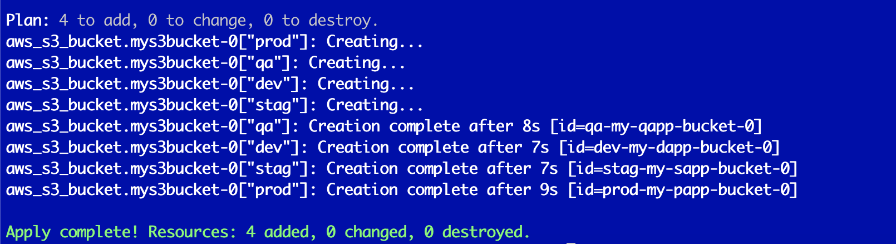

*Confirm Resource Creation from AWS Console*

-   Within the AWS Console \> type “S3” from the console’s search box \> and select the first search result (“S3”) as depicted below

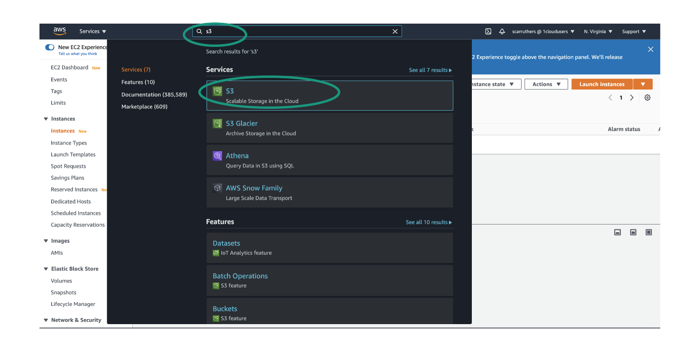

-   Within the S3 Console \> type “bucket-\<pod-number” into the box labeled “Find buckets by name” as depicted below \> press enter
-   The resultant list confirms that the four buckets declared in the for_each loop of the Terraform manifest were created successfully and one for each of the keys within the map

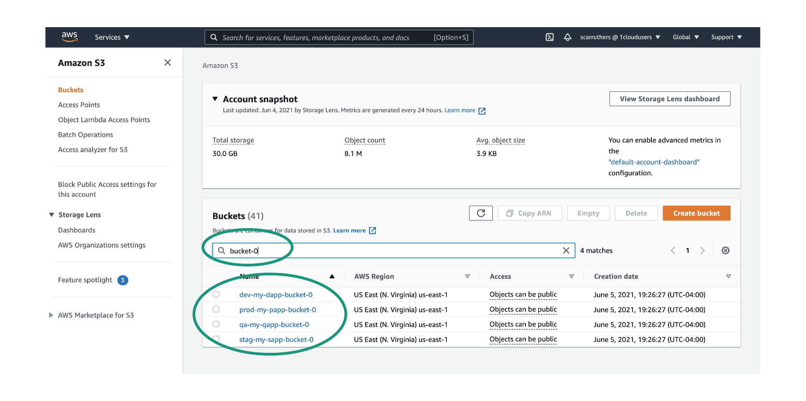

-   Drill into the first search result by selecting the bucket’s name hyperlink as depicted below

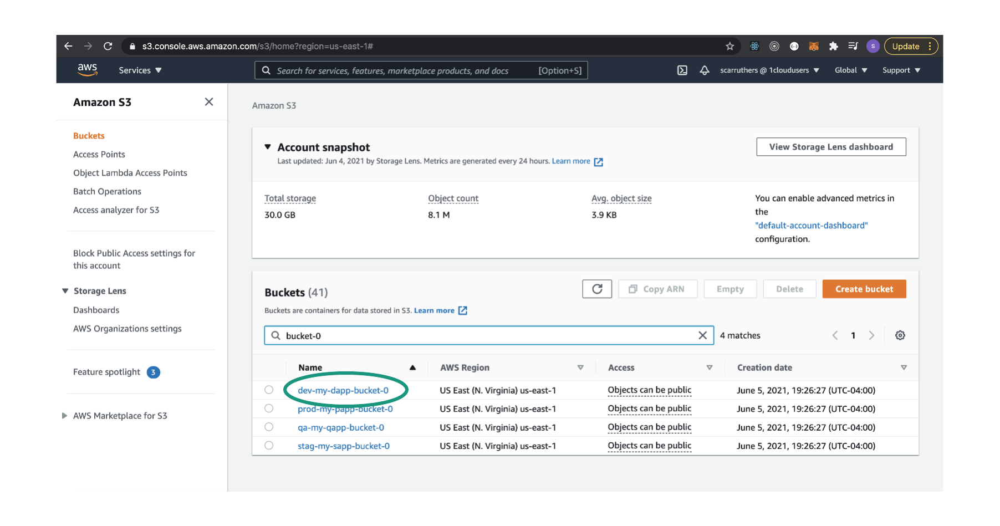

-   Open the bucket’s Properties tab as depicted below.
-   Note in the Tags section the Keys and Values were configured with the manifest map specifications. As the for loop was iterated over - the specifications in the map for this iteration (dev) were populated into the Tags based on keys and values of that map entry.

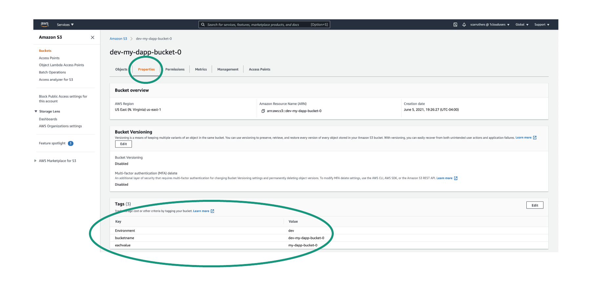

*Destroy Terraform Resources*

-   With the validations now complete of Terraform S3 Resource creation via a map and iterating over the map’s key-value pairs via a Meta-Argument for_each loop - we will proceed in removing all associated resources from AWS
-   Ensure that your terminal is within the lab8 directory and this section's sub-directory prior to issuing the destroy command

| terraform destroy -auto-approve |
|---------------------------------|

-   Output truncated to only display command invoke and completion segments

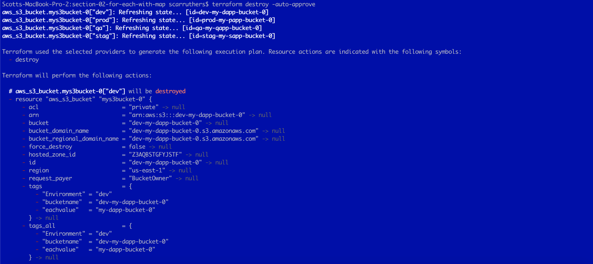

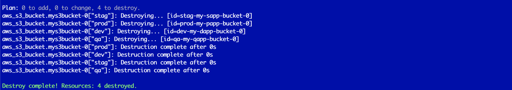

## **Section-03: Create Multiple AWS S3 Buckets using Meta-Argument For_Each with String Set**

*Subdirectory for Lab Section*

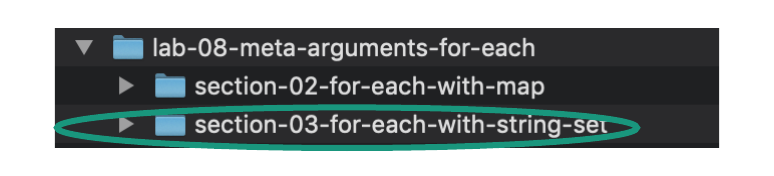

*Change Directory into Section Sub-Directory Containing Terraform Manifest Location*

| cd lab-08-meta-arguments-for-each/section-03-for-each-with-string-set/ |
|------------------------------------------------------------------------|

*Source code overview*

-   Within this source code we will create three (3) EC2 compute instances via a Meta-Argument for_each loop
-   The for_each loop will obtain the EC2 Name tag via a string set

*Overview of Terraform Manifest*

| Open the following file in your local code editor for this section:  aws-ec2-resources.tf  Edit the code as necessary for your own Student Pod as instructed in the commented section of the manifest that begins with - “\#\#\#Note regarding lab usage”. Visual highlights are provided in the depictions below for further clarification of the location of necessary per pod edits. |
|-----------------------------------------------------------------------------------------------------------------------------------------------------------------------------------------------------------------------------------------------------------------------------------------------------------------------------------------------------------------------------------------|

| For the purpose of breaking down the Terraform Resource blocks within this manifest the following are provided: In this section an uncommented view of the entire manifest (Terraform block, Providers block, all Resource blocks) are provided to allow review of how the blocks are structured and correlated In the subsequent sections per Resource code blocks are provided with significant commenting to deep dive into the intent, purpose, and syntax of each resource |
|---------------------------------------------------------------------------------------------------------------------------------------------------------------------------------------------------------------------------------------------------------------------------------------------------------------------------------------------------------------------------------------------------------------------------------------------------------------------------------|

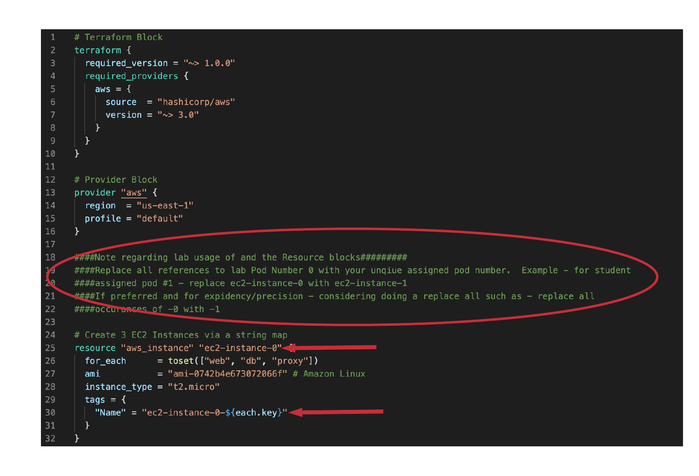

*Manifest Per Resource Review*

| Note - no action is necessary by the student in this section but rather this serves as a very granular break down of to be created Terraform resources  The code block comments/breakdowns are also found in the GitHub repo for this lab and within the “commented” directory |
|--------------------------------------------------------------------------------------------------------------------------------------------------------------------------------------------------------------------------------------------------------------------------------|

-   AWS EC2 Resource

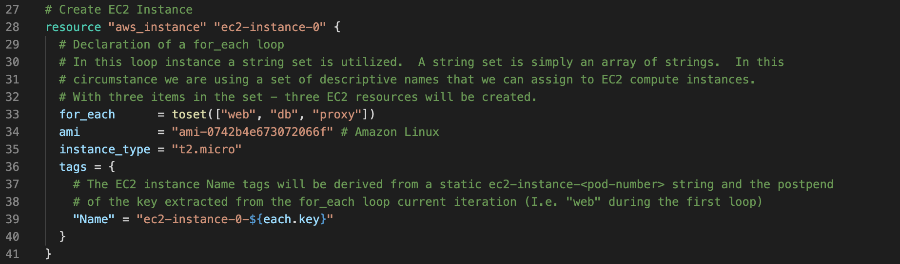

*Workflow Command Execution*

-   Execute the following commands to initialize, validate, display plan, and eventually create the resources of the Terraform manifest
-   Expected outcome accompanies/follows each command set

| terraform init |
|----------------|

| terraform validate |
|--------------------|

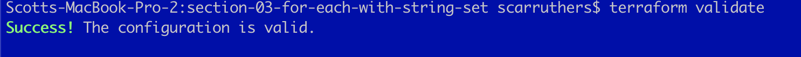

| terraform plan |
|----------------|

-   Output truncated as the plan output is a rather lengthy list of resources and associated attributes across three resources to be created
-   Note that while only a single manifest Resource block was declared - plan indicates 3 resources are to be added. Thus validating the intended impact of the for_each argument.
-   Additionally the snippet displays an example of one of the three EC2 instances to be created and the specific instance displayed is associated with the string set entry of “db”
-   The tags block of the output validates the tag Name - for the displayed instance - is properly referencing the string set as the for_each loop is iterated and is set to “ec2-instance-0-db”

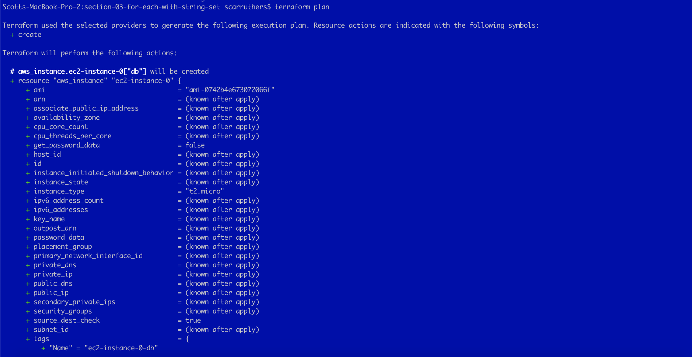

| terraform apply -auto-approve |
|-------------------------------|

-   Truncated output displaying resultant only

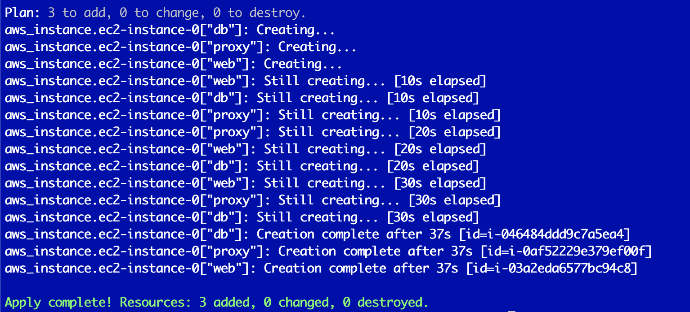

*Confirm Resource Creation from AWS Console*

-   Within the AWS Console \> type “EC2” from the console’s search box \> and select the first search result (“EC2”) as depicted below

-   Select “Instances (running)” from the EC2 Console page as depicted below

-   Within the EC2 Console’s \> “Filter instances” search box \> type the beginning of tag Name syntax defined within the manifest (I.e. ec2-instance-\<pod-number\>) \> press enter
-   In the search results note that three EC2 instances were created and were successfully assigned the string set names via for_each loop iteration

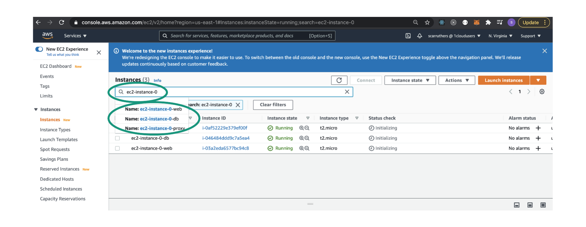

*Destroy Terraform Resources*

-   With the validations now complete of Terraform Resource creation via a for_each loop over a string set - we will proceed in removing all associated resources from AWS
-   Ensure that your terminal is within the lab8 directory and this section's sub-directory prior to issuing the destroy command

| terraform destroy -auto-approve |
|---------------------------------|

-   Output truncated to only display command invoke and completion segments
-   Note that the destroy process may take a few minutes to complete
