# Lab 10 - **Terraform Variables - Input Variables**

## **Section-01: Lab Overview**

Within this lab we will deeply explore Terraform input variables via labs focused on:

| Input Variables - Basics Input Variables via prompt during terraform plan or apply Default variable override values using the CLI argument -var Default variable override values using Environment Variables Input Variables using terraform.tfvars files |
|-----------------------------------------------------------------------------------------------------------------------------------------------------------------------------------------------------------------------------------------------------------|

*GitHub Directory Code Location and Guidance*

-   The Github root directory for this lab and corresponding sub-directories are depicted below.
-   Use your own local copy of the repository for code execution and any code edits necessary.

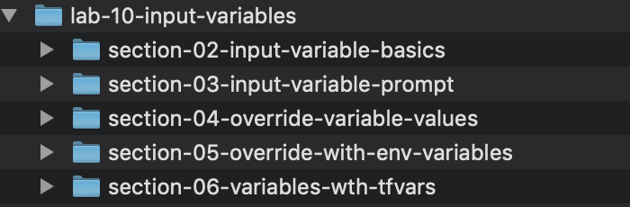

## **Section-02: Input Variable Basics**

*Subdirectory for Lab Section*

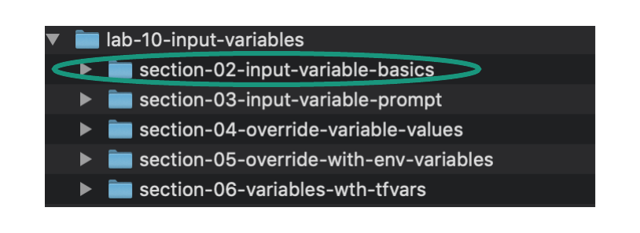

*Change Directory into Section Sub-Directory Containing Terraform Manifest Location*

| cd lab-10-input-variables/section-02-input-variable-basics/ |
|-------------------------------------------------------------|

*Source code overview*

| Two distinct Terraform files exist in this lab as detailed below: variables.tf Contains variables for AWS region, AMI (Amazon Machine Image), and Count (number of EC2 instances that should be created).  Note that the name of this variables file is entirely arbitrary - could be named anything according to our preference Note that within the same directory the variables created in variables.tf may be called within any other Terraform file. In our example the variables will be called with the Provider/Resource file described below. These variables are globally exposed within the directory and thus we do not need to reference the name of the variables file and/or export/import variables explicitly. We may simply reference exposed variables directly from within other Terraform files. resources.tf This file holds all of the Providers and Resources for this example. This is a rather large code base that includes EC2 instances and associated security groups to allow ingress access to the resources. We will not heavily comment/describe a majority of this file as they are topics covered previously. But we will call attention to variable usage - the primary topic of this lab - within the file. |
|---------------------------------------------------------------------------------------------------------------------------------------------------------------------------------------------------------------------------------------------------------------------------------------------------------------------------------------------------------------------------------------------------------------------------------------------------------------------------------------------------------------------------------------------------------------------------------------------------------------------------------------------------------------------------------------------------------------------------------------------------------------------------------------------------------------------------------------------------------------------------------------------------------------------------------------------------------------------------------------------------------------------------------------------------------------------------------------------------------------------------------------------------------------------------------------------------------------------------------------------------|

*Overview of Terraform Manifest*

| Open the following files in your local code editor for this section:  variables.tf resources.tf  Edit the code as necessary for your own Student Pod - within the resources.tf manifest - as instructed in the commented section of the manifest that begins with - “\#\#\#Note regarding lab usage”. Visual highlights are provided in the depictions below for further clarification of the location of necessary per pod edits. |
|------------------------------------------------------------------------------------------------------------------------------------------------------------------------------------------------------------------------------------------------------------------------------------------------------------------------------------------------------------------------------------------------------------------------------------|

| For the purpose of breaking down the Terraform Resource blocks within this manifest the following are provided: In this section an uncommented view of the entire manifest (Terraform block, Providers block, all Resource blocks) are provided to allow review of how the blocks are structured and correlated In the subsequent sections per Resource code blocks are provided with significant commenting to deep dive into the intent, purpose, and syntax of each resource |
|---------------------------------------------------------------------------------------------------------------------------------------------------------------------------------------------------------------------------------------------------------------------------------------------------------------------------------------------------------------------------------------------------------------------------------------------------------------------------------|

| An Apache Web Server is configured within the Resources manifest block - defined within User Data - to allow interesting ingress testing. Additionally necessary security groups are included to allow ingress traffic to the Web Server and to the EC2 instance directly via SSH. |
|------------------------------------------------------------------------------------------------------------------------------------------------------------------------------------------------------------------------------------------------------------------------------------|

-   Terraform Variables File

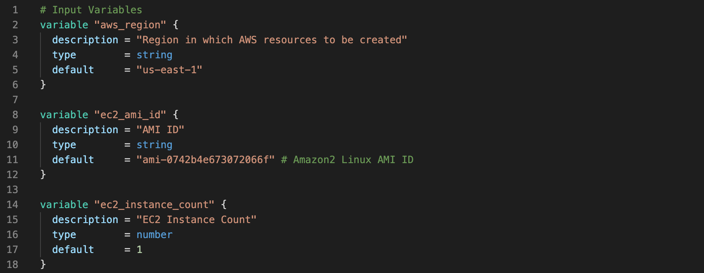

-   Terraform Provider and Resource Blocks/File

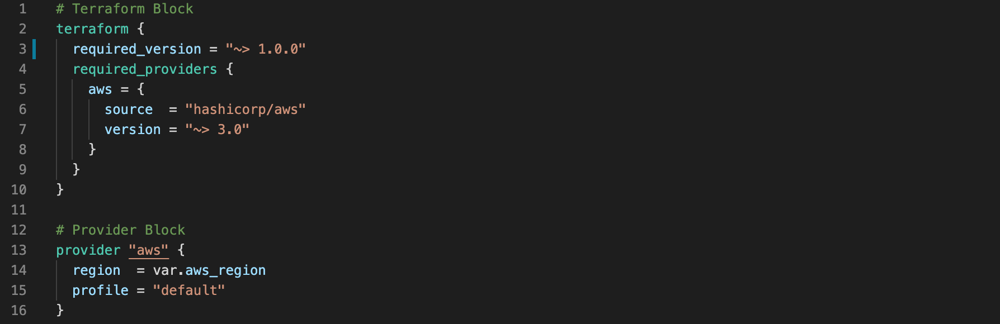

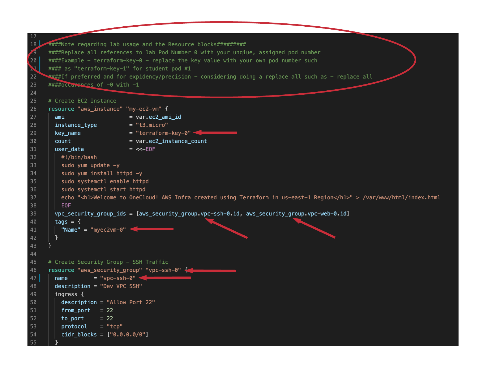

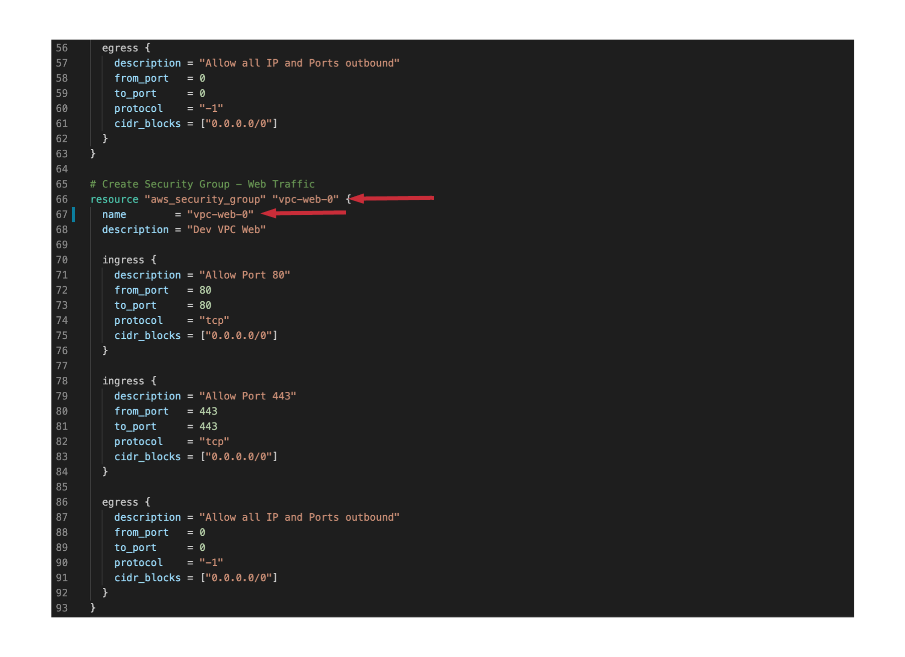

*Manifest Per Resource Review*

| Note - no action is necessary by the student in this section but rather this serves as a very granular break down of to be created Terraform resources  The code block comments/breakdowns are also found in the GitHub repo for this lab and within the “commented” directory |
|--------------------------------------------------------------------------------------------------------------------------------------------------------------------------------------------------------------------------------------------------------------------------------|

-   Terraform Variables File

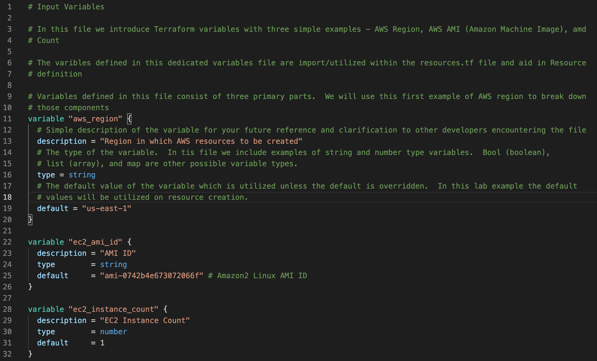

-   Terraform Resources File
    -   Note - we are only including commented blocks of the resources file and focus on new topic introduction

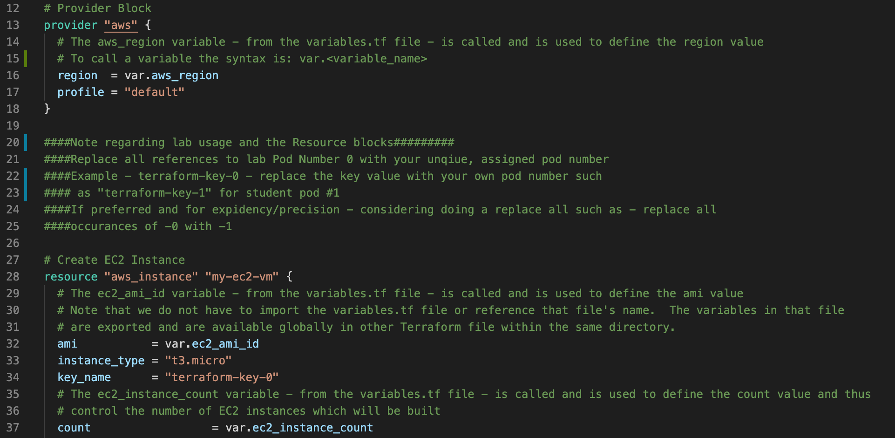

*Workflow Command Execution*

-   Execute the following commands to initialize, validate, display plan, and eventually create the resources of the Terraform manifest
-   Expected outcome accompanies/follows each command set

| terraform init |
|----------------|

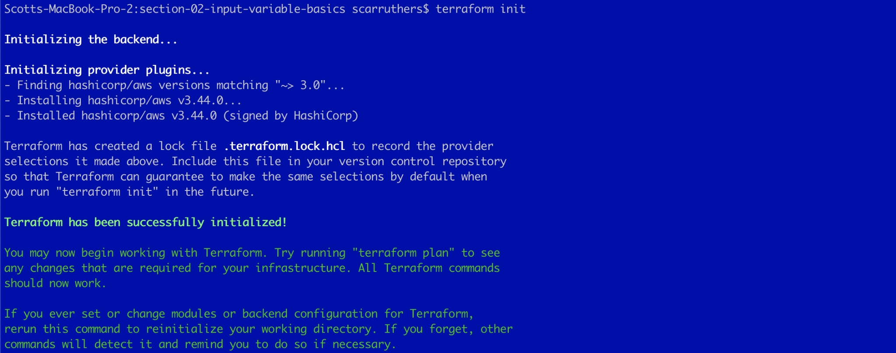

| terraform validate |
|--------------------|

| terraform fmt |
|---------------|

-   No output is returned from the Terraform format command - indicating no spacing/alignment adjustments were necessary across the three manifests in the current working directory - which is rather typical when developing within a code editor that adjusts formatting in real time.

| terraform plan |
|----------------|

-   Output truncated to only include initiation and completion sequences

| terraform apply -auto-approve |
|-------------------------------|

-   Truncated output displaying initiation and resultant only
-   Note in the highlighted portion of the initiation that the AMI ID was properly populated via the definition within the variables file

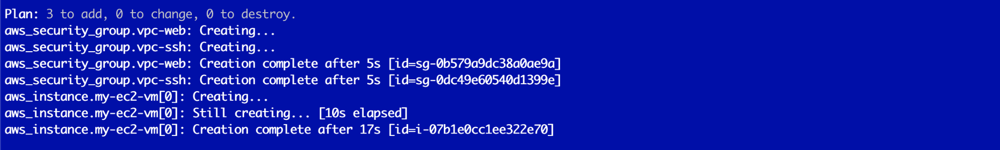

*Confirm Resource Creation from AWS Console*

-   Within the AWS Console \> type “EC2” from the console’s search box \> and select the first search result (“EC2”) as depicted below

-   Select “Instances (running)” from the EC2 Console page as depicted below

-   Within the Terraform manifest we assigned a Tag which may be used for ease of isolating our specific resource
-   Within the EC2 Console’s \> “Filter instances” search box \> type the tag Name value defined within the manifest (I.e. myec2vm-\<pod-number\>) and then select the returned search result as depicted below

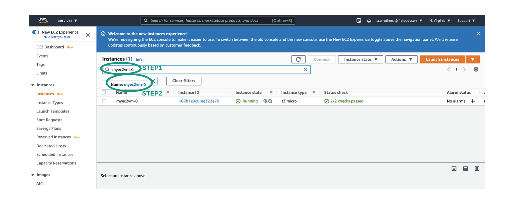

*Additional Validations*

-   With the EC2 instance selected (STEP1 below) \> open the resource’s “Networking” tab (STEP2 below)
-   First note that the Region variable was called/utilized successfully (STEP3 below). Based on the Availability Zone residing in “us-east-1” (I.e. in the example captured below the Availability Zone is “us-east-1d” which is an AZ within the Region of “us-east-1”) we have confirmation of this variable usage.
-   Next capture the “Public IP address” of the resource by using the copy icon to the left of the field (STEP4 below)

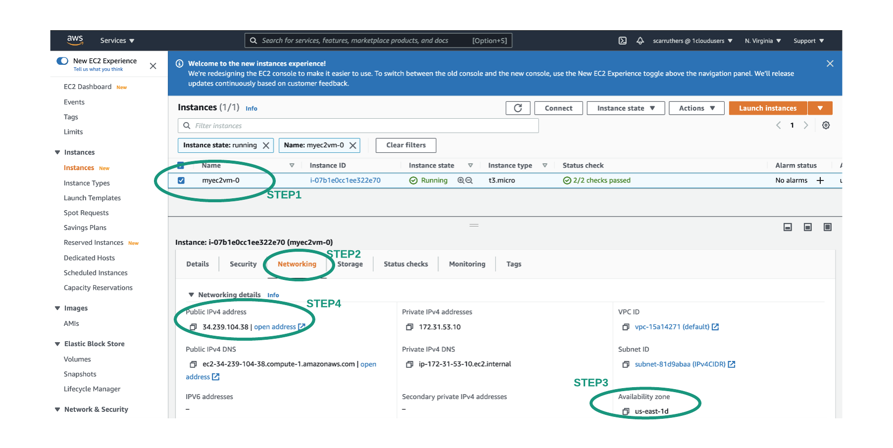

-   Within your web browser and in a new tab \> paste the EC2 public IP address into the address bar and press enter
-   The HTML page displayed below should appear and thus validating the user_data (Apache web server) and the security groups of this lab are behaving as expected allowing ingress HTTP traffic and serves as as our final validation of an EC2 resource creation using variable calls

*Destroy Terraform Resources*

-   With the validations now complete of Terraform Resource creation with variable declarations - we will proceed in removing all associated resources from AWS
-   Ensure that your terminal is within the lab10 directory and this section's sub-directory prior to issuing the destroy command

| terraform destroy -auto-approve |
|---------------------------------|

-   Output truncated to only display command invoke and completion segments
-   Note that the destroy process may take a few minutes to complete as depicted below

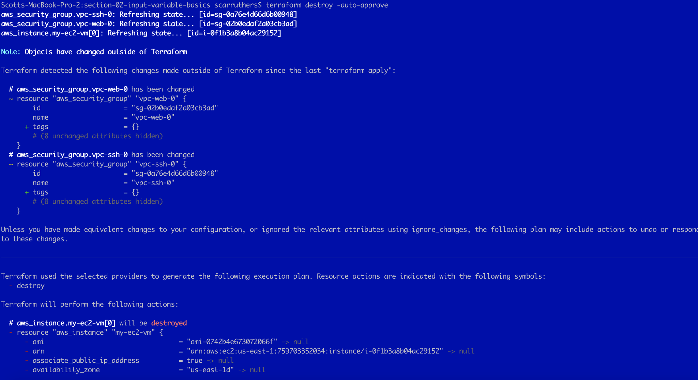

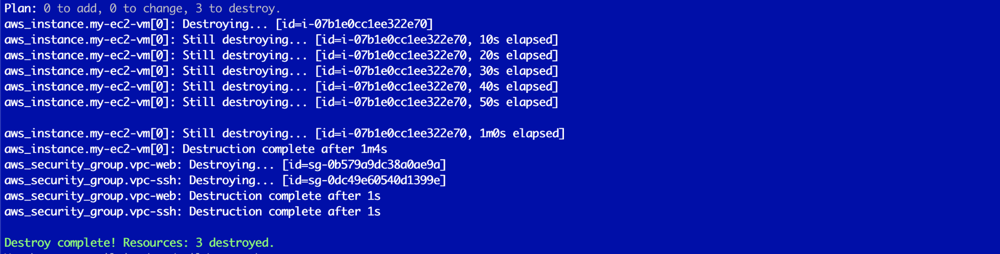

## **Section-03: Input Variable Via Prompt**

*Subdirectory for Lab Section*

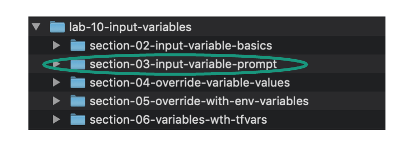

*Change Directory into Section Sub-Directory Containing Terraform Manifest Location*

| cd lab-10-input-variables/section-03-input-variable-prompt/ |
|-------------------------------------------------------------|

*Source code overview*

| In this lab we will add a new variable into the Terraform variables manifest The introduced variable will have no default value When a variable does not have a default value - execution of terraform plan or terraform apply will prompt the user for the value of the variable. |
|------------------------------------------------------------------------------------------------------------------------------------------------------------------------------------------------------------------------------------------------------------------------------------|

*Overview of Terraform Manifest*

| Open the following files in your local code editor for this section:  variables.tf resources.tf  Edit the code as necessary for your own Student Pod - within the resources.tf manifest - as instructed in the commented section of the manifest that begins with - “\#\#\#Note regarding lab usage”. Visual highlights are provided in the depictions below for further clarification of the location of necessary per pod edits. |
|------------------------------------------------------------------------------------------------------------------------------------------------------------------------------------------------------------------------------------------------------------------------------------------------------------------------------------------------------------------------------------------------------------------------------------|

| For the purpose of breaking down the Terraform Resource blocks within this manifest the following are provided: In this section an uncommented view of the entire manifest (Terraform block, Providers block, all Resource blocks) are provided to allow review of how the blocks are structured and correlated In the subsequent sections per Resource code blocks are provided with significant commenting to deep dive into the intent, purpose, and syntax of each resource |
|---------------------------------------------------------------------------------------------------------------------------------------------------------------------------------------------------------------------------------------------------------------------------------------------------------------------------------------------------------------------------------------------------------------------------------------------------------------------------------|

-   Terraform Variables File

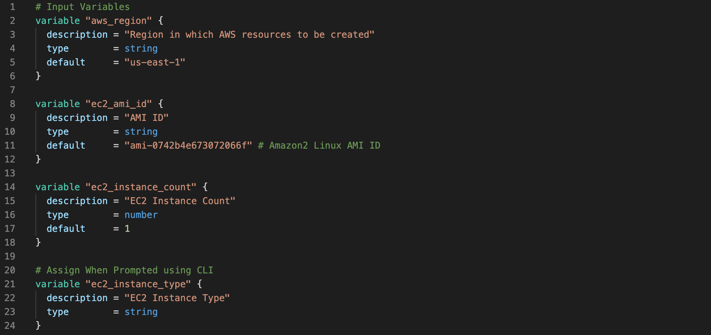

-   Terraform Provider and Resource Blocks/File

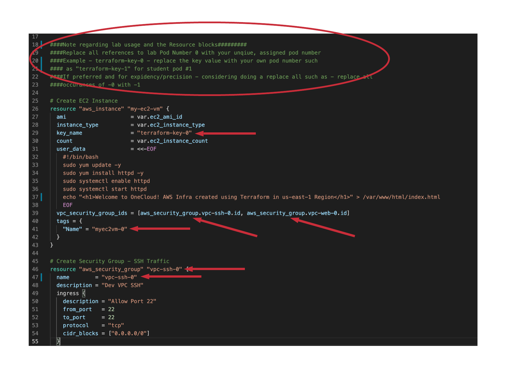

*Manifest Per Resource Review*

| Note - no action is necessary by the student in this section but rather this serves as a very granular break down of to be created Terraform resources  The code block comments/breakdowns are also found in the GitHub repo for this lab and within the “commented” directory |
|--------------------------------------------------------------------------------------------------------------------------------------------------------------------------------------------------------------------------------------------------------------------------------|

Terraform Variables File

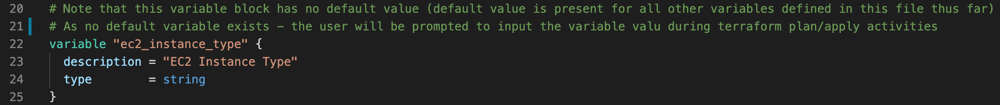

Terraform Providers and Resources File

*Workflow Command Execution*

-   Execute the following commands to initialize, validate, display plan, and eventually create the resources of the Terraform manifest
-   Expected outcome accompanies/follows each command set

| terraform init |
|----------------|

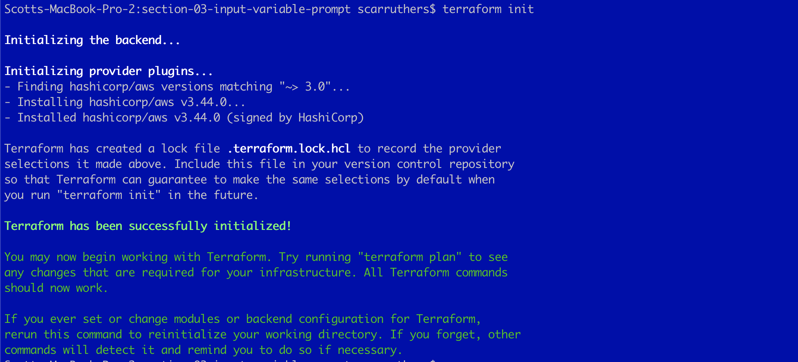

| terraform validate |
|--------------------|

| terraform fmt |
|---------------|

-   No output is returned from the Terraform format command - indicating no spacing/alignment adjustments were necessary across the three manifests in the current working directory - which is rather typical when developing within a code editor that adjusts formatting in real time.

| terraform plan |
|----------------|

-   On execution of the plan command we receive a prompt not seen prior
-   The prompt has includes the Description from the variables.tf file and the specific variable of interest and thus we can use this description to instruct the user on expected entry type/value
-   Enter - t3.small - for a sample input value

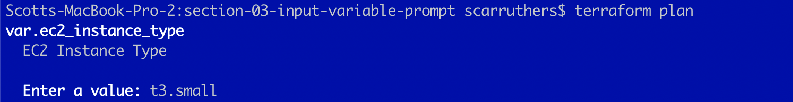

| t3.small |
|----------|

-   Terraform plan will then progress and will display the build of the resource with the entered input from user as depicted below

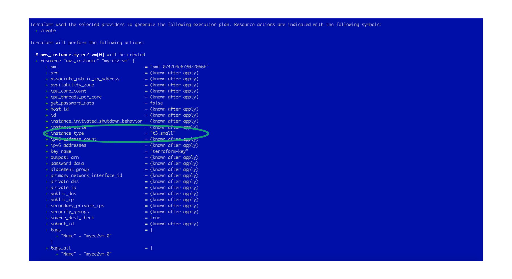

| terraform apply -auto-approve |
|-------------------------------|

-   On execution of the apply command we again receive a prompt to enter the instance type
-   Enter - t3.small - for a sample input value

| t3.small |
|----------|

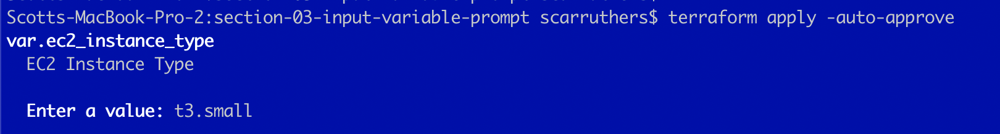

-   Terraform apply will then progress and displays the build of the resource with the entered input from user as depicted below

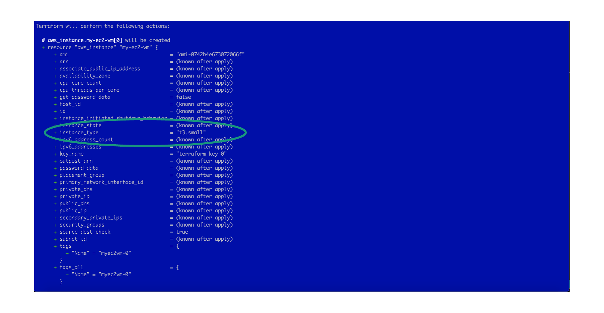

*Destroy Terraform Resources*

-   As the objective of this lab primarily was to introduce and experience the ability to prompt a user for variable input during resource creation - we do not need any further validations and we may proceed with resource destruction
-   If desired - visit the AWS EC2 Console to validate that the new instance was created with the user inputted instance type (t3.small) as an additional validation

| terraform destroy -auto-approve |
|---------------------------------|

-   Output truncated to only display command invoke and completion segments
-   Note that the destroy process will prompt for variable value entry as well

| t3.small |
|----------|

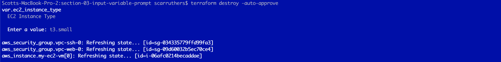

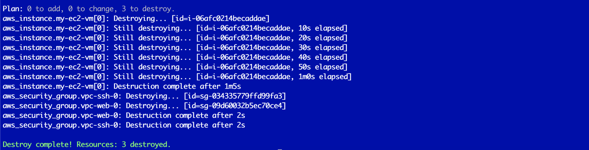

## **Section-04: Default Variable Override with Var Switch**

*Subdirectory for Lab Section*

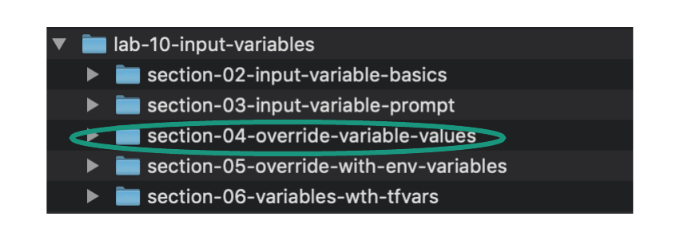

*Change Directory into Section Sub-Directory Containing Terraform Manifest Location*

| cd lab-10-input-variables/section-04-override-variable-values/ |
|----------------------------------------------------------------|

*Source code overview*

| In this section we will override the default variable values defined in variables.tf by providing new values using the -var argument during terraform plan/apply execution |
|----------------------------------------------------------------------------------------------------------------------------------------------------------------------------|

*Overview of Terraform Manifest*

| Open the following files in your local code editor for this section:  variables.tf resources.tf  Edit the code as necessary for your own Student Pod - within the resources.tf manifest - as instructed in the commented section of the manifest that begins with - “\#\#\#Note regarding lab usage”. Visual highlights are provided in the depictions below for further clarification of the location of necessary per pod edits.. |
|-------------------------------------------------------------------------------------------------------------------------------------------------------------------------------------------------------------------------------------------------------------------------------------------------------------------------------------------------------------------------------------------------------------------------------------|

| For the purpose of breaking down the Terraform Resource blocks within this manifest the following are provided: In this section an uncommented view of the entire manifest (Terraform block, Providers block, all Resource blocks) are provided to allow review of how the blocks are structured and correlated In the subsequent sections per Resource code blocks are provided with significant commenting to deep dive into the intent, purpose, and syntax of each resource |
|---------------------------------------------------------------------------------------------------------------------------------------------------------------------------------------------------------------------------------------------------------------------------------------------------------------------------------------------------------------------------------------------------------------------------------------------------------------------------------|

-   Terraform Variables File

| Note - the only edit of the variables.tf file from the prior section is the ec2_instance_type variable has now been provided a default value  As user variable value input is no longer our focus - the default value was introduced to negate being prompted for this value |
|------------------------------------------------------------------------------------------------------------------------------------------------------------------------------------------------------------------------------------------------------------------------------|

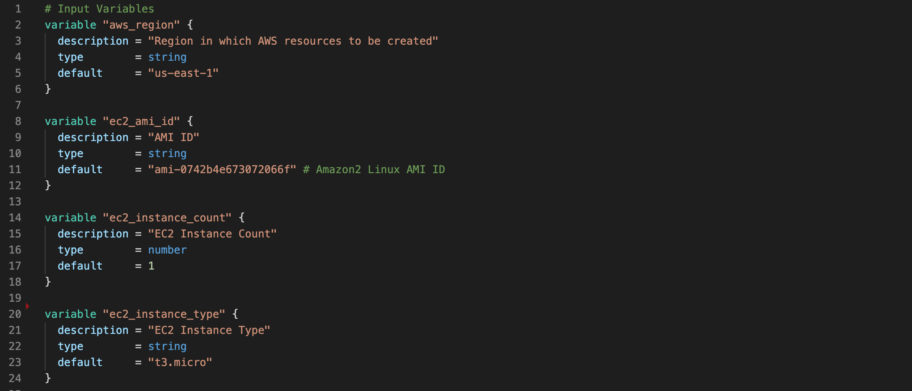

-   Terraform Provider and Resource Blocks/File

| Note - there are no edits in the resources.tf file from the prior section  The typical process of editing the file for your student pod number is necessary however |
|---------------------------------------------------------------------------------------------------------------------------------------------------------------------|

*Manifest Per Resource Review*

| Note - no action is necessary by the student in this section but rather this serves as a very granular break down of to be created Terraform resources  The code block comments/breakdowns are also found in the GitHub repo for this lab and within the “commented” directory |
|--------------------------------------------------------------------------------------------------------------------------------------------------------------------------------------------------------------------------------------------------------------------------------|

Terraform Variables File

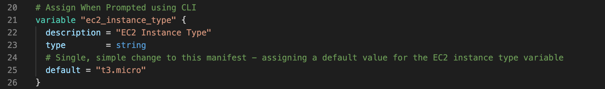

*Workflow Command Execution*

-   Execute the following commands to initialize, validate, display plan, and eventually create the resources of the Terraform manifest
-   Expected outcome accompanies/follows each command set

| terraform init |
|----------------|

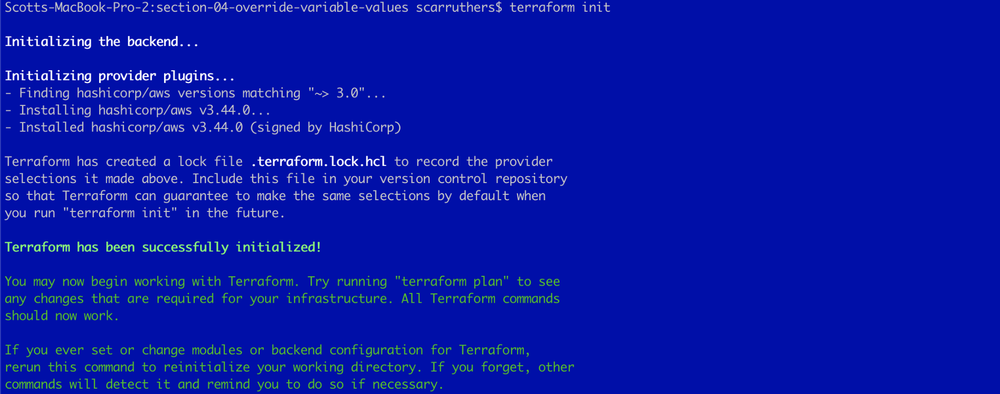

| terraform validate |
|--------------------|

| terraform fmt |
|---------------|

-   No output is returned from the Terraform format command - indicating no spacing/alignment adjustments were necessary across the three manifests in the current working directory - which is rather typical when developing within a code editor that adjusts formatting in real time.

| terraform plan -var="ec2_instance_type=t3.small" -var="ec2_instance_count=2" |
|------------------------------------------------------------------------------|

| In the execution of terraform plan the default values for two variables will be overwritten as follows: The default EC2 instance type’s default value of t3.micro will be overridden with the specified value of t3.small The Meta-Argument Count variable’s default value of 1 will be overridden with the specified value of 2 - meaning two EC2 instances should be created As seen in these examples - the use of the “-var” operator \> followed by the variable name \> followed by the override value - is our mechanism to specify non-default values Output truncated to only include initiation and completion sequences Note that the instance_type value is t3.small in the plan output - which is not the default value but rather our override Additionally the output indicates two EC2 instances would be created which is again our specified override of the default value (Note - two EC2 instances and two security groups will be created - thus the count of 4 to add) |
|----------------------------------------------------------------------------------------------------------------------------------------------------------------------------------------------------------------------------------------------------------------------------------------------------------------------------------------------------------------------------------------------------------------------------------------------------------------------------------------------------------------------------------------------------------------------------------------------------------------------------------------------------------------------------------------------------------------------------------------------------------------------------------------------------------------------------------------------------------------------------------------------------------------------------------------------------------------------------------------------|

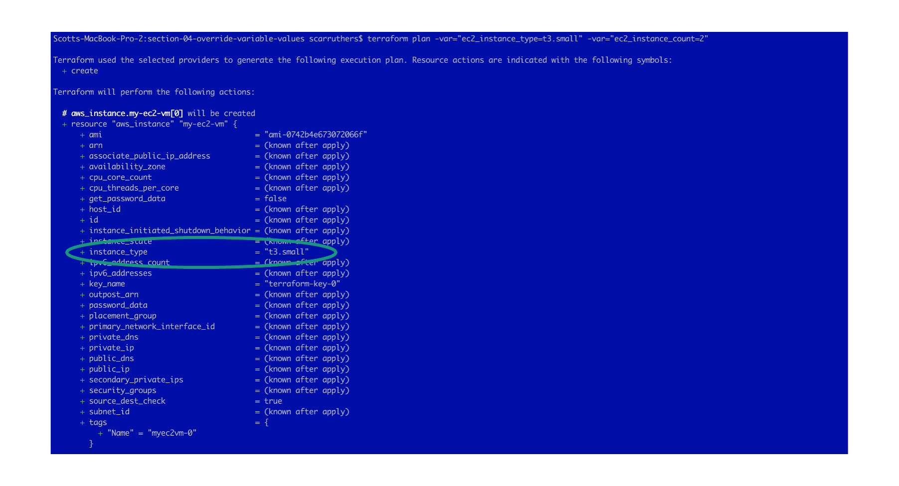

| terraform apply -var="ec2_instance_type=t3.small" -var="ec2_instance_count=2" -auto-approve |
|---------------------------------------------------------------------------------------------|

| Utilize the same -var arguments and default variable value overrides as demonstrated in terraform plan but now with terraform apply Note in the resultant - as depicted below - two EC2 instances have been created. Thus we have validation of both default overrides - 1) In terraform apply we are able to validate the instance_type being utilized is t3.small 2) In the terraform apply result we are able to validate that two instances are created. Truncated output displaying initiation and resultant only |
|------------------------------------------------------------------------------------------------------------------------------------------------------------------------------------------------------------------------------------------------------------------------------------------------------------------------------------------------------------------------------------------------------------------------------------------------------------------------------------------------------------------------|

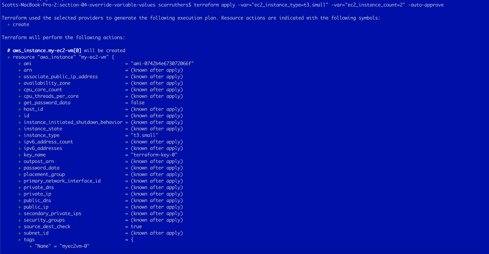

*Destroy Terraform Resources*

-   As the objective of this lab primarily was to introduce and experience the ability to override a default variable via the -var argument during resource plan/creation - we do not need any further validations and we may proceed with resource destruction
-   If desired - visit the AWS EC2 Console to validate that two new instances were created (validating the count override) with the instance type of t3.small (validating the instance type override) as an additional validation

| terraform destroy -auto-approve |
|---------------------------------|

-   Output truncated to only display command invoke and completion segments

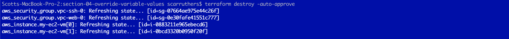

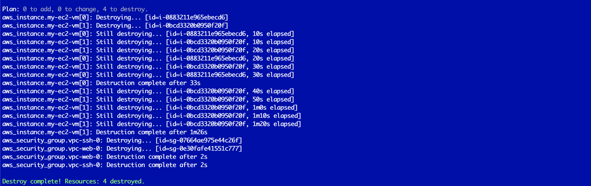

## **Section-05: Default Variable Override with Env Variables**

*Subdirectory for Lab Section*

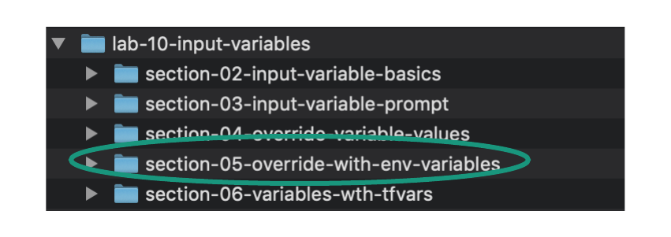

*Change Directory into Section Sub-Directory Containing Terraform Manifest Location*

| cd lab-10-input-variables/section-05-override-with-env-variables/ |
|-------------------------------------------------------------------|

*Source code overview*

| In this section we will override the default variable values defined in variables.tf by declaring local environment variables When we create an Environment Variable on our local PC using the following syntax - Terraform will recognize that such a variable exists during plan/apply executions and use the value instead of the default value from the variables.tf file: export TF_VAR_variable_name=value Example syntax in our lab: Note the TF_VAR\_ and then the variable name nomenclature - this syntax is necessary to be recognized by Terraform as an environment variable it should pay attention to export TF_VAR_ec2_instance_type=t3.large Thus the syntax is: export TF_VAR_\<variable_name_to_override\>=\<desired_value\> |
|-------------------------------------------------------------------------------------------------------------------------------------------------------------------------------------------------------------------------------------------------------------------------------------------------------------------------------------------------------------------------------------------------------------------------------------------------------------------------------------------------------------------------------------------------------------------------------------------------------------------------------------------------------------------------------------------------------------------------------------------------|

*Overview of Terraform Manifest*

| Open the following files in your local code editor for this section:  variables.tf resources.tf  Edit the code as necessary for your own Student Pod - within the resources.tf manifest - as instructed in the commented section of the manifest that begins with - “\#\#\#Note regarding lab usage”. Visual highlights are provided in the depictions below for further clarification of the location of necessary per pod edits. |
|------------------------------------------------------------------------------------------------------------------------------------------------------------------------------------------------------------------------------------------------------------------------------------------------------------------------------------------------------------------------------------------------------------------------------------|

| For the purpose of breaking down the Terraform Resource blocks within this manifest the following are provided: In this section an uncommented view of the entire manifest (Terraform block, Providers block, all Resource blocks) are provided to allow review of how the blocks are structured and correlated |
|-----------------------------------------------------------------------------------------------------------------------------------------------------------------------------------------------------------------------------------------------------------------------------------------------------------------|

-   Variables File

| As the goal of this lab is to observe the behavior and ability to override a variable’s default value with an environment variable - we will repurpose the exact code from our prior section (Section-04).  |
|-------------------------------------------------------------------------------------------------------------------------------------------------------------------------------------------------------------|

-   Terraform Provider and Resource Blocks/File

| Note - there are no edits in the resources.tf file from the prior section  The typical process of editing the file for your student pod number is necessary however |
|---------------------------------------------------------------------------------------------------------------------------------------------------------------------|

*Invoke Environment Variables Locally*

-   From your local terminal - invoke environment variables detailed below
-   The methodology to export environment variables is different depending on if the working environment where terraform manifests are launched is a Windows or MacOS/Linux platform
-   Instructions for both MacOS and Windows are provided below. Only execute one of these instruction sets depending on your local OS.

**MacOS Environment Variable Invoke**

-   Execute commands in this section from a MacOS terminal session

| export TF_VAR_ec2_instance_count=2 export TF_VAR_ec2_instance_type=t2.small |
|-----------------------------------------------------------------------------|

-   Confirm the environment variables were called properly
    -   Invoking the following command should display the values of the now configured environment variables if they were called properly.
    -   Example output is depicted below command

| echo \$TF_VAR_ec2_instance_count, \$TF_VAR_ec2_instance_type |
|--------------------------------------------------------------|

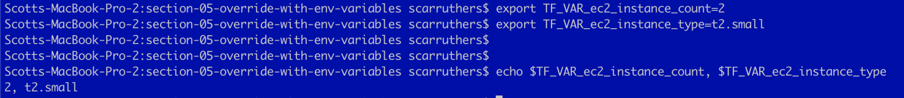

**Windows Environment Variable Invoke**

-   Execute commands in this section from a Windows PowerShell session

| \$Env:TF_VAR_ec2_instance_count = “2” \$Env:TF_VAR_ec2_instance_type = “t2.small” |
|-----------------------------------------------------------------------------------|

-   Confirm the environment variables were called properly
    -   Invoking the following command should display the values of the now configured environment variables if they were called properly.
    -   Example output is depicted below command

| echo \$Env:TF_VAR_ec2_instance_count echo \$Env:TF_VAR_ec2_instance_type |
|--------------------------------------------------------------------------|

*Workflow Command Execution (MacOS and Windows)*

-   Execute the following commands to initialize, validate, display plan, and eventually create the resources of the Terraform manifest
-   Expected outcome accompanies/follows each command set

| terraform init |
|----------------|

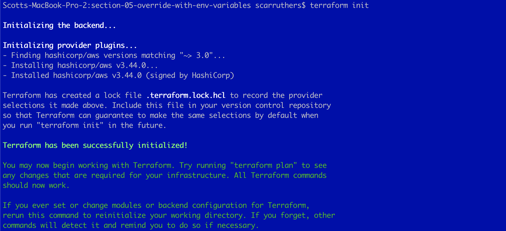

| terraform validate |
|--------------------|

| terraform fmt |
|---------------|

-   No output is returned from the Terraform format command - indicating no spacing/alignment adjustments were necessary across the three manifests in the current working directory - which is rather typical when developing within a code editor that adjusts formatting in real time.

| terraform plan |
|----------------|

-   Unlike the usage of command line driven -var specification - the use of environment variables requires nothing special in the terraform plan or terraform apply commands
-   Terraform simply initiates the use of the environment variables based on the usage of the TF_VAR naming convention
-   The output of terraform plan validates the effective use of the environment variables via:
    -   As depicted in the highlight below - the EC2 instances are to be created with the instance_type of t2.small - which is the definition within the environment variable and overrides the variables.tf file specification of t3.micro
    -   The execution plan intends the add of four (4) resources - two EC2 instances and two security groups - which corresponds with the environment count specification of EC2 instances and overrides the manifest setting

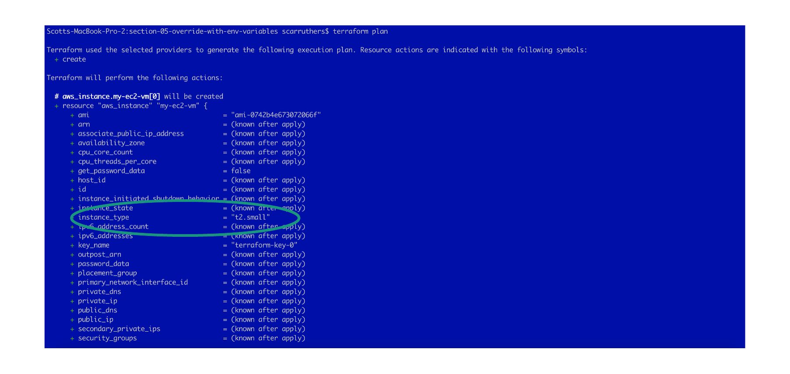

| We will not proceed with a terraform apply invoke in this circumstance as it is rather unnecessary The output of terraform plan has provided complete validation of the usage and override capabilities of local environment variables |
|----------------------------------------------------------------------------------------------------------------------------------------------------------------------------------------------------------------------------------------|

*Environment Variable Removal*

-   The final step of this section will be to execute the commands to unset the environment variables as they are not needed post validation
-   Removal additionally ensures the variables will not impact future labs
-   Environment variable removal will be different depending on a MacOS/Linux or Windows platform and thus both procedures are provided below.
-   Only execute one of these methodologies - depending on your platform.

**MacOS Environment Removal**

-   Utilize the unset commands to remove the environment variables
-   The echo command will confirm the removal of the environment variable with expected output - which is empty - depicted

| unset TF_VAR_ec2_instance_count unset TF_VAR_ec2_instance_type echo \$TF_VAR_ec2_instance_count, \$TF_VAR_ec2_instance_type |
|-----------------------------------------------------------------------------------------------------------------------------|

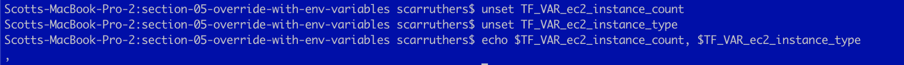

**Windows Environment Removal**

-   Utilize the Remove-Item commands to remove the environment variables
-   The echo commands will confirm the removal of the environment variable with expected output - which is empty - depicted

| Remove-Item Env:TF_VAR_ec2_instance_count Remove-Item Env:TF_VAR_ec2_instance_type echo \$Env:TF_VAR_ec2_instance_count echo \$Env:TF_VAR_ec2_instance_type |
|-------------------------------------------------------------------------------------------------------------------------------------------------------------|

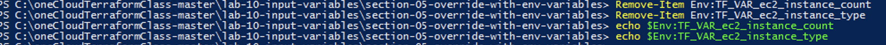

## **Section-06: Default Variable Override with TFVARs**

*Subdirectory for Lab Section*

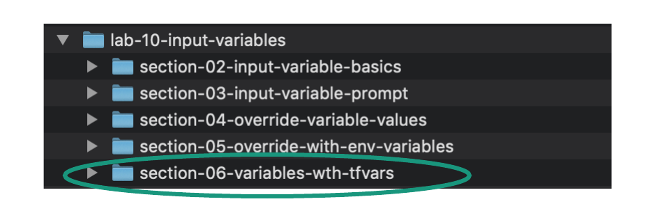

*Change Directory into Section Sub-Directory Containing Terraform Manifest Location*

| cd lab-10-input-variables/section-06-variables-wth-tfvars/ |
|------------------------------------------------------------|

*Source code overview*

| In this section we will override default variable values defined in variables.tf by declaring a TFVARs file When we create a TFVARs file (I.e. terraform.tfvars in our lab example) any variables contained within that TFVARs file will override variable values set elsewhere The use case making this necessary or appealing could be a scenario in which source code is downloaded from a repository that has variables set and we want to override some of the default variables without changing the source code itself Example usage in our lab: A terraform.tfvars file is introduced The tfvars file has a couple of variables that we will observe override the variables of the same name and their default values in variables.tf |
|-----------------------------------------------------------------------------------------------------------------------------------------------------------------------------------------------------------------------------------------------------------------------------------------------------------------------------------------------------------------------------------------------------------------------------------------------------------------------------------------------------------------------------------------------------------------------------------------------------------------------------------------------------------------------------------------------------------------------------------------------|

*Overview of Terraform Manifest*

| Open the following files in your local code editor for this section:  variables.tf resources.tf terraform.tfvars Edit the code as necessary for your own Student Pod - within the resources.tf manifest - as instructed in the commented section of the manifest that begins with - “\#\#\#Note regarding lab usage”. Visual highlights are provided in the depictions below for further clarification of the location of necessary per pod edits. |
|----------------------------------------------------------------------------------------------------------------------------------------------------------------------------------------------------------------------------------------------------------------------------------------------------------------------------------------------------------------------------------------------------------------------------------------------------|

| For the purpose of breaking down the Terraform Resource blocks within this manifest the following are provided: In this section an uncommented view of the entire manifest (Terraform block, Providers block, all Resource blocks) are provided to allow review of how the blocks are structured and correlated In the subsequent sections per Resource code blocks are provided with significant commenting to deep dive into the intent, purpose, and syntax of each resource |
|---------------------------------------------------------------------------------------------------------------------------------------------------------------------------------------------------------------------------------------------------------------------------------------------------------------------------------------------------------------------------------------------------------------------------------------------------------------------------------|

-   Variables File

| As the goal of this lab is to observe the behavior and ability to override a variable’s default value with TFVAR variables - we will repurpose the exact code from our prior section (Section-05).  |
|-----------------------------------------------------------------------------------------------------------------------------------------------------------------------------------------------------|

-   Terraform Provider and Resource Blocks/File

| Note - there are no edits in the resources.tf file from the prior section  The typical process of editing the file for your student pod number is necessary however |
|---------------------------------------------------------------------------------------------------------------------------------------------------------------------|

-   TFVARs File

*Manifest Per Resource Review*

| Note - no action is necessary by the student in this section but rather this serves as a very granular break down of to be created Terraform resources  The code block comments/breakdowns are also found in the GitHub repo for this lab and within the “commented” directory |
|--------------------------------------------------------------------------------------------------------------------------------------------------------------------------------------------------------------------------------------------------------------------------------|

TFVARs File

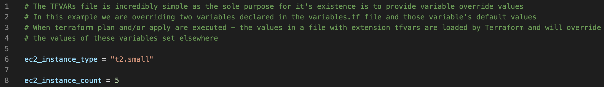

*Workflow Command Execution*

-   Execute the following commands to initialize, validate, display plan, and eventually create the resources of the Terraform manifest
-   Expected outcome accompanies/follows each command set

| terraform init |
|----------------|

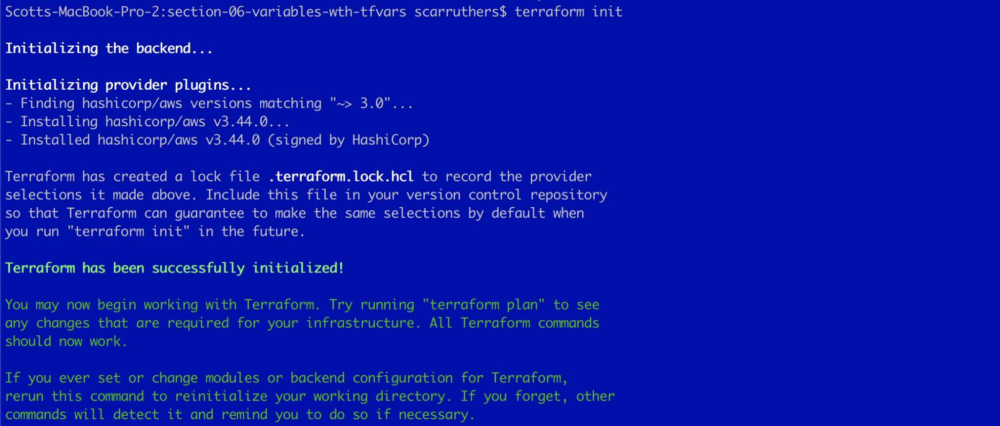

| terraform validate |
|--------------------|

| terraform fmt |
|---------------|

-   No output is returned from the Terraform format command - indicating no spacing/alignment adjustments were necessary across the three manifests in the current working directory - which is rather typical when developing within a code editor that adjusts formatting in real time.

| terraform plan |
|----------------|

-   The output of terraform plan validates the effective use of the TFVARs variables via:
    -   As depicted in the highlight below - the EC2 instances are to be created with instance_type of t2.small - which is the definition within the TFVARs variable and the variables.tf file specification of t3.micro is overridden
    -   The Plan is adding seven (7) resources - five EC2 instances and two security groups - which corresponds with the TFVARs EC2 count specification and overrides the variables.tf value/count of one EC2 instance

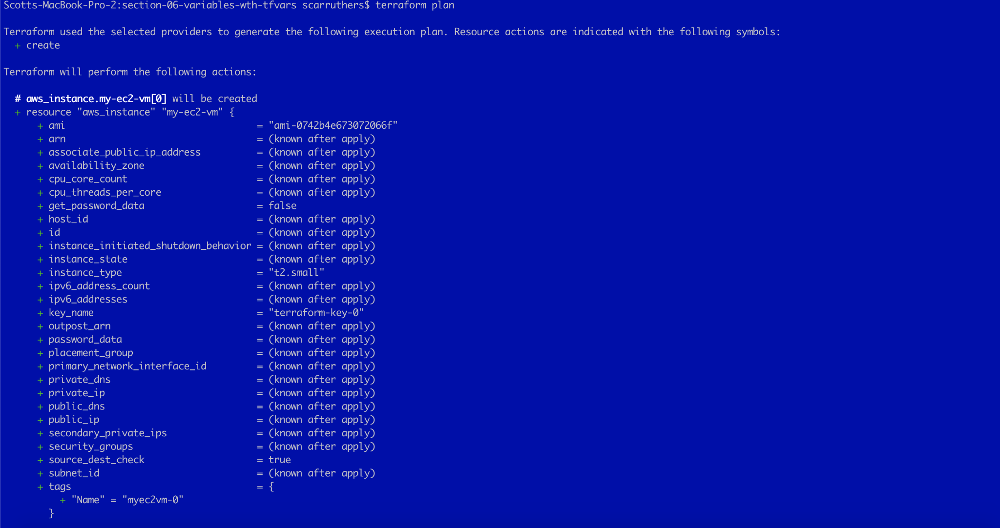

*Section Completion*

-   We will not proceed with the terraform apply invoke in this circumstance as it is rather unnecessary
-   The output of terraform plan has provided complete validation of the usage of a TFVARs file and the override capabilities on variables initialized elsewhere and those variable’s default values

## **Section-07: Data Sources**

*Subdirectory for Lab Section*

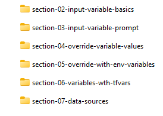

*Change Directory into Section Sub-Directory Containing Terraform Manifest Location*

| cd lab-10-input-variables/section-07-data-sources/ |
|----------------------------------------------------|

*Source code overview*

| In this section we be obtaining variables from Data Sources in Terraform. Data Sources in Terraform are defined in our terraform manifest files and are used for gathering information about our infrastructure and configuration.  When we define our Data Sources, we can use filters to find specific information from the cloud providers API. Information gathered by Data Sources can then be used to define the values of our arguments in our resources. In this lab we will use Data Sources to gather the AMI ID of an Ubuntu image. These value will then be used to provision an EC2 instance using this AMI ID. |
|------------------------------------------------------------------------------------------------------------------------------------------------------------------------------------------------------------------------------------------------------------------------------------------------------------------------------------------------------------------------------------------------------------------------------------------------------------------------------------------------------------------------------------------------------------------------------------------------------------------------------|

*Overview of Terraform Manifest*

| Open the following files in your local code editor for this section:  variables.tf resources.tf terraform.tfvars Edit the code as necessary for your own Student Pod - within the terraform.tfvars man |
|--------------------------------------------------------------------------------------------------------------------------------------------------------------------------------------------------------|

| For the purpose of breaking down the Terraform Resource blocks within this manifest the following are provided: In this section an uncommented view of the entire manifest (Terraform block, Providers block, all Resource blocks) are provided to allow review of how the blocks are structured and correlated. In the subsequent sections per Resource code blocks are provided with significant commenting to deep dive into the intent, purpose, and syntax of each resource |
|----------------------------------------------------------------------------------------------------------------------------------------------------------------------------------------------------------------------------------------------------------------------------------------------------------------------------------------------------------------------------------------------------------------------------------------------------------------------------------|

-   Variables File

| As the goal of this lab is to observe the behavior and ability to override a variable’s default value with TFVAR variables - we will repurpose the exact code from our prior section (Section-06).  |
|-----------------------------------------------------------------------------------------------------------------------------------------------------------------------------------------------------|

-   Terraform Provider and Resource Blocks/File

| Note - there are no edits in the resources.tf file  We will only edit the terraform.tfvars file to set the actual variables for your student pod number. |
|----------------------------------------------------------------------------------------------------------------------------------------------------------|

Resources.tf

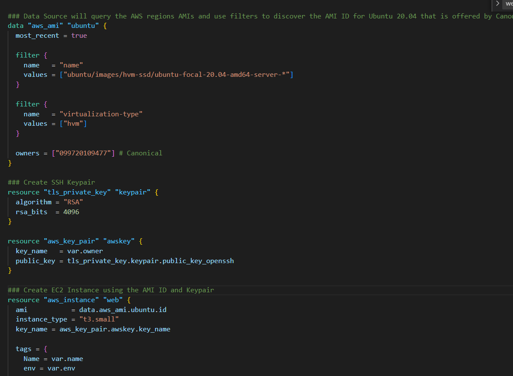

The data source will query for the regions AMIs and will filter and find an AMI ID with a specific name and owner. The AMI ID then gets passed down to the aws_instance resource.

Terraform.tfvars

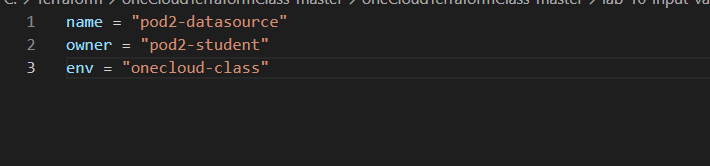

Modify the terraform.tfvars file and replace ‘x’ with your specific pod number.

*Workflow Command Execution*

-   Execute the following commands to initialize, validate, display plan, and eventually create the resources of the Terraform manifest
-   Expected outcome accompanies/follows each command set

| terraform init |
|----------------|

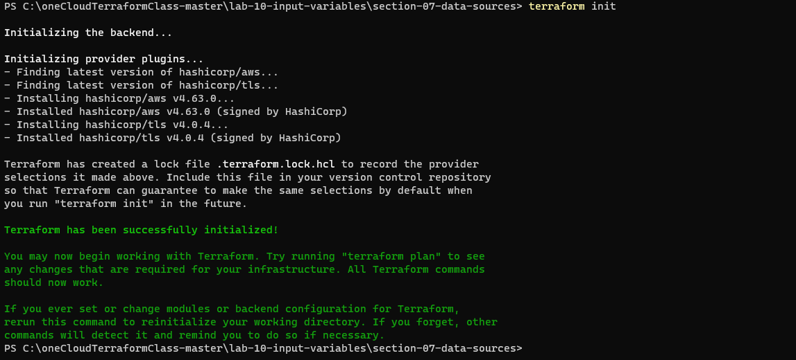

| terraform validate |
|--------------------|

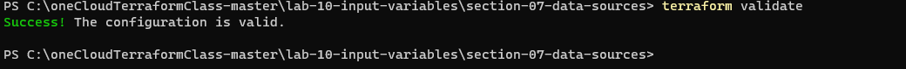

| terraform fmt |
|---------------|

-   No output is returned from the Terraform format command - indicating no spacing/alignment adjustments were necessary across the three manifests in the current working directory - which is rather typical when developing within a code editor that adjusts formatting in real time.

| terraform plan |
|----------------|

-   The output of terraform plan validates the effective use of the TFVARs variables via:
    -   As depicted in the highlight below - the EC2 instances are to be created with instance_type of t2.small - which is the definition within the TFVARs variable and the variables.tf file specification of t3.micro is overridden
    -   The Plan is adding seven (3) resources – 1 EC2 instances, a keypair and AWS keypair.
    -   Notice the AMI ID. This was due to the data source discovering this in AWS.

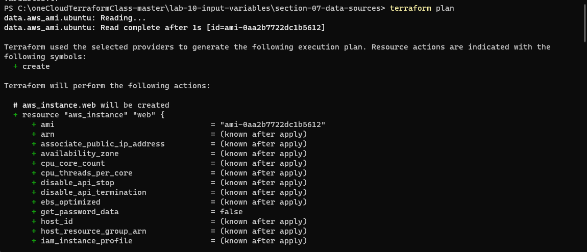

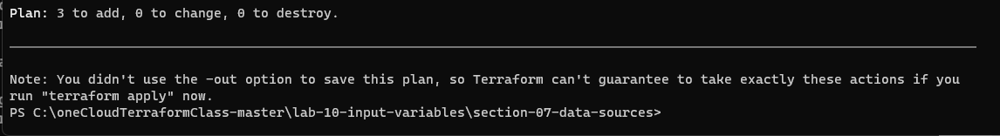

| terraform apply –auto-approve |
|-------------------------------|

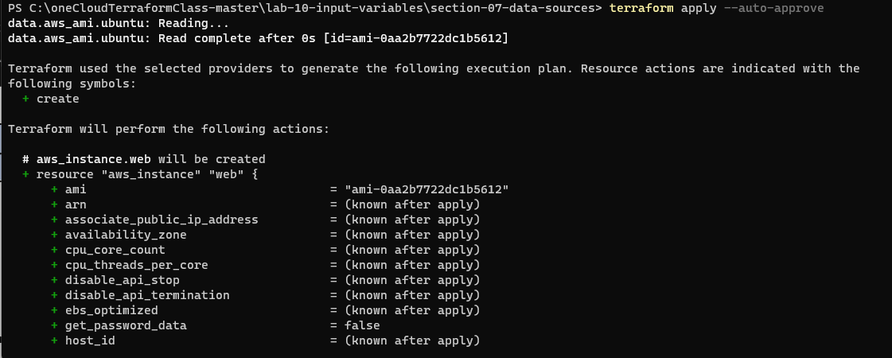

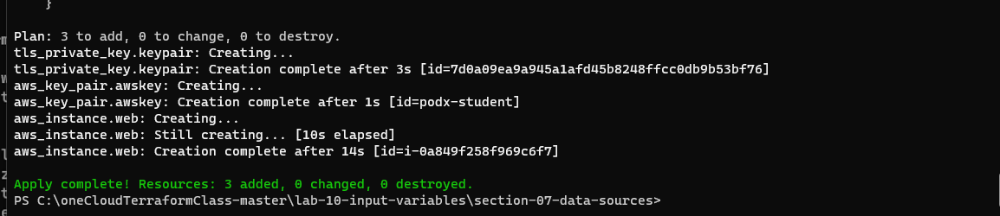

| terraform show |
|----------------|

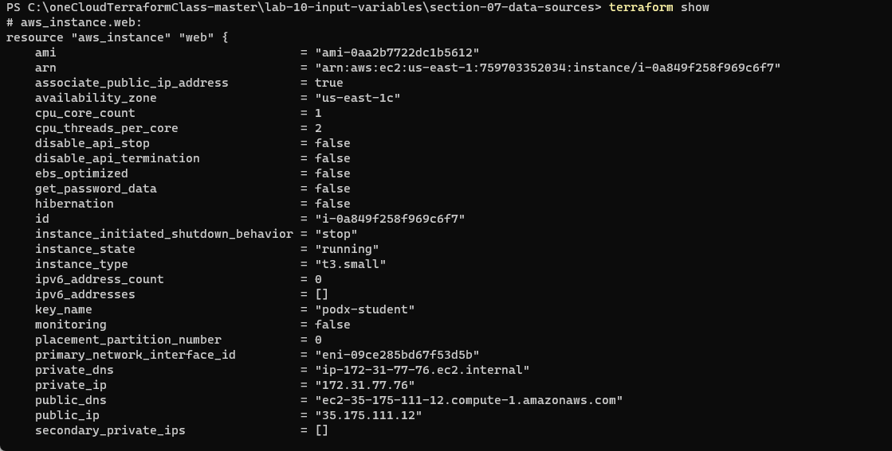

*Section Completion*

-   You may check the AWS console to see the EC2 Instance you just created
-   Run ‘terraform destroy’ once finished
-   Data sources can be very helpful to get information about the infrastructure. Data source documentation can be found under the provider documentation. Each provider has it’s own data sources that can be queried.
